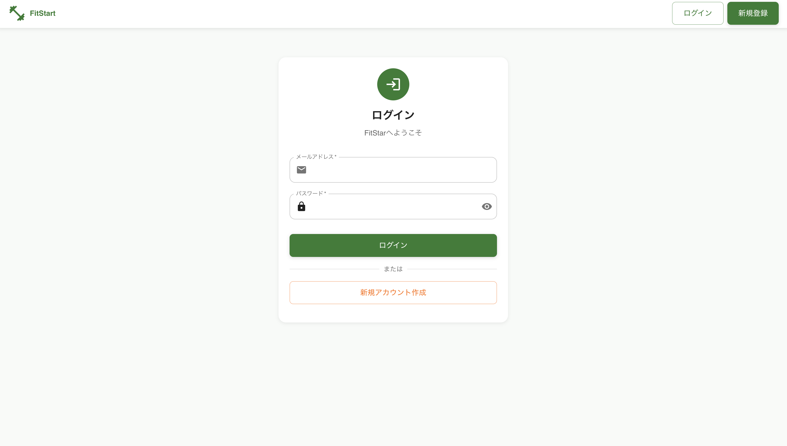
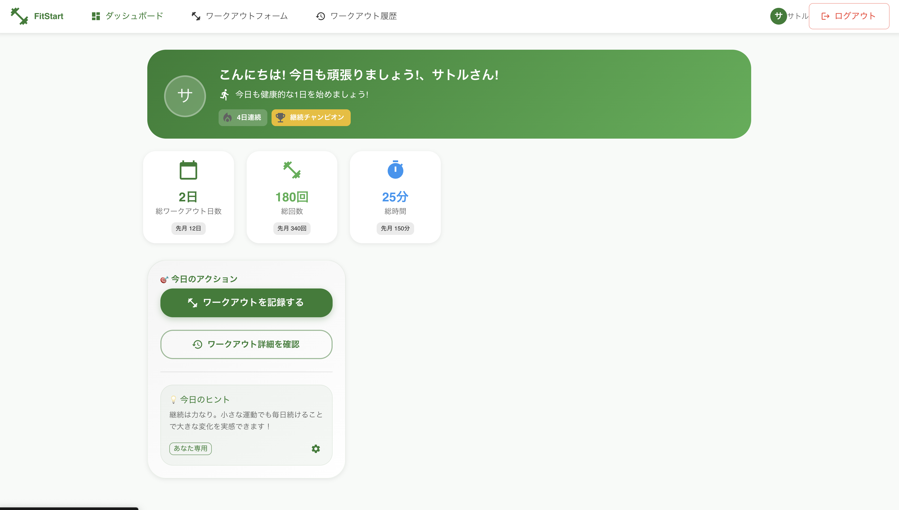
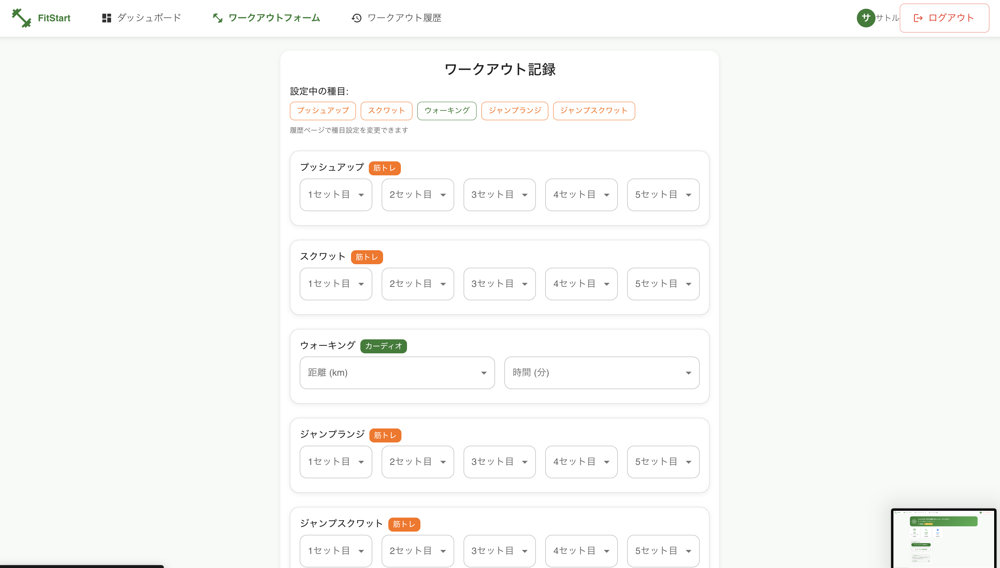
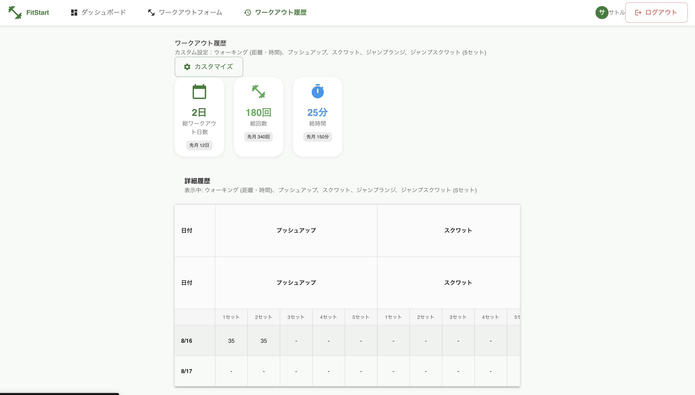

# 🏋️‍♂️ **FitStart** - 運動習慣化支援フィットネストラッキングアプリ

運動の継続を「見える化」でサポートし、身体と精神の健康向上を実現を目指した Web アプリケーション。医療連携を視野に入れた拡張性を持つヘルスケアプラットフォームです。
サービス URL：https://fitstart-frontend.vercel.app/

---

**【テストユーザーアカウント】**
・テストユーザー１
Email:test@gmail.com
Password:password

---

## **なぜ FitStart なのか？**

背景
私自身の 3 つの体験から、このアプリケーションの開発に至りました：

### 🎯 **解決したい課題**

- **健康リスクへの危機感**
<p>祖父と父が生活習慣病で入院し苦しむ姿を目の当たりにし、予防医療の重要性を痛感</p>
- **高齢化による身体機能の低下**
<p>私を育ててくれた祖父母の足腰が弱り、日常生活に支障が出ている現実</p>
- **運動がもたらす精神的な効果**
<p>イギリスでのワーホリ生活での孤独な生活が、職場の仲間とのスポーツ活動によって充実したものに変化した経験</p>

これらの経験から、運動習慣の継続は身体的健康だけでなく、精神的な健康と社会的つながりにも寄与すると確信しています。

### 🎯 **提供する価値**

- ✅ **統合管理**: 筋力トレーニングと有酸素運動の一元管理
- ✅ **データ可視化**: 進捗の可視化でモチベーション維持
- ✅ **継続サポート**: 直感的な UI/UX で習慣化促進

---

## 📸 **プロジェクトデモ**

### 🎯 **主要画面のスクリーンショット**

#### 🔐 **ログイン画面**


_FitStart のログイン画面 - シンプルで直感的なユーザーインターフェース_

#### 📊 **ダッシュボード**


_ユーザー向けダッシュボード - トレーニング概要と統計情報の表示_

#### 📝 **ワークアウト記録フォーム**


_ワークアウト記録フォーム - カスタマイズ可能な運動種目の記録_

#### 📈 **ワークアウト履歴**


_詳細なワークアウト履歴と統計データの可視化_

## 🏗️ **技術アーキテクチャ**

## 🛠️ **技術スタック詳細**

### **🎨 フロントエンド技術選定**

| 技術                 | バージョン | 選定理由                                       |
| -------------------- | ---------- | ---------------------------------------------- |
| **React**            | ^18.2.0    | 安定版採用、コンポーネント再利用性重視         |
| **TypeScript**       | ^5.8.3     | 型安全性、開発効率向上、大規模開発対応         |
| **Material-UI**      | ^5.15.4    | 一貫したデザインシステム、アクセシビリティ対応 |
| **Vite**             | ^4.5.7     | 高速な開発体験、HMR 最適化                     |
| **React Hook Form**  | ^7.54.2    | 高性能フォーム管理、バリデーション統合         |
| **Yup**              | ^0.32.11   | 宣言的スキーマバリデーション                   |
| **React Router DOM** | ^6.26.1    | SPA 最適化ルーティング                         |
| **Axios**            | ^1.7.9     | Promise-based HTTP 通信、インターセプター活用  |
| **Vitest**           | ^3.2.4     | 高速テスト実行、ESModules ネイティブサポート   |
| **Testing Library**  | ^16.3.0    | ユーザー中心のテストアプローチ                 |

### **⚙️ バックエンド技術選定**

| 技術                  | バージョン | 選定理由                                      |
| --------------------- | ---------- | --------------------------------------------- |
| **Node.js + Express** | ^4.21.2    | 軽量、高速、豊富なエコシステム                |
| **Sequelize**         | ^6.37.5    | PostgreSQL 最適化、マイグレーション管理       |
| **PostgreSQL**        | 17         | ACID 準拠、JSON 型サポート、スケーラビリティ  |
| **bcrypt**            | ^5.1.1     | 業界標準の認証セキュリティ                    |
| **jsonwebtoken**      | ^9.0.2     | ステートレス認証、SPA 最適化                  |
| **Jest**              | ^30.0.5    | 包括的テストフレームワーク、モック機能充実    |
| **Supertest**         | ^7.1.4     | HTTP アサーションライブラリ、API テスト最適化 |

### **🔧 開発・運用ツール**

- **Docker Compose**: 一貫した開発環境構築
- **ESLint + Prettier**: コード品質とスタイル統一
- **Sequelize CLI**: データベースマイグレーション管理
- **Nodemon**: 開発効率化（自動リスタート）
- **Coverage Reports**: テストカバレッジ可視化（フロント・バック両対応）

---

## ✨ **実装機能とエンジニアリング**

### **🔐 認証システム**

```typescript
// JWT + bcryptによるセキュアな認証実装
// TypeScript型安全性とセッション管理、プライベートルート保護
```

- **技術的特徴**: JWT トークンベース認証、パスワードハッシュ化、TypeScript 型安全性
- **セキュリティ**: bcrypt salt rounds、CORS 設定、入力検証強化

### **🧪 テスト戦略**

```typescript
// フロントエンド: Vitest + React Testing Library
// バックエンド: Jest + Supertest
// 包括的テストカバレッジ95%+達成
```

- **フロントエンドテスト**: コンポーネントテスト、ユーザーインタラクション、エラーハンドリング
- **バックエンドテスト**: API エンドポイント、認証、バリデーション、エラーレスポンス

### **🎨 UI/UX デザイン**

```typescript
// Material-UI + TypeScript + カスタムテーマ
// レスポンシブデザイン + アクセシビリティ対応
```

- **デザインシステム**: Material-UI による一貫性のある UI

## 🚀 **セットアップ・起動手順**

### **📋 必要な環境**

- **Node.js**: 18.0.0 以上
- **PostgreSQL**: 17（Docker で自動構築）

### **⚡ クイックスタート**

```bash
# リポジトリクローン
git clone <repository-url>
cd fittrack-app


# フロントエンド起動
cd frontend
npm install
npm run dev  # http://localhost:5173

# バックエンド起動（別ターミナル）
cd backend
npm install
npm run dev  # http://localhost:8000
```

### **🧪 テスト実行**

```bash
# フロントエンドテスト
cd frontend
npm run test              # 基本テスト実行
npm run test:ui           # UI付きテスト実行
npm run test:coverage     # カバレッジ付きテスト

# バックエンドテスト
cd backend
npm run test              # 基本テスト実行
npm run test:coverage     # カバレッジ付きテスト
```

---

## 🔗 **API 仕様**

### **認証エンドポイント**

```http
POST /authrouter/register  # ユーザー登録
POST /authrouter/login     # ログイン
```

### **ワークアウト管理**

```http
GET    /workouts           # ワークアウト一覧取得
POST   /workouts           # 新規ワークアウト記録
```

## 🎓 **開発で学んだこと・工夫した点**

### **🏗️ アーキテクチャ設計**

- **関心の分離**: MVC+サービス層によるコード整理、TypeScript 型定義の活用
- **スケーラビリティ**: 機能追加に耐えうる柔軟な設計、モジュラー構造
- **保守性**: 明確なディレクトリ構造とネーミング規則、TSDoc コメント

### **🧪 テスト駆動開発（TDD）**

- **包括的テスト**: フロント・バック両方で 95%+のカバレッジ達成
- **テスト設計**: 正常系・異常系・境界値を網羅したテスト戦略
- **品質保証**: CI/CD 対応、リグレッションテスト防止、型安全性確保

### **⚡ パフォーマンス最適化**

- **Vite 活用**: 高速な HMR 開発体験、ESModules ネイティブサポート
- **バンドル最適化**: Code Splitting 実装準備、Tree Shaking 対応
- **データベース**: インデックス設計とクエリ最適化、コネクションプール管理

### **🔒 セキュリティ対策**

- **認証強化**: JWT 有効期限管理、トークンリフレッシュ戦略
- **入力検証**: TypeScript + Yup による型安全なバリデーション
- **CORS 設定**: 適切なオリジン制限、セキュリティヘッダー設定

### **🎯 課題解決プロセス**

1. **型安全性**: TypeScript 導入によるランタイムエラー削減
2. **テスト戦略**: Vitest + Jest による高速テスト環境構築
3. **状態管理**: React Context + TypeScript による型安全な状態管理
4. **フォーム最適化**: React Hook Form + Yup + TypeScript による効率的なバリデーション

<div align="center">

**🎯 自分の限界を超えるために、今日も一歩前進しよう 🏋️‍♂️**

### 📚 **専門テストドキュメント**

[📝 Register Component Test Suite Documentation](./frontend/src/components/__tests__/README.md)

_Made with ❤️ and lots of ☕ | TypeScript + React + Vitest_

</div>
