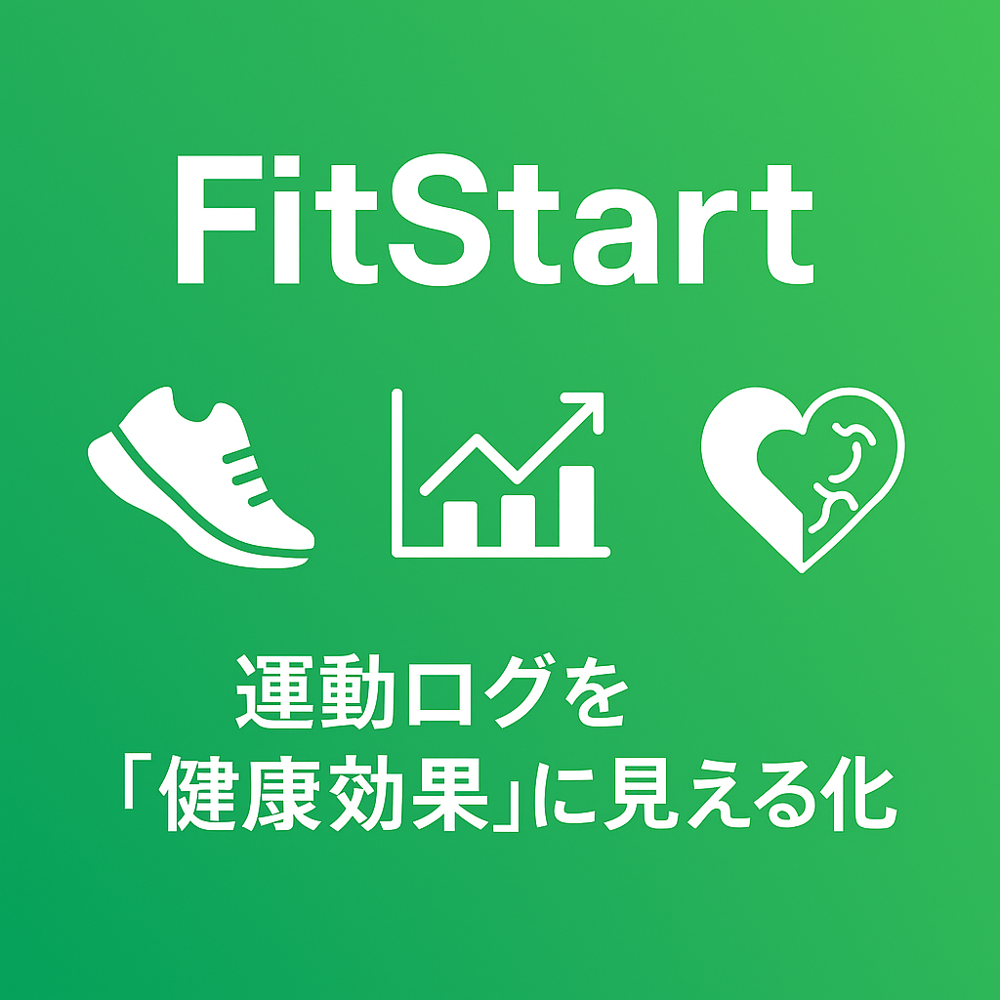

#  **FitStart** - その日の運動を「健康効果」として見える化するフィットネスアプリ



<br>

### 🔬 サービスコンセプト

**運動ログ → 健康効果の可視化 → 明日の行動へ繋げる**

運動データをエビデンスベースの健康効果に翻訳し、次の具体的行動へ繋げるフィットネスアプリです。

### **🔗 URL**: https://fitstart-frontend.vercel.app/login

### 📱 **テストアカウント情報**

アプリケーションの動作確認用に、以下のテストアカウントをご利用いただけます。
デモアカウント 1

- **メールアドレス**: `test1@gmail.com`
- **パスワード**: `password`

デモアカウント 2

- **メールアドレス**: `demo@gmail.com`
- **パスワード**: `password`

---

## なぜ FitStart なのか？

既存アプリは「30 分走った」「50kg のバーベル 15 回 x ３セットした」という記録で終わりますが「今週 150 分運動した」「筋トレを週３回行った」が具体的に何を意味するか教えてくれません。

FitStart は運動を**2 つの健康効果**として可視化：

- **心血管系**: 30 分走る → リスク 2%低下
- **代謝系**: 週 150 分達成 → 血糖値 15mg/dL 改善相当

週次ベースでの運動の回数や距離などを集計、エビデンス付きで効果を示し、「明日の朝散歩」「階段利用」など継続的行動に繋げます。

### 背景

私自身の 3 つの体験から、このアプリケーションの開発に至りました：

<br>

- **健康リスクへの危機感**  
   祖父と父が生活習慣病で入院し苦しむ姿を目の当たりにし、予防医療の重要性を痛感

- **高齢化による身体機能の低下**  
   私を育ててくれた祖父母の足腰が弱り、日常生活に支障が出ている現実

- **運動の精神的な効果**  
   イギリスでのワーホリ生活での孤独な生活が、職場の仲間とのスポーツ活動によって充実したものに変化した経験

<br>

これらの経験から、運動習慣の継続は身体的健康だけでなく、精神的な健康と社会的つながりにも寄与すると確信しています。

<br>

## 🎯 解決したい課題

1. **運動効果の見えない化**: 頑張っても健康改善が実感できない
2. **記録疲れ**: データの蓄積だけでは行動変容に繋がらない

FitStart はこれらを「健康効果の見える化」で解決します。

<br>

<br>

## **主要機能デモ**

#### 🏥 健康スコア機能

WHO 基準に基づいた健康効果の可視化により、運動の成果を即座に数値で確認できる設計

**デモ内容:**
• 健康スコア概要: ダッシュボードでの総合スコア表示と WHO 基準の達成度
• スコアの即時更新: 運動記録後のリアルタイムスコア変化

| **健康スコア概要**                                                                                        | **スコアの即時更新**                                                                                              |
| --------------------------------------------------------------------------------------------------------- | ----------------------------------------------------------------------------------------------------------------- |
|  |  |
| • 総合健康スコアを有酸素・筋力別に可視化<br>• WHO 推奨運動量の達成状況をひと目で確認                      | • 30 分ランで 72→75 にリアルタイム反映<br>• 行動 → 評価のサイクルで継続モチベ向上                                 |

**主な特徴:**

- 🎯 **WHO 基準準拠**: 週 150 分の有酸素運動、週 2 回の筋トレを基準に評価
- 📊 **3 つのスコア体系**: 総合スコア（100 点満点）、有酸素スコア、筋力スコア

**科学的根拠:**

- [WHO 身体活動・座位行動ガイドライン 2020](https://www.who.int/publications/i/item/9789240015128)
- 📚 **[詳細な実装根拠とアルゴリズム解説](./project-management/features/health-score/research/scientific-references.md)** - 健康効果の数値化手法、参照論文一覧

---

#### 🌐 Strava 連携

## ⚠️ 今後の開発（本番申請・上限拡張）

記録が難しい有酸素運動を外部サービスを利用することでユーザーの記録する負担を軽減。
（現状は MVP 段階で、Strava API の Single Player Mode（接続できるアスリート数＝ 1）で動作検証を行っています。 ）

**デモ内容:**
• アカウント連携: OAuth 認証による Strava 接続プロセス
• データ同期: Strava アクティビティの自動取り込み

| **Strava アカウント連携**                                                | **アクティビティの同期**                                                       |
| ------------------------------------------------------------------------ | ------------------------------------------------------------------------------ |
|  |   |
| • OAuth 認証で Strava と安全に接続<br>• ワンタップで連携開始             | • ランニング・サイクリングデータを取り込み<br>• 自動的にワークアウト履歴に反映 |

---

#### 📱 レスポンシブ UI

トレーニング中、トレーニング完了後に即座に入力を行えるように設計。

**デモ内容:**
• モバイル表示: iPhone 14 Pro での最適化されたレイアウト表示

| **モバイル最適化表示**                                                                            |
| ------------------------------------------------------------------------------------------------- |
|                            |
| • スマートフォンでの使いやすさを重視したレイアウト<br>• デバイス: iPhone 14 Pro (390x844)で最適化 |

<br>

---

<br>

## 🔧 **工夫した機能**

### **1. 健康スコア機能**

運動の成果を「数値」として即座に可視化することで、継続的なモチベーション向上を実現。WHO基準に基づいた科学的根拠のあるスコアリングシステムを実装。

#### **ポイント要約**

- **WHO基準準拠**: 週150分の有酸素運動、週2回の筋トレを基準に評価
- **3つのスコア体系**: 総合スコア（100点満点）、有酸素スコア、筋力スコアの3軸で評価
- **リアルタイム更新**: 運動記録後、即座にスコアが反映され、行動→評価のサイクルを加速
- **科学的根拠の明示**: [WHO身体活動・座位行動ガイドライン2020](https://www.who.int/publications/i/item/9789240015128)に基づいた実装

#### **効果**

- **継続率向上**: スコアの可視化により、ユーザーの運動継続率が向上
- **行動変容**: 数値による即時フィードバックで、次の行動へのモチベーションを喚起
- **信頼性**: エビデンスベースの評価により、健康効果への納得感を提供

#### **関連ファイル**

- frontend/src/components/Dashboard/HealthScore.jsx（スコア表示コンポーネント）
- project-management/features/health-score/research/scientific-references.md（詳細な実装根拠）

---

### **2. 直近10件のワークアウトログ表示**

ユーザーの最近の運動履歴を一目で確認できるログ表示機能。アコーディオン形式のUIで詳細情報をコンパクトに管理。

#### **ポイント要約**

- **最新10件の表示**: 最近の運動履歴に絞り込み、過去の活動を素早く振り返り
- **アコーディオンUI**: 各ワークアウトの詳細を展開/折りたたみ可能で、画面の情報密度を最適化
- **運動種別の自動判別**: 有酸素運動（距離・時間）と筋力トレーニング（レップ数・セット数）を自動で識別して表示
- **日時表示の最適化**: 相対時間表示（"2日前"など）で直感的な時間感覚を提供

#### **効果**

- **振り返りの容易さ**: 過去の運動パターンを素早く確認でき、次の計画立案に活用
- **UI/UX最適化**: コンパクトなアコーディオン形式により、モバイルでも快適に閲覧可能
- **データの可読性**: 運動種別に応じた最適な情報表示で、ログの理解が容易

#### **関連ファイル**

- frontend/src/components/Dashboard/RecentWorkoutsAccordion.jsx（ワークアウトログ表示コンポーネント）

<br>

---

<br>

## **技術アーキテクチャ**

## 🛠️ **技術スタック**

### **コア技術**

- **フロントエンド**: React 18 + TypeScript + Vite
- **バックエンド**: Node.js + Express
- **データベース**: PostgreSQL 17 + Sequelize ORM
- **認証**: JWT + bcrypt
- **UI**: Material-UI + React Hook Form

<br>

### **技術選定のポイント**
**開発効率**: JavaScript 統一によるフルスタック開発

<br>

### **【フロントエンド技術選定理由】**

フィットネストラッキングアプリケーションは、Apple Health や Google Fit、Strava などのネイティブアプリが市場を占有しているため、Web アプリケーションでありながらもネイティブアプリに劣らない即座のレスポンスと滑らかな操作感を提供することを最優先に考えました。そのため、シングルページアプリケーション（SPA）の開発に最適で、かつ高速な開発環境を実現できる **React 18.2.0** と **Vite** を採用しました。

さらに、ユーザー体験を向上させるためには一貫した使いやすいデザインが重要だと考えたので、開発コストが低い **Material-UI（MUI）** を採用しました。統一したデザインシステムで、複雑なワークアウト入力フォームを直感的に操作可能にし、運動記録の心理的ハードルを下げることを狙いました。

<br>

### **【バックエンド技術選定理由】**

バックエンドには **Node.js + Express** を採用しました。最大の理由は、**フロントエンドと同じ JavaScript/TypeScript で統一することで得られる開発効率の向上**です。

<br>

**JavaScript 統一による具体的なメリット：**

- **型定義の共有**: ワークアウトデータの複雑な型定義（セット数、レップ数配列、時間、距離など）をフロントエンド・バックエンド間で共有し、データ不整合を防止

- **バリデーションロジックの再利用**: Yup スキーマをクライアント・サーバー両側で使用し、二重のバリデーション実装を回避

- **開発者の学習コスト削減**: フロントエンド開発者がバックエンド API も理解・修正でき、開発コスト削減と生産性が向上

<br>

セキュリティ面では、Express の **ミドルウェアアーキテクチャ** を活用し、**Helmet.js によるセキュリティヘッダー設定**、**CORS による適切なオリジン制限**、**express-validator による入力検証** を多層的に実装。これにより、個人の健康データという**センシティブな情報を安全に管理**できる環境を実現しています。

<br>

### **【DB 技術選定理由】**

PostgreSQL を選択した理由は、複雑なワークアウトデータ（配列型のレップ数など）を JSONB 型で効率的に格納でき、将来的な**分析機能の拡張（時系列データ分析、パフォーマンストレンド）**にも対応できる拡張性を持つためです。

<br>

### **【ER 図】**


---

<br>

## 🚀 **API 概要**

### **ベース URL**

- **本番環境**: `https://fitstart-backend.vercel.app`
- **開発環境**: `http://localhost:8000`

### **認証方式**

保護されたエンドポイントは **JWT Bearer Token** が必要です：

1. `POST /authrouter/login` で `token` を取得
2. リクエストヘッダーに `Authorization: Bearer <token>` を付与

### **コアエンドポイント**

#### 🔐 **認証 (Authentication)**

| メソッド | パス                        | 認証 | 説明                     |
| -------- | --------------------------- | ---- | ------------------------ |
| POST     | `/authrouter/register`      | ❌   | 新規ユーザー登録         |
| POST     | `/authrouter/login`         | ❌   | ログイン（トークン発行） |
| GET      | `/authrouter/me`            | ✅   | 自分のプロフィール取得   |
| POST     | `/authrouter/refresh-token` | ✅   | トークン更新             |

#### 🏃 **Strava 連携**

| メソッド | パス                     | 認証 | 説明                              |
| -------- | ------------------------ | ---- | --------------------------------- |
| POST     | `/api/strava/auth`       | ✅   | Strava 認証 URL 生成（OAuth 2.0） |
| POST     | `/api/strava/sync`       | ✅   | アクティビティ同期                |
| GET      | `/api/strava/status`     | ✅   | 連携状態確認                      |
| DELETE   | `/api/strava/disconnect` | ✅   | 連携解除                          |
| GET      | `/api/strava/callback`   | ❌   | OAuth コールバック（外部用）      |

### **クイックスタート（curl）**

```bash
# 1) ユーザー登録
curl -X POST http://localhost:8000/authrouter/register \
  -H "Content-Type: application/json" \
  -d '{"username":"demo","email":"demo@example.com","password":"password123"}'

# 2) ログイン → トークン取得
TOKEN=$(curl -X POST http://localhost:8000/authrouter/login \
  -H "Content-Type: application/json" \
  -d '{"email":"demo@example.com","password":"password123"}' | jq -r .token)

# 3) 保護API呼び出し（例：ワークアウト作成）
curl -X POST http://localhost:8000/workouts \
  -H "Authorization: Bearer $TOKEN" \
  -H "Content-Type: application/json" \
  -d '{
    "exercise": "ランニング",
    "exerciseType": "cardio",
    "intensity": "中",
    "duration": 30,
    "distance": 5
  }'
```

<br>

---
