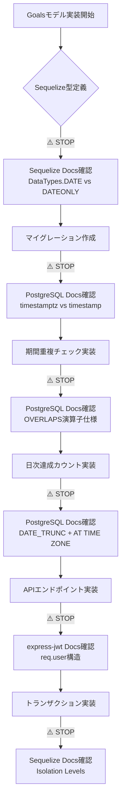

# 月次目標機能 - クリティカル領域の公式ドキュメント参照ガイド

**文書番号**: CDR-MG-001
**バージョン**: 1.0.0
**作成日**: 2025-09-13
**ステータス**: Active

## ⚠️ 重要: 実装前の確認事項

**クリティカル領域の実装では、必ず以下の公式ドキュメントを参照してください。**
実装中に不明な点が発生した場合は、**実装を中断して**ドキュメントを確認することを強く推奨します。

---

## 1. Sequelize ORM - データベース層

### 1.1 マイグレーション実装

**公式ドキュメント**: https://sequelize.org/docs/v6/other-topics/migrations/

**必須参照セクション**:
- [Migration Skeleton](https://sequelize.org/docs/v6/other-topics/migrations/#migration-skeleton)
- [Creating the first Model (and Migration)](https://sequelize.org/docs/v6/other-topics/migrations/#creating-the-first-model-and-migration)
- [The `.sequelizerc` file](https://sequelize.org/docs/v6/other-topics/migrations/#the-sequelizerc-file)

**実装チェックポイント**:
```javascript
// ⚠️ STOP: マイグレーション作成前に確認
// 1. queryInterface.createTable のオプション確認
// 2. データ型のマッピング（Sequelize.DATE vs Sequelize.DATEONLY）
// 3. インデックス作成の構文
```

### 1.2 トランザクション管理

**公式ドキュメント**: https://sequelize.org/docs/v6/other-topics/transactions/

**必須参照セクション**:
- [Managed transactions](https://sequelize.org/docs/v6/other-topics/transactions/#managed-transactions)
- [Isolation levels](https://sequelize.org/docs/v6/other-topics/transactions/#isolation-levels)
- [Concurrent/Partial transactions](https://sequelize.org/docs/v6/other-topics/transactions/#concurrentpartial-transactions)

**実装チェックポイント**:
```javascript
// ⚠️ STOP: リワードclaim実装前に確認
// 1. sequelize.transaction() の使い方
// 2. lock: true オプションの動作
// 3. ISOLATION LEVELの選択（READ COMMITTED vs SERIALIZABLE）
```

### 1.3 フック（Hooks）

**公式ドキュメント**: https://sequelize.org/docs/v6/other-topics/hooks/

**必須参照セクション**:
- [Available hooks](https://sequelize.org/docs/v6/other-topics/hooks/#available-hooks)
- [Model hooks](https://sequelize.org/docs/v6/other-topics/hooks/#model-hooks)
- [Connection hooks](https://sequelize.org/docs/v6/other-topics/hooks/#connection-hooks)

---

## 2. PostgreSQL - データベース機能

### 2.1 DATE_TRUNC関数（タイムゾーン処理）

**公式ドキュメント**: https://www.postgresql.org/docs/current/functions-datetime.html#FUNCTIONS-DATETIME-TRUNC

**必須参照セクション**:
- 9.9.3. `date_trunc` - https://www.postgresql.org/docs/current/functions-datetime.html#FUNCTIONS-DATETIME-TRUNC
- 9.9.4. `AT TIME ZONE` - https://www.postgresql.org/docs/current/functions-datetime.html#FUNCTIONS-DATETIME-ZONECONVERT

**実装チェックポイント**:
```sql
-- ⚠️ STOP: 日次達成カウントSQL作成前に確認
-- 1. DATE_TRUNC('day', timestamp) の動作
-- 2. AT TIME ZONE 'Asia/Tokyo' の変換仕様
-- 3. タイムゾーン付きタイムスタンプ(timestamptz)の扱い
```

### 2.2 OVERLAPS演算子（期間重複チェック）

**公式ドキュメント**: https://www.postgresql.org/docs/current/functions-datetime.html#FUNCTIONS-DATETIME-OVERLAPS

**必須参照セクション**:
- Table 9.35. Date/Time Operators - `OVERLAPS`

**実装チェックポイント**:
```sql
-- ⚠️ STOP: 期間重複チェック実装前に確認
-- 1. (start1, end1) OVERLAPS (start2, end2) の判定ロジック
-- 2. NULL値の扱い
-- 3. 境界値の判定（開区間 vs 閉区間）
```

### 2.3 CHECK制約

**公式ドキュメント**: https://www.postgresql.org/docs/current/ddl-constraints.html#DDL-CONSTRAINTS-CHECK-CONSTRAINTS

**必須参照セクション**:
- 5.4.1. Check Constraints

---

## 3. Express JWT - 認証層

### 3.1 express-jwt ミドルウェア

**公式ドキュメント**: https://github.com/auth0/express-jwt#readme

**必須参照セクション**:
- [Usage](https://github.com/auth0/express-jwt#usage)
- [Error handling](https://github.com/auth0/express-jwt#error-handling)
- [Options](https://github.com/auth0/express-jwt#options)

**実装チェックポイント**:
```javascript
// ⚠️ STOP: 認証ミドルウェア適用前に確認
// 1. algorithms: ['HS256'] の指定
// 2. req.user へのペイロード格納
// 3. UnauthorizedError のハンドリング
```

### 3.2 jsonwebtoken ライブラリ

**公式ドキュメント**: https://github.com/auth0/node-jsonwebtoken#readme

**必須参照セクション**:
- [jwt.verify(token, secretOrPublicKey, [options, callback])](https://github.com/auth0/node-jsonwebtoken#jwtverifytoken-secretorpublickey-options-callback)
- [TokenExpiredError](https://github.com/auth0/node-jsonwebtoken#tokenexpirederror)

---

## 4. Node.js Crypto - 暗号化

### 4.1 暗号化実装（将来のトークン暗号化用）

**公式ドキュメント**: https://nodejs.org/api/crypto.html

**必須参照セクション**:
- [crypto.createCipheriv()](https://nodejs.org/api/crypto.html#cryptocreatecipherivalgorithm-key-iv-options)
- [crypto.createDecipheriv()](https://nodejs.org/api/crypto.html#cryptocreatedecipherivalgorithm-key-iv-options)
- [crypto.randomBytes()](https://nodejs.org/api/crypto.html#cryptorandombytessize-callback)

---

## 5. 実装フロー with ドキュメント確認ポイント



---

## 6. 実装時の判断基準

### 🔴 実装を中断してドキュメント参照が必要な場合

1. **新しいSequelize/PostgreSQL機能を使う時**
   - 例: 初めてDATE_TRUNCを使う
   - 例: トランザクション分離レベルを設定する

2. **エラーが発生して原因が不明な時**
   - 例: マイグレーションエラー
   - 例: JWT検証エラー

3. **セキュリティに関わる実装をする時**
   - 例: 認証ミドルウェアの設定
   - 例: トークンの暗号化

### 🟡 実装を続行しつつ後で確認する場合

1. **既存コードのパターンを踏襲する時**
   - 例: 他のモデルと同じバリデーション

2. **UIコンポーネントの実装**
   - 例: Material-UIの使用

### 🟢 ドキュメント参照不要な場合

1. **純粋なビジネスロジック**
   - 例: 進捗率の計算

2. **フォーマット処理**
   - 例: 表示文字列の生成

---

## 7. チェックリスト

実装開始前に、以下のドキュメントをブックマークしてください：

- [ ] Sequelize v6 Documentation
- [ ] PostgreSQL 15 Documentation
- [ ] express-jwt GitHub README
- [ ] Node.js Crypto API Documentation
- [ ] Material-UI Components (UI実装時)

---

## ⚠️ 重要な注意事項

**実装中に以下の状況が発生した場合は、必ず実装を中断してドキュメントを確認してください：**

1. 「これで動くはず」という推測で実装している
2. Stack Overflowの回答をそのままコピーしようとしている
3. エラーメッセージの意味が理解できない
4. セキュリティに関わる処理を実装している

**Remember: "When in doubt, check the docs!"**