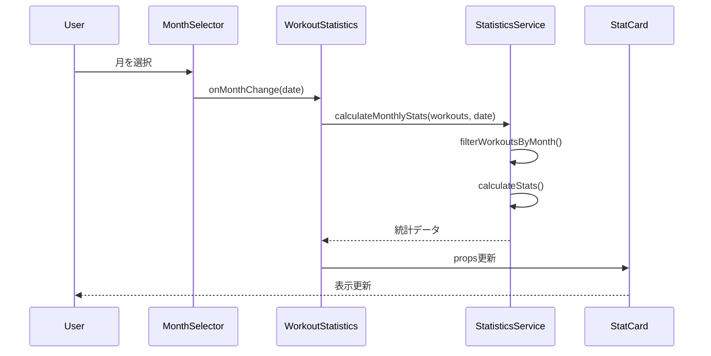

# 月別統計機能 - コンポーネントアーキテクチャ設計書

**文書番号**: CAD-MS-001
**バージョン**: 1.0.0
**作成日**: 2025-01-18
**ステータス**: Draft

## 改訂履歴
| バージョン | 日付 | 変更者 | 変更内容 |
|-----------|------|--------|----------|
| 1.0.0 | 2025-01-18 | Team | MVP版初版作成 |

## 1. アーキテクチャ概要

### 1.1 設計方針
- **最小限の変更**: 既存コンポーネントの拡張を優先
- **段階的実装**: MVP → 拡張機能の順で実装
- **再利用性**: 将来の月次目標機能での活用を考慮
- **パフォーマンス**: クライアントサイドでの効率的なデータ処理

### 1.2 コンポーネント階層

```
Dashboard/WorkoutHistory (Pages)
    └── WorkoutStatistics (既存コンポーネント - 拡張)
            ↓ imports
        components/statistics/
            ├── WorkoutStatistics.jsx (拡張)
            ├── MonthSelector.jsx (新規 - MVP)
            ├── StatCard.jsx (既存)
            └── StatisticsLoading.jsx (既存)

        services/
            └── StatisticsService.js (拡張)

        components/ (将来実装)
            └── MonthNavigation.jsx
```

## 2. コンポーネント詳細設計

### 2.1 StatisticsService (拡張)

#### 2.1.1 既存機能
```javascript
// 現在の実装
const calculateWorkoutStats = (workouts) => {
  // 全期間の統計計算
  // モックデータによる前月比較
}
```

#### 2.1.2 MVP拡張設計
```javascript
// services/StatisticsService.js

/**
 * 月別フィルタリング機能
 * @param {Array} workouts - ワークアウトデータ配列
 * @param {Date} targetDate - 対象月を表す日付
 * @returns {Array} フィルタリングされたワークアウト
 */
const filterWorkoutsByMonth = (workouts, targetDate) => {
  const year = targetDate.getFullYear();
  const month = targetDate.getMonth();

  return workouts.filter(workout => {
    const workoutDate = new Date(workout.dateForSort || workout.date);
    return workoutDate.getFullYear() === year &&
           workoutDate.getMonth() === month;
  });
};

/**
 * 月別統計計算（新規）
 * @param {Array} workouts - 全ワークアウトデータ
 * @param {Date} selectedMonth - 選択された月
 * @returns {Object} 月別統計データ
 */
const calculateMonthlyStats = (workouts, selectedMonth = new Date()) => {
  // 現在月のワークアウト
  const currentMonthWorkouts = filterWorkoutsByMonth(workouts, selectedMonth);

  // 前月の日付を計算
  const previousMonth = new Date(selectedMonth);
  previousMonth.setMonth(previousMonth.getMonth() - 1);
  const previousMonthWorkouts = filterWorkoutsByMonth(workouts, previousMonth);

  // 統計計算
  const currentStats = calculateStats(currentMonthWorkouts);
  const previousStats = calculateStats(previousMonthWorkouts);

  return {
    current: {
      ...currentStats,
      period: formatMonthYear(selectedMonth)
    },
    previous: {
      ...previousStats,
      period: formatMonthYear(previousMonth)
    },
    changeRates: calculateChangeRates(currentStats, previousStats)
  };
};

/**
 * 内部統計計算
 */
const calculateStats = (workouts) => {
  // ユニークな日数カウント
  const uniqueDays = new Set(
    workouts.map(w => new Date(w.dateForSort || w.date).toDateString())
  ).size;

  // 総回数と総距離の集計
  const totals = workouts.reduce((acc, workout) => ({
    totalReps: acc.totalReps + (workout.totalReps || 0),
    totalDistance: acc.totalDistance + (workout.totalDistance || 0)
  }), { totalReps: 0, totalDistance: 0 });

  return {
    totalDays: uniqueDays,
    ...totals
  };
};

// 既存関数との互換性維持
const calculateWorkoutStats = (workouts, selectedMonth) => {
  if (selectedMonth) {
    return calculateMonthlyStats(workouts, selectedMonth);
  }
  // 既存の動作を維持（全期間統計）
  return calculateLegacyStats(workouts);
};

export { calculateWorkoutStats, calculateMonthlyStats, filterWorkoutsByMonth };
```

### 2.2 MonthSelector コンポーネント (新規 - MVP)

#### 2.2.1 仕様
```jsx
// components/statistics/MonthSelector.jsx

import { useState } from 'react';
import { ToggleButton, ToggleButtonGroup, MenuItem, Select } from '@mui/material';

const MonthSelector = ({ onMonthChange, currentMonth }) => {
  const [viewMode, setViewMode] = useState('current'); // current | specific

  // MVP: シンプルなプリセット選択
  const presetMonths = [
    { value: 'current', label: '今月' },
    { value: '2024-07', label: '2024年7月' },
    { value: '2024-08', label: '2024年8月' }
  ];

  return (
    <Box sx={{ mb: 2, display: 'flex', gap: 2, alignItems: 'center' }}>
      <ToggleButtonGroup
        value={viewMode}
        exclusive
        onChange={(e, newMode) => {
          if (newMode) {
            setViewMode(newMode);
            if (newMode === 'current') {
              onMonthChange(new Date());
            }
          }
        }}
        size="small"
      >
        <ToggleButton value="current">今月</ToggleButton>
        <ToggleButton value="specific">月を選択</ToggleButton>
      </ToggleButtonGroup>

      {viewMode === 'specific' && (
        <Select
          value={currentMonth}
          onChange={(e) => onMonthChange(new Date(e.target.value))}
          size="small"
          sx={{ minWidth: 150 }}
        >
          {presetMonths.slice(1).map(month => (
            <MenuItem key={month.value} value={month.value}>
              {month.label}
            </MenuItem>
          ))}
        </Select>
      )}
    </Box>
  );
};
```

### 2.3 WorkoutStatistics コンポーネント (拡張)

#### 2.3.1 変更内容
```jsx
// components/statistics/WorkoutStatistics.jsx

import { useState } from 'react';
import MonthSelector from './MonthSelector';
import { calculateMonthlyStats } from '../../services/StatisticsService';

const WorkoutStatistics = ({ workouts, loading }) => {
  const [selectedMonth, setSelectedMonth] = useState(new Date());

  // 月別統計を計算
  const stats = calculateMonthlyStats(workouts, selectedMonth);

  if (loading) {
    return <StatisticsLoading />;
  }

  return (
    <Box>
      {/* 月選択UI */}
      <MonthSelector
        currentMonth={selectedMonth}
        onMonthChange={setSelectedMonth}
      />

      {/* 既存の統計カード表示 */}
      <Grid container spacing={3}>
        <StatCard
          title="総ワークアウト日数"
          value={stats.current.totalDays}
          unit="日"
          icon={CalendarIcon}
          change={stats.changeRates.daysChangeRate}
          lastValue={stats.previous.totalDays}
          color="primary"
        />
        <StatCard
          title="総回数"
          value={stats.current.totalReps}
          unit="回"
          icon={FitnessIcon}
          change={stats.changeRates.repsChangeRate}
          lastValue={stats.previous.totalReps}
          color="success"
        />
        <StatCard
          title="総距離"
          value={stats.current.totalDistance}
          unit="km"
          icon={DirectionsRunIcon}
          change={stats.changeRates.distanceChangeRate}
          lastValue={stats.previous.totalDistance}
          color="info"
        />
      </Grid>

      {/* 選択月の表示 */}
      <Typography variant="caption" color="text.secondary" sx={{ mt: 1 }}>
        {stats.current.period} vs {stats.previous.period}
      </Typography>
    </Box>
  );
};
```

## 3. 状態管理設計

### 3.1 ローカル状態
- `selectedMonth`: WorkoutStatistics内で管理
- `viewMode`: MonthSelector内で管理

### 3.2 Props フロー
```
Dashboard/WorkoutHistory
    │
    ├─[workouts]→ WorkoutStatistics
    │                 │
    │                 ├─[selectedMonth]→ MonthSelector
    │                 ├─[stats]→ StatCard
    │                 └─[loading]→ StatisticsLoading
```

## 4. データフロー



## 5. スタイリング設計

### 5.1 レスポンシブ対応
```jsx
// ブレークポイント別の表示
const responsiveStyles = {
  // モバイル（xs）
  xs: {
    MonthSelector: 'vertical stack',
    StatCards: '1 column'
  },
  // タブレット（sm）
  sm: {
    MonthSelector: 'horizontal',
    StatCards: '2 columns'
  },
  // デスクトップ（md+）
  md: {
    MonthSelector: 'horizontal',
    StatCards: '3 columns'
  }
};
```

## 6. パフォーマンス最適化

### 6.1 メモ化戦略
```javascript
import { useMemo } from 'react';

const WorkoutStatistics = ({ workouts, loading }) => {
  const [selectedMonth, setSelectedMonth] = useState(new Date());

  // 高コストな計算をメモ化
  const stats = useMemo(
    () => calculateMonthlyStats(workouts, selectedMonth),
    [workouts, selectedMonth]
  );

  // ...
};
```

### 6.2 仮想化（将来実装）
- 大量データ時の表示最適化
- React Windowの導入検討

## 7. テスト戦略

### 7.1 単体テスト
```javascript
// StatisticsService.test.js
describe('calculateMonthlyStats', () => {
  it('should correctly filter workouts by month', () => {
    // テストケース
  });

  it('should handle month boundaries correctly', () => {
    // タイムゾーンを考慮したテスト
  });

  it('should calculate change rates accurately', () => {
    // 変化率計算のテスト
  });
});
```

### 7.2 統合テスト
- MonthSelector → WorkoutStatistics の連携
- データ更新時の再計算

## 8. 移行計画

### Phase 1 (MVP - 1日)
1. StatisticsService拡張
2. MonthSelector実装
3. WorkoutStatistics更新
4. 基本的なテスト

### Phase 2 (拡張 - 2日)
1. MonthNavigationコンポーネント
2. カレンダーピッカー
3. 年間表示機能

### Phase 3 (最適化 - 1日)
1. パフォーマンスチューニング
2. キャッシング実装
3. エラーハンドリング強化

## 9. 依存関係

### 9.1 外部ライブラリ
- Material-UI v5 (既存)
- React 18 (既存)
- Day.js (日付処理 - 追加検討)

### 9.2 内部依存
- TransformWorkoutData service
- API client
- Auth hooks

## 10. セキュリティ考慮事項
- XSS対策: React標準のエスケープ処理
- データ検証: 入力値の型チェック
- 認証: JWT tokenによるAPI保護（既存）