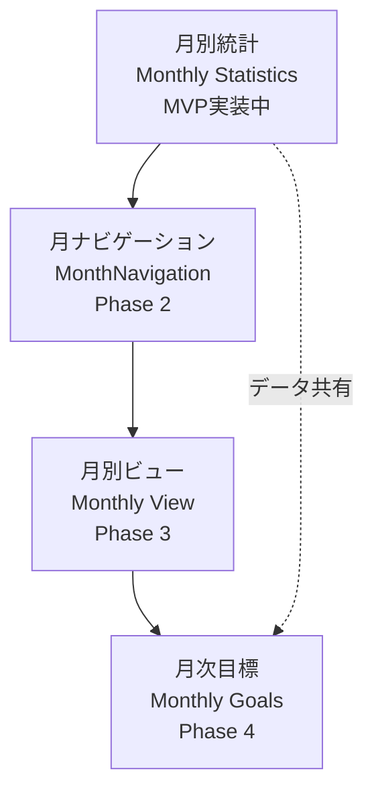

# 月別統計機能 - 統合ロードマップ

**文書番号**: IRM-MS-001
**バージョン**: 1.0.0
**作成日**: 2025-01-18
**ステータス**: Active

## 1. 機能間の統合計画

### 1.1 関連機能の相互依存関係



## 2. Phase別実装計画

### Phase 1: MVP実装（現在）
**期間**: 1-2日
**スコープ**: 月別統計機能の基本実装

#### 実装内容
- [x] 要件定義・設計書作成
- [ ] StatisticsService拡張
- [ ] MonthSelector（簡易版）実装
- [ ] WorkoutStatistics更新
- [ ] 基本テスト

#### 成果物
```
frontend/src/
├── services/
│   └── StatisticsService.js (拡張)
└── components/statistics/
    ├── MonthSelector.jsx (新規)
    └── WorkoutStatistics.jsx (更新)
```

### Phase 2: MonthNavigation統合
**期間**: 1日
**前提条件**: Phase 1完了

#### 統合ポイント
```javascript
// MonthNavigationをWorkoutStatisticsに統合
const WorkoutStatistics = ({ workouts, loading }) => {
  const [currentMonth, setCurrentMonth] = useState(new Date());

  return (
    <>
      <MonthNavigation
        currentDate={currentMonth}
        onDateChange={setCurrentMonth}
      />
      {/* 統計表示 */}
    </>
  );
};
```

#### 影響範囲
- WorkoutHistory.jsx
- Dashboard.jsx
- 月別統計の表示ロジック

### Phase 3: Monthly View実装
**期間**: 2-3日
**前提条件**: Phase 2完了

#### 統合内容
- カレンダービュー実装
- 日別ワークアウト表示
- 月別統計との連携

#### データ共有
```javascript
// 共通の月別データフィルタリング
const useMonthlyWorkouts = (month) => {
  const [workouts] = useWorkouts();

  return useMemo(
    () => filterWorkoutsByMonth(workouts, month),
    [workouts, month]
  );
};
```

### Phase 4: Monthly Goals統合
**期間**: 3-4日
**前提条件**: Phase 3完了、DB拡張

#### 統合要素
- 目標設定UI
- 進捗計算ロジック
- 統計との比較表示

## 3. 既存機能への影響と修正

### 3.1 monthly-view/MonthNavigation.md への追加

```markdown
## 統合仕様

### 月別統計との連携
MonthNavigationコンポーネントは月別統計機能と連携し、
選択された月のデータをリアルタイムで更新する。

#### Props拡張
| プロパティ | 型 | 説明 |
|-----------|-----|------|
| showStatistics | boolean | 統計表示の有効化 |
| onStatsUpdate | (stats) => void | 統計更新コールバック |
```

### 3.2 monthly-goals への依存関係追加

```markdown
## 前提条件
- 月別統計機能（monthly-statistics）の実装完了
- StatisticsServiceの月別フィルタリング機能

## データ連携
月次目標の進捗計算には、月別統計機能の
calculateMonthlyStats()を使用する。
```

## 4. 共通コンポーネント・サービス

### 4.1 共通サービス層
```javascript
// services/MonthlyDataService.js (将来実装)
export class MonthlyDataService {
  // 月別データの共通処理
  static filterByMonth(data, month) { }
  static calculateMonthRange(month) { }
  static formatMonthLabel(month) { }
}
```

### 4.2 共通フック
```javascript
// hooks/useMonthlyData.js (将来実装)
export const useMonthlyData = (initialMonth) => {
  const [currentMonth, setCurrentMonth] = useState(initialMonth);
  const [monthlyData, setMonthlyData] = useState(null);

  // 月別データの取得・更新ロジック
  return { currentMonth, setCurrentMonth, monthlyData };
};
```

## 5. テスト統合戦略

### 5.1 段階的テスト
1. **Phase 1**: 単体テスト中心
2. **Phase 2**: 統合テスト追加
3. **Phase 3**: E2Eテスト実装
4. **Phase 4**: 全機能統合テスト

### 5.2 共通テストユーティリティ
```javascript
// tests/utils/monthlyTestHelpers.js
export const generateMockWorkouts = (month, count) => { };
export const assertMonthlyStats = (stats, expected) => { };
```

## 6. パフォーマンス最適化計画

### 6.1 データキャッシング
```javascript
// Phase 2で実装
const monthlyCache = new Map();

const getCachedMonthlyData = (month) => {
  const key = `${month.getFullYear()}-${month.getMonth()}`;
  return monthlyCache.get(key);
};
```

### 6.2 遅延ロード
- Phase 3: Monthly Viewの遅延ロード
- Phase 4: Goals機能の動的インポート

## 7. マイグレーション戦略

### 7.1 後方互換性の維持
```javascript
// 既存APIとの互換性維持
const calculateWorkoutStats = (workouts, options = {}) => {
  if (options.month) {
    // 新機能: 月別統計
    return calculateMonthlyStats(workouts, options.month);
  }
  // 既存機能: 全期間統計
  return calculateAllTimeStats(workouts);
};
```

### 7.2 段階的移行
1. 既存機能を維持したまま新機能追加
2. ユーザーフィードバック収集
3. 段階的に新UIへ移行

## 8. リスク管理

| リスク | 影響 | 対策 |
|--------|------|------|
| Phase間の依存関係 | 中 | 各Phaseを独立して動作可能に設計 |
| パフォーマンス低下 | 高 | 早期からキャッシング実装 |
| UI/UXの一貫性 | 低 | デザインシステムの活用 |

## 9. 成功指標

### 技術指標
- [ ] 各Phaseの独立動作確認
- [ ] パフォーマンステスト合格（< 100ms）
- [ ] テストカバレッジ > 80%

### ビジネス指標
- [ ] ユーザー満足度向上
- [ ] 月別統計の利用率 > 70%
- [ ] バグ報告率 < 1%

## 10. 次のステップ

### 即実行（MVP）
1. ブランチ作成: `feature/monthly-statistics-comparison`
2. StatisticsService拡張実装
3. MonthSelector実装
4. 動作確認・テスト

### Phase 2準備
1. MonthNavigationコンポーネント設計レビュー
2. 統合ポイントの確認
3. テスト計画策定