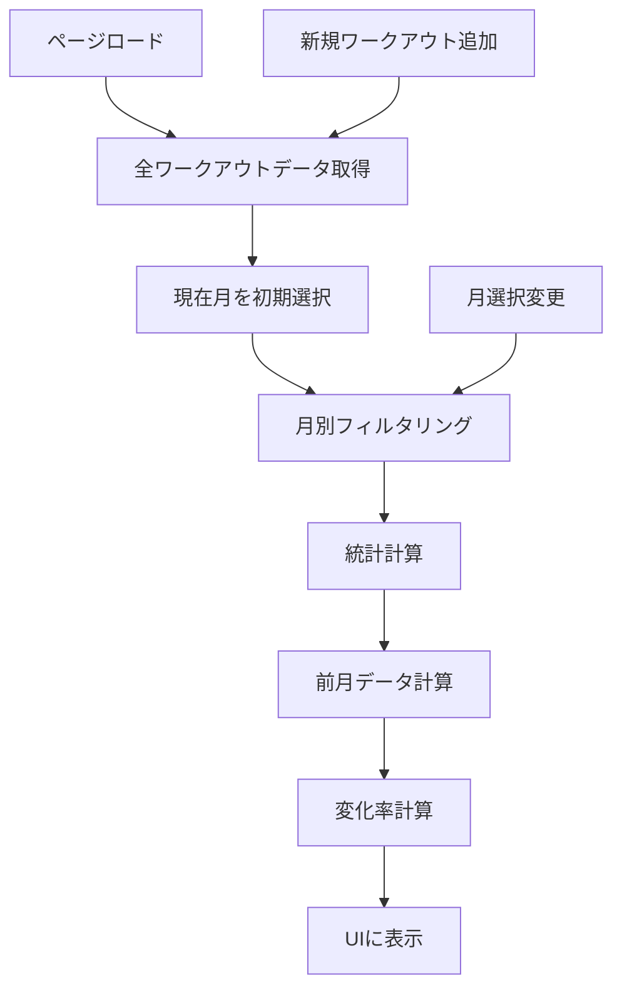

# 月別統計機能 - 機能要件書 (MVP版)

**文書番号**: FRD-MS-001
**バージョン**: 1.0.0
**作成日**: 2025-09-18
**ステータス**: Draft

## 改訂履歴
| バージョン | 日付 | 変更者 | 変更内容 |
|-----------|------|--------|----------|
| 1.0.0 | 2025-01-18 | Team | MVP版初版作成 |

## 1. 機能概要

### 1.1 目的
ユーザーが自身のワークアウト活動を月単位で把握し、過去の実績と比較することで、トレーニングの進捗を定量的に確認できる機能を提供する。

### 1.2 スコープ (MVP版)
- ✅ 月別のワークアウト統計集計
- ✅ 実データに基づく前月比較
- ✅ 特定月（7月、8月）の個別集計表示
- ✅ 統計カードUIの拡張
- ❌ 年間統計（将来実装）
- ❌ カスタム期間設定（将来実装）
- ❌ エクスポート機能（将来実装）

### 1.3 ビジネス価値
- **ユーザーエンゲージメント向上**: 進捗の可視化によりモチベーション維持
- **データドリブンなトレーニング**: 実績に基づく改善点の把握
- **継続性の促進**: 前月との比較による競争心の刺激

## 2. ユーザーストーリー

### US-001: 月別統計の閲覧
**As a** フィットネスアプリユーザー
**I want to** 月単位でワークアウト統計を確認する
**So that** トレーニングの進捗を把握できる

**受け入れ条件**:
- [x] 現在月の統計が表示される
- [x] 総ワークアウト日数、総回数、総距離が確認できる
- [x] 前月との比較が％表示される
- [x] データがない月は「データなし」と表示される

### US-002: 特定月の統計確認
**As a** フィットネスアプリユーザー
**I want to** 7月や8月など特定月の統計を個別に確認する
**So that** 過去の特定期間のパフォーマンスを振り返れる

**受け入れ条件**:
- [x] 月選択UIから特定月を選択できる
- [x] 選択した月の統計が即座に表示される
- [x] 選択月と前月の比較が表示される

### US-003: リアルタイムデータ反映
**As a** フィットネスアプリユーザー
**I want to** 新しいワークアウトを記録したら統計に即反映される
**So that** 常に最新の進捗を確認できる

**受け入れ条件**:
- [x] ワークアウト追加後、統計が自動更新される
- [x] ページリロード不要で反映される

## 3. 機能要件詳細

### 3.1 データ要件

#### 3.1.1 入力データ
```javascript
{
  workouts: [
    {
      id: number,
      date: string (ISO 8601),
      exercise: string,
      exerciseType: 'strength' | 'cardio',
      // strength fields
      sets?: number,
      reps?: number,
      repsDetail?: Array<{reps: number}>,
      // cardio fields
      duration?: number,
      distance?: number
    }
  ]
}
```

#### 3.1.2 集計データ
```javascript
{
  currentMonth: {
    totalDays: number,     // ユニークな日数
    totalReps: number,      // 総回数
    totalDistance: number,  // 総距離（km）
    period: string          // "2025年1月"
  },
  previousMonth: {
    totalDays: number,
    totalReps: number,
    totalDistance: number,
    period: string
  },
  changeRates: {
    daysChangeRate: number,     // %
    repsChangeRate: number,     // %
    distanceChangeRate: number  // %
  }
}
```

### 3.2 ビジネスルール

#### 3.2.1 集計ロジック
- **総ワークアウト日数**: 同日の複数ワークアウトは1日としてカウント
- **総回数**: strength typeのreps合計
- **総距離**: cardio typeのdistance合計（km）
- **変化率計算**: `((現在値 - 前月値) / 前月値) * 100`
- **前月値が0の場合**: 現在値 > 0 なら 100%、それ以外は 0%

#### 3.2.2 月の定義
- 月の境界はユーザーのタイムゾーンに基づく
- 月初は1日 00:00:00、月末は最終日 23:59:59

### 3.3 処理フロー



## 4. 非機能要件

### 4.1 パフォーマンス
- 統計計算は100ms以内に完了
- 月切り替えは即座に反映（< 50ms）
- 1000件のワークアウトデータでも遅延なし

### 4.2 セキュリティ
- ユーザーは自身のデータのみアクセス可能
- JWT認証必須

### 4.3 可用性
- オフライン時はキャッシュデータを表示
- エラー時は適切なフォールバック表示

### 4.4 ユーザビリティ
- モバイルファースト設計
- 直感的な月選択UI
- ローディング状態の明示

## 5. 制約事項
- 既存のStatisticsServiceを拡張（破壊的変更なし）
- Material-UI v5のコンポーネントを使用
- 既存のAPIエンドポイントを活用（新規API追加なし）

## 6. 前提条件
- ワークアウトデータにdate フィールドが存在
- ユーザー認証システムが稼働中
- フロントエンドでの集計処理が許容される

## 7. リスクと対策

| リスク | 影響度 | 発生確率 | 対策 |
|-------|-------|---------|------|
| 大量データでのパフォーマンス低下 | 高 | 低 | ページネーション、仮想スクロール導入 |
| タイムゾーン処理の不整合 | 中 | 中 | Day.jsでの統一処理 |
| 月跨ぎデータの扱い | 低 | 低 | 明確なビジネスルール定義 |

## 8. 成功指標
- [ ] ユーザーの70%が月別統計を定期的に確認
- [ ] ページロード時間 < 1秒
- [ ] バグ報告率 < 1%
- [ ] 前月比較機能の利用率 > 50%

## 9. MVP後の拡張計画
1. **Phase 2**: 年間統計、四半期統計
2. **Phase 3**: カスタム期間設定、CSV/PDFエクスポート
3. **Phase 4**: 目標設定との統合、達成率表示

## 10. 実装優先順位
1. StatisticsServiceの月別フィルタリング機能
2. 簡易月選択UI（タブ or ドロップダウン）
3. 実データによる前月比較
4. 特定月（7月、8月）表示
5. MonthNavigationコンポーネント（将来の拡張性）