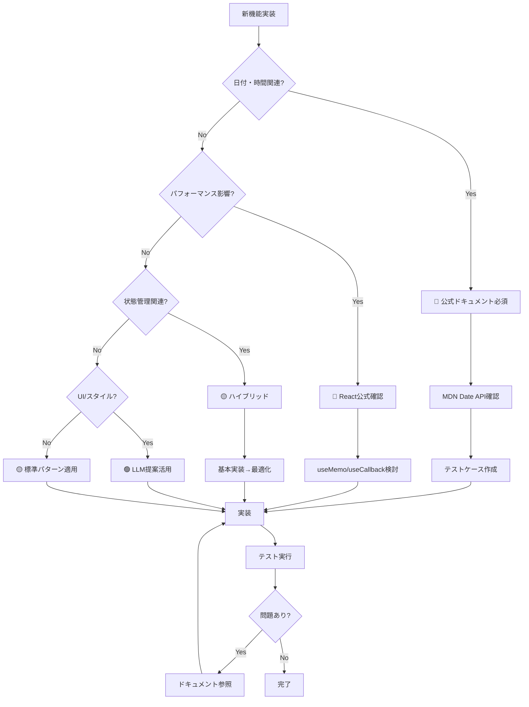

# 月別統計機能 - リスク評価マトリクス

**文書番号**: RAM-MS-001
**バージョン**: 1.0.0
**作成日**: 2025-01-18
**ステータス**: Active

## リスク評価サマリー

| リスクレベル | 項目数 | 対応方針 |
|-------------|--------|----------|
| 🔴 高リスク | 3項目 | ドキュメント深掘り必須 |
| 🟡 中リスク | 4項目 | ハイブリッドアプローチ |
| 🟢 低リスク | 5項目 | LLM提案活用可 |

## 高リスク項目（ドキュメント深掘り必須）

| 項目 | リスク内容 | 影響度 | 対策 | 参照URL |
|------|-----------|--------|------|---------|
| **日付境界処理** | 月末日の計算ミス、タイムゾーンによるズレ | 致命的 | Date APIの仕様確認、テストケース作成 | [MDN Date](https://developer.mozilla.org/en-US/docs/Web/JavaScript/Reference/Global_Objects/Date) |
| **大量データ処理** | 1000件以上でパフォーマンス低下 | 高 | useMemo活用、仮想化検討 | [React Performance](https://react.dev/learn/render-and-commit) |
| **月跨ぎ計算** | 1/31→2月などの特殊ケース | 高 | 明示的な月末日処理 | [Date.setMonth](https://developer.mozilla.org/en-US/docs/Web/JavaScript/Reference/Global_Objects/Date/setMonth) |

### 詳細分析: 日付境界処理

**リスクシナリオ**:
```javascript
// 問題例: 3/31 から前月を計算
const date = new Date('2025-03-31');
date.setMonth(date.getMonth() - 1);
// 期待: 2025-02-28
// 実際: 2025-03-03 (2月31日が3月3日に)
```

**緩和策**:
```javascript
const getPreviousMonth = (date) => {
  const newDate = new Date(date);
  const currentDay = newDate.getDate();

  // 月を変更
  newDate.setMonth(newDate.getMonth() - 1);

  // 日付が変わった場合は月末に調整
  if (newDate.getDate() !== currentDay) {
    newDate.setDate(0); // 前月の最終日
  }

  return newDate;
};
```

## 中リスク項目（ハイブリッドアプローチ）

| 項目 | リスク内容 | 影響度 | 対策 | 実装方針 |
|------|-----------|--------|------|---------|
| **状態管理** | 不要な再レンダリング | 中 | React DevToolsで監視 | LLM提案＋プロファイリング |
| **MUI互換性** | v4→v5の破壊的変更 | 中 | 移行ガイド参照 | 公式ドキュメント＋実装確認 |
| **データ変換** | 型の不整合 | 中 | TypeScript導入検討 | 段階的な型定義追加 |
| **エラー処理** | 例外の未捕捉 | 中 | try-catch、エラーバウンダリ | 標準パターン適用 |

### 詳細分析: 状態管理

**リスクシナリオ**:
- 月選択のたびに全コンポーネントが再レンダリング
- 統計計算が毎回実行される

**緩和策**:
```javascript
// Context分割でパフォーマンス改善
const MonthContext = createContext();
const StatsContext = createContext();

// メモ化で不要な再計算を防止
const stats = useMemo(
  () => expensiveCalculation(data),
  [data] // 依存配列を正確に
);
```

## 低リスク項目（LLM提案活用可）

| 項目 | リスク内容 | 影響度 | 理由 | 検証方法 |
|------|-----------|--------|------|----------|
| **UIレイアウト** | デザイン崩れ | 低 | 視覚的に確認可能 | ブラウザ確認 |
| **定数定義** | 命名規則違反 | 低 | 影響範囲限定的 | ESLint |
| **フォーマット処理** | 表示形式の不統一 | 低 | ロジックに影響なし | 単体テスト |
| **ローディング表示** | UXの低下 | 低 | 非クリティカル | 手動確認 |
| **色・アイコン** | デザイン不整合 | 低 | 機能に影響なし | デザインレビュー |

## リスク発生確率と影響度マトリクス

```
影響度
  ↑
高│ [月跨ぎ計算]     [日付境界処理]
  │                  [大量データ]
  │
中│ [MUI互換性]      [状態管理]
  │ [エラー処理]     [データ変換]
  │
低│ [UI/UX]          [定数定義]
  │ [フォーマット]    [色/アイコン]
  └─────────────────────────────→
    低      中        高    発生確率
```

## 実装判断フローチャート



## リスク軽減アクションプラン

### 即実行（実装前）
1. **日付処理ライブラリの検討**
   - [ ] Day.js導入の是非判断
   - [ ] ネイティブDate APIで十分か評価

2. **テスト環境準備**
   - [ ] 異なるタイムゾーンでのテスト環境
   - [ ] 大量データ生成スクリプト作成

### 実装中の継続的対策
1. **パフォーマンスモニタリング**
   ```javascript
   // React DevTools Profilerの活用
   console.time('monthlyStatsCalculation');
   const stats = calculateMonthlyStats(data);
   console.timeEnd('monthlyStatsCalculation');
   ```

2. **エラー監視**
   ```javascript
   // エラーバウンダリの実装
   class ErrorBoundary extends React.Component {
     componentDidCatch(error, errorInfo) {
       console.error('Statistics Error:', error, errorInfo);
     }
   }
   ```

### 実装後の検証
1. **境界値テスト**
   - [ ] 月末日（28, 29, 30, 31日）
   - [ ] 年跨ぎ（12月→1月）
   - [ ] うるう年（2月29日）

2. **負荷テスト**
   - [ ] 100件のデータ
   - [ ] 1000件のデータ
   - [ ] 10000件のデータ

## 継続的リスク管理

### 週次レビュー項目
- パフォーマンスメトリクス確認
- エラーログ分析
- ユーザーフィードバック収集

### 月次評価
- リスクマトリクスの更新
- 新規リスクの特定
- 緩和策の効果測定

## エスカレーション基準

### 即座にエスカレーション
- 本番環境でのデータ不整合
- パフォーマンス低下（>1秒）
- セキュリティ脆弱性の発見

### 24時間以内に報告
- 中程度のバグ発生
- ユーザビリティ問題
- テスト失敗率>10%

## 参考資料
- [JavaScript Date完全ガイド](https://developer.mozilla.org/en-US/docs/Web/JavaScript/Reference/Global_Objects/Date)
- [React パフォーマンス最適化](https://react.dev/learn/render-and-commit)
- [MUI v5移行ガイド](https://mui.com/material-ui/migration/migration-v4/)