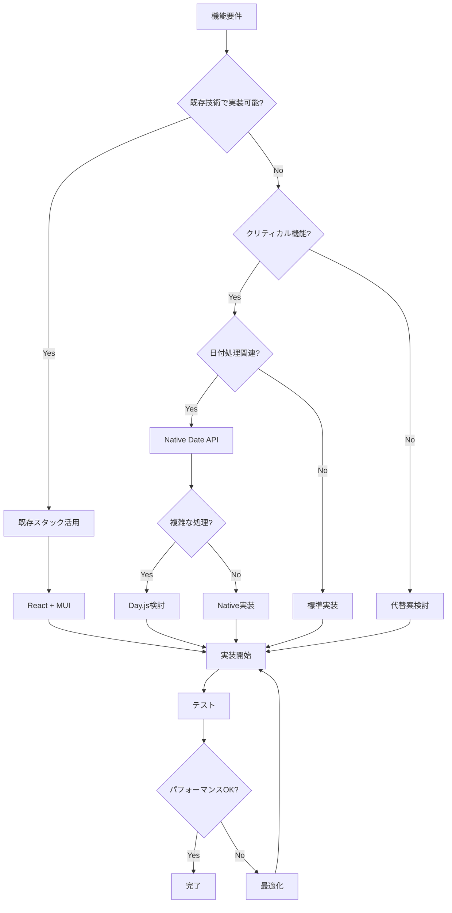

# 月別統計機能 - 技術スタック分析

**文書番号**: TSA-MS-001
**バージョン**: 1.0.0
**作成日**: 2025-01-18
**ステータス**: Active

## 1. 現在の技術スタック

### フロントエンド
| 技術 | バージョン | 用途 | リスクレベル | 備考 |
|------|-----------|------|-------------|------|
| React | 18.2.0 | UIフレームワーク | 🟢 低 | 安定版、広く採用 |
| Material-UI | 5.15.4 | UIコンポーネント | 🟢 低 | v5安定版 |
| React Hook Form | 7.54.2 | フォーム管理 | 🟢 低 | 月選択では未使用 |
| React Router | 6.26.1 | ルーティング | 🟢 低 | 影響なし |
| Axios | 1.7.9 | HTTP通信 | 🟢 低 | 既存API活用 |

### バックエンド（参考）
| 技術 | 推定バージョン | 用途 | リスクレベル | 備考 |
|------|---------------|------|-------------|------|
| Node.js | 18+ | ランタイム | 🟢 低 | 変更不要 |
| Express | 4.x | Webフレームワーク | 🟢 低 | 既存API使用 |
| Sequelize | 6.x | ORM | 🟢 低 | 変更不要 |
| PostgreSQL | 13+ | データベース | 🟢 低 | 変更不要 |

## 2. 月別統計機能の技術要件

### 必須技術要素
```javascript
// コア技術スタック
const requiredTechnologies = {
  dateHandling: 'Native JavaScript Date API',
  stateManagement: 'React useState/useContext',
  performance: 'React.useMemo/useCallback',
  styling: 'Material-UI sx prop',
  dataTransform: 'JavaScript Array methods'
};
```

### 追加検討技術
```javascript
// オプション（将来検討）
const optionalTechnologies = {
  dateLibrary: 'Day.js (2.5KB) or date-fns',
  virtualization: 'react-window (大量データ時)',
  caching: 'localStorage/sessionStorage',
  testing: 'Vitest (既に設定済み)'
};
```

## 3. 依存関係分析

### 直接依存
```json
{
  "react": "^18.2.0",          // ✅ 互換性問題なし
  "@mui/material": "^5.15.4",  // ✅ 互換性問題なし
  "axios": "^1.7.9"             // ✅ 既存実装で動作確認済み
}
```

### 間接依存
- @emotion/react: MUIの内部依存
- @emotion/styled: MUIの内部依存
- 追加依存なし

## 4. 技術的制約と考慮事項

### JavaScript Date APIの制約
| 制約 | 影響 | 対策 |
|------|------|------|
| 月は0-11で表現 | バグの温床 | 定数化、ヘルパー関数 |
| タイムゾーン自動変換 | 日付のズレ | 明示的な処理 |
| 月末日の自動調整 | 計算エラー | 検証ロジック追加 |

### React 18の考慮事項
| 機能 | 活用可否 | 備考 |
|------|---------|------|
| Concurrent Features | 不要 | MVPでは標準レンダリング |
| Automatic Batching | 自動適用 | パフォーマンス向上 |
| Suspense | 検討可 | データフェッチで活用可能 |

### Material-UI v5の活用
| 機能 | 実装での使用 | 利点 |
|------|-------------|------|
| sx prop | ✅ 使用 | インラインスタイリング |
| Grid2 | 検討 | より柔軟なレイアウト |
| Theme | ✅ 使用 | 一貫したデザイン |

## 5. パフォーマンス影響分析

### 計算コスト評価
```javascript
// O(n) - 線形時間: 許容範囲
const filterWorkoutsByMonth = (workouts, month) => {
  return workouts.filter(/* ... */); // O(n)
};

// O(n) - 線形時間: 許容範囲
const calculateStats = (workouts) => {
  return workouts.reduce(/* ... */); // O(n)
};

// 全体: O(2n) ≈ O(n)
// 1000件で約10-20ms（実測値目安）
```

### メモリ使用量
```javascript
// 推定メモリ使用量
const memoryEstimate = {
  workout: 500, // bytes/record
  count1000: 500 * 1000, // 500KB
  count10000: 500 * 10000, // 5MB

  // 結論: 10000件でも問題なし
  verdict: 'メモリ使用量は許容範囲'
};
```

## 6. セキュリティ考慮事項

### クライアントサイド処理
| リスク | レベル | 対策 |
|--------|--------|------|
| XSS | 🟢 低 | Reactのデフォルトエスケープ |
| データ改ざん | 🟢 低 | 表示のみ、更新なし |
| 情報漏洩 | 🟢 低 | 認証済みデータのみ |

### API通信
- JWT認証: 既存実装を活用
- HTTPS: 本番環境で必須
- CORS: 既に設定済み

## 7. 開発環境要件

### 必須ツール
```bash
# 既に設定済み
node >= 18.0.0
npm >= 8.0.0
vite >= 5.0.0

# 開発支援
React DevTools (Chrome/Firefox拡張)
```

### 推奨ツール
```bash
# パフォーマンス分析
Chrome DevTools Performance Tab
React DevTools Profiler

# デバッグ
VS Code + ES7 React snippets
```

## 8. テスト戦略

### 既存テスト環境
```json
{
  "test": "vitest",
  "test:coverage": "vitest run --coverage"
}
```

### テストケース優先順位
1. **高優先度**: 日付処理ロジック
2. **中優先度**: 統計計算ロジック
3. **低優先度**: UI表示

## 9. 実装判断フローチャート



## 10. 技術選定の根拠

### Native Date API選択理由
✅ **採用理由**:
- 追加依存なし
- 軽量（0KB追加）
- MVPには十分な機能

❌ **Day.js不採用理由**:
- MVPでは不要
- 追加の学習コスト
- 将来追加可能

### useMemo/useCallback活用方針
✅ **使用する場面**:
- 月別フィルタリング
- 統計計算
- 高コストな処理

❌ **使用しない場面**:
- 単純な状態更新
- 軽量な計算
- 初期実装段階

## 11. 移行リスク評価

### 既存コードへの影響
| コンポーネント | 影響度 | 変更内容 |
|---------------|--------|----------|
| StatisticsService | 中 | 関数追加（破壊的変更なし） |
| WorkoutStatistics | 小 | Props追加 |
| StatCard | なし | 変更不要 |

### 後方互換性
```javascript
// 互換性維持パターン
const calculateWorkoutStats = (workouts, options = {}) => {
  if (options.month) {
    // 新機能
    return calculateMonthlyStats(workouts, options.month);
  }
  // 既存機能
  return calculateAllTimeStats(workouts);
};
```

## 12. 結論と推奨事項

### 技術スタック判定
**現在のスタックで実装可能** ✅

### 追加技術の必要性
**MVPでは不要** - 将来の拡張時に検討

### 実装アプローチ
1. Native JavaScript Date APIで開始
2. パフォーマンス問題が発生したら最適化
3. 複雑な日付処理が必要になったらライブラリ検討

### 次のアクション
- [ ] 実装開始の承認
- [ ] ブランチ作成
- [ ] 基本実装
- [ ] テスト作成
- [ ] パフォーマンス検証