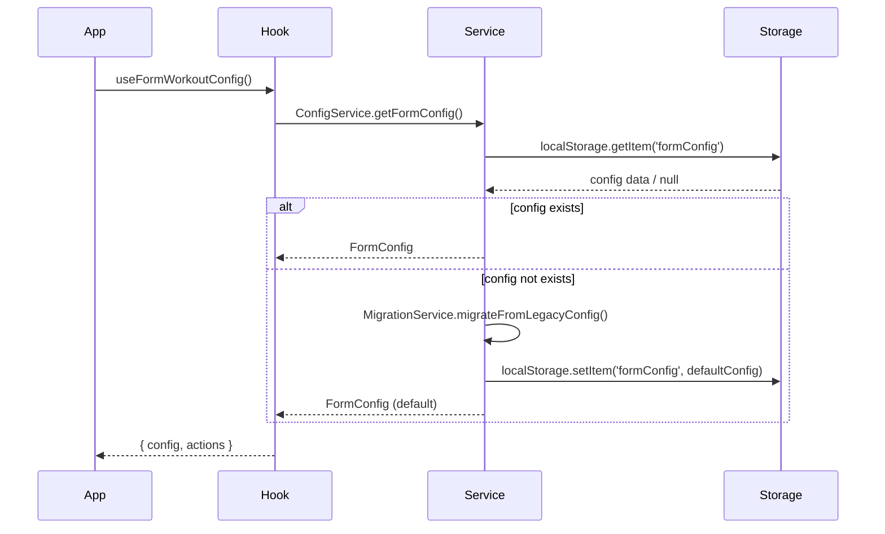
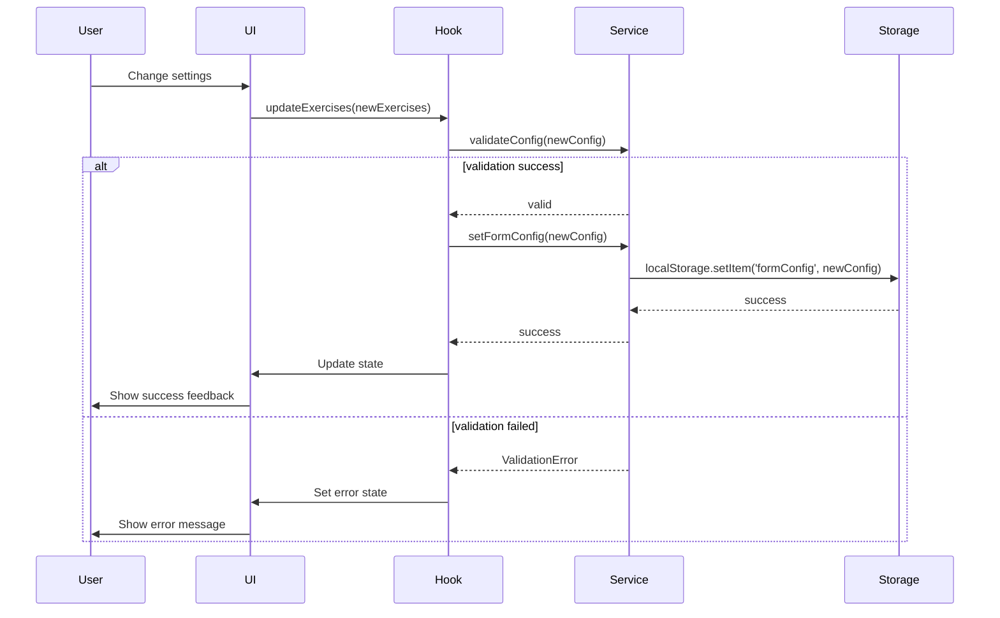

# ワークアウト設定分離機能 - コンポーネント設計書

**文書番号**: CAD-WS-001
**バージョン**: 1.0.0
**作成日**: 2025-01-16
**ステータス**: Draft

## 1. アーキテクチャ概要

### 1.1 設計原則
- **単一責任の原則**: 各コンポーネントは単一の責務を持つ
- **疎結合**: フォーム設定と履歴設定は独立して動作
- **高凝集**: 関連する機能は同一モジュールに集約
- **DRY原則**: 共通ロジックは再利用可能な形で実装

### 1.2 レイヤー構造
```
┌─────────────────────────────────────────┐
│         Presentation Layer              │
│   (WorkoutForm / WorkoutHistory)        │
├─────────────────────────────────────────┤
│         Custom Hooks Layer              │
│ (useFormWorkoutConfig/useHistoryConfig) │
├─────────────────────────────────────────┤
│         Service Layer                   │
│    (ConfigService / MigrationService)   │
├─────────────────────────────────────────┤
│         Storage Layer                   │
│         (LocalStorage API)              │
└─────────────────────────────────────────┘
```

## 2. コンポーネント階層

```
src/
├── components/
│   ├── WorkoutForm/
│   │   ├── WorkoutForm.jsx
│   │   ├── FormCustomizationDrawer.jsx
│   │   └── FormExerciseSelector.jsx
│   ├── WorkoutHistory/
│   │   ├── WorkoutHistory.jsx
│   │   ├── HistoryCustomizationDrawer.jsx
│   │   └── HistoryFilterPanel.jsx
│   └── shared/
│       ├── ExerciseList.jsx
│       ├── ConfigSyncDialog.jsx
│       └── PresetSelector.jsx
├── hooks/
│   ├── useFormWorkoutConfig.js
│   ├── useHistoryWorkoutConfig.js
│   ├── useConfigSync.js
│   └── useConfigMigration.js
├── services/
│   ├── configService.js
│   ├── migrationService.js
│   └── validationService.js
└── utils/
    ├── configDefaults.js
    └── configValidators.js
```

## 3. コンポーネント詳細設計

### 3.1 FormCustomizationDrawer
**責務**: ワークアウトフォーム専用の設定UI提供

**Props**:
```typescript
interface FormCustomizationDrawerProps {
  open: boolean;
  onClose: () => void;
  config: FormConfig;
  onConfigUpdate: (config: FormConfig) => void;
  onSyncRequest?: (direction: 'toHistory' | 'fromHistory') => void;
}
```

**状態管理**:
```typescript
const [tempConfig, setTempConfig] = useState<FormConfig>(config);
const [validationErrors, setValidationErrors] = useState<ValidationError[]>([]);
const [isDirty, setIsDirty] = useState(false);
```

**主要メソッド**:
- `handleExerciseToggle(exercise: string): void`
- `handleMaxSetsChange(sets: number): void`
- `handlePresetApply(preset: PresetConfig): void`
- `validateAndSave(): Promise<void>`

### 3.2 HistoryCustomizationDrawer
**責務**: ワークアウト履歴専用の設定UI提供

**Props**:
```typescript
interface HistoryCustomizationDrawerProps {
  open: boolean;
  onClose: () => void;
  config: HistoryConfig;
  onConfigUpdate: (config: HistoryConfig) => void;
  onSyncRequest?: (direction: 'toForm' | 'fromForm') => void;
}
```

**追加機能**:
- 表示カラムの選択
- ソート順の設定
- 日付範囲フィルター設定

### 3.3 ConfigSyncDialog
**責務**: 設定同期の確認と実行

**Props**:
```typescript
interface ConfigSyncDialogProps {
  open: boolean;
  onClose: () => void;
  syncDirection: 'formToHistory' | 'historyToForm';
  sourceConfig: WorkoutConfig;
  targetConfig: WorkoutConfig;
  onConfirm: () => void;
}
```

**UI要素**:
- 変更内容のプレビュー
- 影響を受ける項目のハイライト
- 確認/キャンセルボタン

## 4. Custom Hooks設計

### 4.1 useFormWorkoutConfig
```typescript
interface UseFormWorkoutConfigReturn {
  // State
  config: FormConfig;
  isLoading: boolean;
  error: Error | null;

  // Actions
  updateExercises: (exercises: string[]) => void;
  updateMaxSets: (sets: number) => void;
  applyPreset: (presetKey: string) => void;
  resetToDefault: () => void;

  // Utilities
  isCardioExercise: (exercise: string) => boolean;
  isStrengthExercise: (exercise: string) => boolean;
  getAvailableExercises: () => Exercise[];
}
```

### 4.2 useHistoryWorkoutConfig
```typescript
interface UseHistoryWorkoutConfigReturn {
  // State
  config: HistoryConfig;
  isLoading: boolean;
  error: Error | null;

  // Actions
  updateExercises: (exercises: string[]) => void;
  updateDisplayColumns: (columns: string[]) => void;
  updateSortOrder: (order: 'asc' | 'desc') => void;
  updateDateRange: (range: DateRange) => void;

  // Utilities
  getFilteredExercises: () => Exercise[];
  getDisplaySettings: () => DisplaySettings;
}
```

### 4.3 useConfigSync
```typescript
interface UseConfigSyncReturn {
  syncFormToHistory: () => Promise<void>;
  syncHistoryToForm: () => Promise<void>;
  isSyncing: boolean;
  lastSyncTimestamp: Date | null;
  syncError: Error | null;
}
```

## 5. Service Layer設計

### 5.1 ConfigService
```typescript
class ConfigService {
  // 基本CRUD操作
  static getFormConfig(): FormConfig;
  static setFormConfig(config: FormConfig): void;
  static getHistoryConfig(): HistoryConfig;
  static setHistoryConfig(config: HistoryConfig): void;

  // バリデーション
  static validateConfig(config: WorkoutConfig): ValidationResult;

  // バックアップ/リストア
  static backupConfigs(): ConfigBackup;
  static restoreConfigs(backup: ConfigBackup): void;

  // エクスポート/インポート
  static exportConfig(type: 'form' | 'history'): string;
  static importConfig(data: string, type: 'form' | 'history'): void;
}
```

### 5.2 MigrationService
```typescript
class MigrationService {
  // 旧設定からの移行
  static migrateFromLegacyConfig(): void;

  // バージョン間の移行
  static migrateConfig(config: any, fromVersion: string, toVersion: string): WorkoutConfig;

  // 初期設定の生成
  static generateInitialConfigs(): { form: FormConfig; history: HistoryConfig };

  // データ整合性チェック
  static checkDataIntegrity(): IntegrityCheckResult;
}
```

## 6. 状態管理フロー

### 6.1 初期化シーケンス


### 6.2 設定更新シーケンス


## 7. エラーハンドリング

### 7.1 エラータイプ
```typescript
enum ConfigErrorType {
  VALIDATION_ERROR = 'VALIDATION_ERROR',
  STORAGE_ERROR = 'STORAGE_ERROR',
  MIGRATION_ERROR = 'MIGRATION_ERROR',
  SYNC_ERROR = 'SYNC_ERROR',
}

interface ConfigError {
  type: ConfigErrorType;
  message: string;
  details?: any;
  recoverable: boolean;
}
```

### 7.2 エラー処理戦略
- **バリデーションエラー**: UIにエラーメッセージ表示
- **ストレージエラー**: メモリ内フォールバック
- **移行エラー**: デフォルト設定へのフォールバック
- **同期エラー**: リトライ機能の提供

## 8. パフォーマンス最適化

### 8.1 メモ化戦略
```typescript
// 設定のメモ化
const memoizedConfig = useMemo(() =>
  processConfig(rawConfig), [rawConfig]
);

// 派生データのメモ化
const availableExercises = useMemo(() =>
  filterAvailableExercises(allExercises, selectedExercises),
  [allExercises, selectedExercises]
);
```

### 8.2 遅延読み込み
```typescript
// カスタマイゼーションドロワーの遅延読み込み
const FormCustomizationDrawer = lazy(() =>
  import('./FormCustomizationDrawer')
);
```

### 8.3 デバウンス処理
```typescript
// 設定保存のデバウンス
const debouncedSave = useMemo(
  () => debounce(saveConfig, 500),
  []
);
```

## 9. テスト戦略

### 9.1 単体テスト対象
- 各Custom Hook
- Service層の各メソッド
- バリデーションロジック
- ユーティリティ関数

### 9.2 統合テスト対象
- 設定の読み込み/保存フロー
- 設定同期機能
- データ移行プロセス
- エラーハンドリング

### 9.3 E2Eテストシナリオ
1. 新規ユーザーの初期設定
2. フォーム設定の変更と保存
3. 履歴設定の変更と保存
4. 設定の同期実行
5. 旧データからの移行

## 10. 今後の拡張性

### 10.1 計画されている機能
- クラウド同期
- 設定のバージョン管理
- チーム設定の共有
- AI による設定最適化提案

### 10.2 拡張ポイント
- プラグインアーキテクチャによる機能追加
- 設定のテンプレート機能
- A/Bテスト用の設定切り替え
- 多言語対応