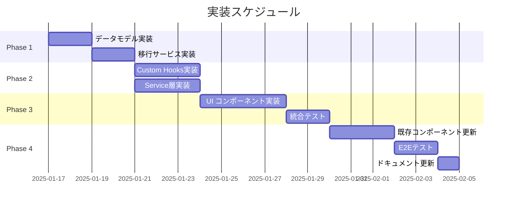

# ワークアウト設定分離機能 - 実装アプローチガイド

**文書番号**: IAG-WS-001
**バージョン**: 1.0.0
**作成日**: 2025-01-16
**ステータス**: Draft

## 1. 実装概要

### 1.1 実装方針
- **段階的移行**: 既存機能を維持しながら新機能を追加
- **非破壊的変更**: 既存データとAPIの互換性を保つ
- **テスト駆動開発**: 各段階でテストを実装
- **フィーチャーフラグ**: 段階的なロールアウトを可能に

### 1.2 実装フェーズ



## 2. Phase 1: 基盤実装 (2-3日)

### 2.1 データモデル実装

#### Step 1: 型定義の作成
`frontend/src/types/config.ts`
```typescript
export interface FormConfig {
  version: string;
  exercises: string[];
  maxSets: number;
  defaultIntensity: 'light' | 'medium' | 'heavy';
  quickInputMode: boolean;
  autoFocus: boolean;
  showTimer: boolean;
  metadata: ConfigMetadata;
}

export interface HistoryConfig {
  version: string;
  exercises: string[];
  maxSets: number;
  displayColumns: DisplayColumn[];
  sortOrder: 'asc' | 'desc';
  dateRange: DateRange;
  groupBy: GroupBy;
  showStatistics: boolean;
  chartType: ChartType;
  metadata: ConfigMetadata;
}

interface ConfigMetadata {
  createdAt: string;
  updatedAt: string;
  lastSyncedAt?: string;
}
```

#### Step 2: デフォルト値の定義
`frontend/src/constants/configDefaults.ts`
```typescript
export const DEFAULT_FORM_CONFIG: FormConfig = {
  version: '1.0.0',
  exercises: ['プッシュアップ', 'スクワット', 'ランニング'],
  maxSets: 3,
  defaultIntensity: 'medium',
  quickInputMode: false,
  autoFocus: true,
  showTimer: false,
  metadata: {
    createdAt: new Date().toISOString(),
    updatedAt: new Date().toISOString()
  }
};

export const DEFAULT_HISTORY_CONFIG: HistoryConfig = {
  // 同様に定義
};
```

### 2.2 移行サービス実装

#### Step 1: MigrationServiceクラスの作成
`frontend/src/services/migrationService.ts`
```typescript
export class MigrationService {
  private static readonly MIGRATION_FLAG = 'fittrack.migration.completed';
  private static readonly LEGACY_KEY = 'workoutConfig';

  static async performMigration(): Promise<void> {
    if (this.isMigrationCompleted()) {
      console.log('Migration already completed');
      return;
    }

    try {
      const legacyConfig = this.readLegacyConfig();

      if (legacyConfig) {
        await this.migrateLegacyConfig(legacyConfig);
      } else {
        await this.createInitialConfigs();
      }

      this.markMigrationComplete();
      console.log('Migration completed successfully');
    } catch (error) {
      console.error('Migration failed:', error);
      throw new MigrationError('Failed to migrate configuration', error);
    }
  }

  private static migrateLegacyConfig(legacy: any): void {
    const formConfig = this.transformToFormConfig(legacy);
    const historyConfig = this.transformToHistoryConfig(legacy);

    ConfigService.saveFormConfig(formConfig);
    ConfigService.saveHistoryConfig(historyConfig);

    // バックアップ作成
    this.backupLegacyConfig(legacy);
  }
}
```

#### Step 2: テストの実装
`frontend/src/services/__tests__/migrationService.test.ts`
```typescript
describe('MigrationService', () => {
  beforeEach(() => {
    localStorage.clear();
  });

  it('should migrate legacy config to new format', async () => {
    const legacyConfig = {
      exercises: ['プッシュアップ', 'スクワット'],
      maxSets: 3
    };

    localStorage.setItem('workoutConfig', JSON.stringify(legacyConfig));

    await MigrationService.performMigration();

    const formConfig = ConfigService.getFormConfig();
    expect(formConfig.exercises).toEqual(legacyConfig.exercises);
    expect(formConfig.maxSets).toBe(legacyConfig.maxSets);
  });
});
```

## 3. Phase 2: ビジネスロジック実装 (3-4日)

### 3.1 Custom Hooks実装

#### Step 1: useFormWorkoutConfigフック
`frontend/src/hooks/useFormWorkoutConfig.js`
```javascript
import { useState, useEffect, useCallback, useMemo } from 'react';
import { ConfigService } from '../services/configService';
import { DEFAULT_FORM_CONFIG } from '../constants/configDefaults';

export const useFormWorkoutConfig = () => {
  const [config, setConfig] = useState(DEFAULT_FORM_CONFIG);
  const [isLoading, setIsLoading] = useState(true);
  const [error, setError] = useState(null);

  // 初期化
  useEffect(() => {
    const initConfig = async () => {
      try {
        setIsLoading(true);

        // 移行チェック
        await MigrationService.performMigration();

        // 設定読み込み
        const savedConfig = ConfigService.getFormConfig();
        if (savedConfig) {
          setConfig(savedConfig);
        }
      } catch (err) {
        setError(err);
        console.error('Failed to initialize form config:', err);
      } finally {
        setIsLoading(false);
      }
    };

    initConfig();
  }, []);

  // 種目更新
  const updateExercises = useCallback((exercises) => {
    try {
      const newConfig = {
        ...config,
        exercises,
        metadata: {
          ...config.metadata,
          updatedAt: new Date().toISOString()
        }
      };

      ConfigService.saveFormConfig(newConfig);
      setConfig(newConfig);
    } catch (err) {
      setError(err);
      console.error('Failed to update exercises:', err);
    }
  }, [config]);

  // セット数更新
  const updateMaxSets = useCallback((maxSets) => {
    // 同様に実装
  }, [config]);

  return {
    config,
    isLoading,
    error,
    updateExercises,
    updateMaxSets,
    // その他のメソッド
  };
};
```

#### Step 2: useHistoryWorkoutConfigフック
`frontend/src/hooks/useHistoryWorkoutConfig.js`
```javascript
// useFormWorkoutConfigと同様の構造で実装
export const useHistoryWorkoutConfig = () => {
  // 履歴固有の機能を追加
  const updateDisplayColumns = useCallback((columns) => {
    // 実装
  }, [config]);

  const updateDateRange = useCallback((range) => {
    // 実装
  }, [config]);

  // ...
};
```

### 3.2 ConfigServiceクラスの実装

`frontend/src/services/configService.ts`
```typescript
export class ConfigService {
  private static readonly FORM_KEY = 'fittrack.config.form';
  private static readonly HISTORY_KEY = 'fittrack.config.history';

  // フォーム設定
  static getFormConfig(): FormConfig | null {
    return this.getConfig<FormConfig>(this.FORM_KEY);
  }

  static saveFormConfig(config: FormConfig): void {
    this.saveConfig(this.FORM_KEY, config);
  }

  // 履歴設定
  static getHistoryConfig(): HistoryConfig | null {
    return this.getConfig<HistoryConfig>(this.HISTORY_KEY);
  }

  static saveHistoryConfig(config: HistoryConfig): void {
    this.saveConfig(this.HISTORY_KEY, config);
  }

  // 共通メソッド
  private static getConfig<T>(key: string): T | null {
    try {
      const data = localStorage.getItem(key);
      if (!data) return null;

      const config = JSON.parse(data);

      // バリデーション
      if (!this.validateConfig(config)) {
        console.error('Invalid config format');
        return null;
      }

      return config;
    } catch (error) {
      console.error(`Failed to read config: ${key}`, error);
      return null;
    }
  }

  private static saveConfig<T>(key: string, config: T): void {
    try {
      // バックアップ作成
      this.createBackup(key);

      // 保存
      localStorage.setItem(key, JSON.stringify(config));
    } catch (error) {
      console.error(`Failed to save config: ${key}`, error);
      throw error;
    }
  }
}
```

## 4. Phase 3: UIコンポーネント実装 (4-5日)

### 4.1 FormCustomizationDrawer

`frontend/src/components/WorkoutForm/FormCustomizationDrawer.jsx`
```javascript
import { useState, useEffect } from 'react';
import {
  Drawer,
  Box,
  Typography,
  List,
  ListItem,
  ListItemText,
  ListItemIcon,
  Checkbox,
  Button,
  Divider,
  Slider
} from '@mui/material';

const FormCustomizationDrawer = ({
  open,
  onClose,
  config,
  onConfigUpdate,
  onSyncRequest
}) => {
  const [tempConfig, setTempConfig] = useState(config);
  const [hasChanges, setHasChanges] = useState(false);

  useEffect(() => {
    setTempConfig(config);
    setHasChanges(false);
  }, [config]);

  const handleExerciseToggle = (exercise) => {
    const newExercises = tempConfig.exercises.includes(exercise)
      ? tempConfig.exercises.filter(e => e !== exercise)
      : [...tempConfig.exercises, exercise];

    setTempConfig({
      ...tempConfig,
      exercises: newExercises
    });
    setHasChanges(true);
  };

  const handleSave = () => {
    onConfigUpdate(tempConfig);
    setHasChanges(false);
    onClose();
  };

  return (
    <Drawer anchor="right" open={open} onClose={onClose}>
      <Box sx={{ width: 400, p: 3 }}>
        <Typography variant="h6">フォーム設定</Typography>

        {/* 種目選択セクション */}
        <Box sx={{ mt: 3 }}>
          <Typography variant="subtitle1">入力する種目</Typography>
          <List>
            {availableExercises.map((exercise) => (
              <ListItem key={exercise} button onClick={() => handleExerciseToggle(exercise)}>
                <ListItemIcon>
                  <Checkbox checked={tempConfig.exercises.includes(exercise)} />
                </ListItemIcon>
                <ListItemText primary={exercise} />
              </ListItem>
            ))}
          </List>
        </Box>

        <Divider sx={{ my: 2 }} />

        {/* セット数設定 */}
        <Box sx={{ mt: 3 }}>
          <Typography variant="subtitle1">最大セット数: {tempConfig.maxSets}</Typography>
          <Slider
            value={tempConfig.maxSets}
            onChange={(e, value) => {
              setTempConfig({ ...tempConfig, maxSets: value });
              setHasChanges(true);
            }}
            min={1}
            max={10}
            marks
          />
        </Box>

        {/* 同期オプション */}
        <Box sx={{ mt: 3 }}>
          <Button
            variant="outlined"
            fullWidth
            onClick={() => onSyncRequest('toHistory')}
          >
            この設定を履歴画面にも適用
          </Button>
        </Box>

        {/* アクションボタン */}
        <Box sx={{ mt: 4, display: 'flex', gap: 1 }}>
          <Button variant="outlined" onClick={onClose}>
            キャンセル
          </Button>
          <Button
            variant="contained"
            onClick={handleSave}
            disabled={!hasChanges}
          >
            保存
          </Button>
        </Box>
      </Box>
    </Drawer>
  );
};

export default FormCustomizationDrawer;
```

### 4.2 ConfigSyncDialog

`frontend/src/components/shared/ConfigSyncDialog.jsx`
```javascript
const ConfigSyncDialog = ({
  open,
  onClose,
  syncDirection,
  sourceConfig,
  targetConfig,
  onConfirm
}) => {
  const getDifferences = () => {
    // 設定の差分を計算
    const diffs = [];

    if (sourceConfig.exercises.length !== targetConfig.exercises.length) {
      diffs.push(`種目数: ${targetConfig.exercises.length} → ${sourceConfig.exercises.length}`);
    }

    if (sourceConfig.maxSets !== targetConfig.maxSets) {
      diffs.push(`セット数: ${targetConfig.maxSets} → ${sourceConfig.maxSets}`);
    }

    return diffs;
  };

  return (
    <Dialog open={open} onClose={onClose}>
      <DialogTitle>設定の同期</DialogTitle>
      <DialogContent>
        <Typography>
          {syncDirection === 'formToHistory'
            ? 'フォーム設定を履歴画面に適用しますか？'
            : '履歴設定をフォーム画面に適用しますか？'}
        </Typography>

        <Box sx={{ mt: 2 }}>
          <Typography variant="subtitle2">変更内容:</Typography>
          <List dense>
            {getDifferences().map((diff, index) => (
              <ListItem key={index}>
                <ListItemText primary={diff} />
              </ListItem>
            ))}
          </List>
        </Box>
      </DialogContent>
      <DialogActions>
        <Button onClick={onClose}>キャンセル</Button>
        <Button onClick={onConfirm} variant="contained">
          同期を実行
        </Button>
      </DialogActions>
    </Dialog>
  );
};
```

## 5. Phase 4: 統合と移行 (3-4日)

### 5.1 既存コンポーネントの更新

#### Step 1: WorkoutFormの更新
```javascript
// Before
import useWorkoutConfig from '../hooks/useWorkoutConfig';

// After
import { useFormWorkoutConfig } from '../hooks/useFormWorkoutConfig';

const WorkoutForm = () => {
  // 旧実装をコメントアウト
  // const { workoutConfig } = useWorkoutConfig();

  // 新実装
  const {
    config,
    updateExercises,
    updateMaxSets
  } = useFormWorkoutConfig();

  // カスタマイゼーションドロワーの追加
  const [drawerOpen, setDrawerOpen] = useState(false);

  return (
    <>
      {/* 既存のフォームUI */}

      {/* 設定ボタンの追加 */}
      <IconButton onClick={() => setDrawerOpen(true)}>
        <SettingsIcon />
      </IconButton>

      {/* カスタマイゼーションドロワー */}
      <FormCustomizationDrawer
        open={drawerOpen}
        onClose={() => setDrawerOpen(false)}
        config={config}
        onConfigUpdate={updateExercises}
      />
    </>
  );
};
```

#### Step 2: WorkoutHistoryの更新
```javascript
// 同様にuseHistoryWorkoutConfigに移行
```

### 5.2 フィーチャーフラグの実装

`frontend/src/features/featureFlags.js`
```javascript
export const FeatureFlags = {
  SEPARATE_CONFIGS: process.env.REACT_APP_SEPARATE_CONFIGS === 'true',
};

// 使用例
const WorkoutForm = () => {
  const config = FeatureFlags.SEPARATE_CONFIGS
    ? useFormWorkoutConfig()
    : useWorkoutConfig();

  // ...
};
```

## 6. テスト戦略

### 6.1 単体テスト

```bash
# 実行するテスト
npm test -- --coverage

# カバレッジ目標
- Services: 90%以上
- Hooks: 85%以上
- Components: 80%以上
- Utils: 95%以上
```

### 6.2 統合テスト

```javascript
describe('Config Migration Integration', () => {
  it('should migrate legacy config correctly', async () => {
    // セットアップ
    setupLegacyConfig();

    // 実行
    await MigrationService.performMigration();

    // 検証
    const formConfig = ConfigService.getFormConfig();
    const historyConfig = ConfigService.getHistoryConfig();

    expect(formConfig).toBeDefined();
    expect(historyConfig).toBeDefined();
  });
});
```

### 6.3 E2Eテスト

```javascript
describe('Workout Config Separation E2E', () => {
  it('should allow independent configuration', () => {
    cy.visit('/workout');

    // フォーム設定を変更
    cy.get('[data-testid="form-settings"]').click();
    cy.get('[data-testid="exercise-pushup"]').uncheck();
    cy.get('[data-testid="save-config"]').click();

    // 履歴画面に移動
    cy.visit('/history');

    // 履歴設定が影響を受けていないことを確認
    cy.get('[data-testid="history-exercise-list"]')
      .should('contain', 'プッシュアップ');
  });
});
```

## 7. デプロイメント手順

### 7.1 段階的ロールアウト

```javascript
// Phase 1: 開発環境でテスト (1週間)
REACT_APP_SEPARATE_CONFIGS=true

// Phase 2: ステージング環境でテスト (1週間)
// 選択したユーザーグループのみ有効化

// Phase 3: 本番環境に段階的展開
// 10% → 50% → 100%
```

### 7.2 ロールバック手順

```bash
# 問題が発生した場合
1. フィーチャーフラグを無効化
   REACT_APP_SEPARATE_CONFIGS=false

2. 旧設定にフォールバック
   MigrationService.rollbackToLegacy()

3. エラーログの収集と分析
   npm run analyze:errors
```

## 8. 監視とメトリクス

### 8.1 監視項目

```javascript
// パフォーマンスメトリクス
const metrics = {
  configLoadTime: 0,
  configSaveTime: 0,
  migrationTime: 0,
  errorRate: 0
};

// エラートラッキング
window.addEventListener('error', (event) => {
  if (event.error?.name === 'ConfigError') {
    trackError({
      type: 'CONFIG_ERROR',
      message: event.error.message,
      stack: event.error.stack
    });
  }
});
```

### 8.2 成功指標の測定

```javascript
// ユーザー行動の追跡
const trackConfigUsage = () => {
  analytics.track('config_updated', {
    type: 'form', // or 'history'
    exercises_count: config.exercises.length,
    max_sets: config.maxSets
  });
};
```

## 9. トラブルシューティング

### 9.1 よくある問題と解決方法

| 問題 | 原因 | 解決方法 |
|-----|------|---------|
| 設定が保存されない | LocalStorage容量不足 | 古いデータをクリア |
| 移行が失敗する | データ形式不正 | デフォルト値で初期化 |
| 同期が機能しない | 設定の不整合 | 設定をリセット |

### 9.2 デバッグツール

```javascript
// コンソールコマンド
window.fittrack = {
  // 設定を確認
  getConfigs: () => ({
    form: ConfigService.getFormConfig(),
    history: ConfigService.getHistoryConfig()
  }),

  // 設定をリセット
  resetConfigs: () => {
    ConfigService.resetToDefaults();
  },

  // 移行状態を確認
  getMigrationStatus: () => {
    return MigrationService.getStatus();
  }
};
```

## 10. ドキュメント更新

### 10.1 更新が必要なドキュメント

- [ ] README.md - 新機能の説明追加
- [ ] CHANGELOG.md - 変更内容の記録
- [ ] API仕様書 - 新しいデータ構造の説明
- [ ] ユーザーガイド - 操作方法の説明
- [ ] 開発者ガイド - 実装詳細の説明

### 10.2 コメントとJSDoc

```javascript
/**
 * ワークアウトフォーム専用の設定管理フック
 *
 * @returns {Object} 設定オブジェクトと更新メソッド
 * @example
 * const { config, updateExercises } = useFormWorkoutConfig();
 * updateExercises(['プッシュアップ', 'スクワット']);
 */
export const useFormWorkoutConfig = () => {
  // 実装
};
```