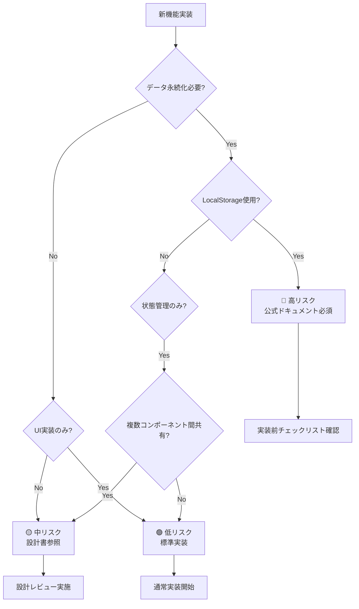

# ワークアウト設定分離機能 - リスク評価マトリクス

**文書番号**: RAM-WS-001
**バージョン**: 1.0.0
**作成日**: 2025-09-16
**ステータス**: Draft

## 1. リスク評価サマリー

### リスクレベル分類
- 🔴 **高リスク**: 公式ドキュメント必須参照、慎重な実装が必要
- 🟡 **中リスク**: ハイブリッドアプローチ、部分的にドキュメント参照
- 🟢 **低リスク**: 標準的な実装パターンで対応可能

## 2. 高リスク領域（公式ドキュメント深掘り必須）

| 項目 | リスク | 影響度 | 対策 | 参照URL |
|------|--------|--------|------|---------|
| **LocalStorage容量超過** | 5-10MB制限を超過するとデータ保存失敗 | 高 | 容量チェック実装、データ圧縮 | [MDN Web Storage API](https://developer.mozilla.org/en-US/docs/Web/API/Web_Storage_API/Using_the_Web_Storage_API#storage_limit) |
| **プライベートブラウジング** | LocalStorage使用不可でアプリ動作不能 | 高 | フォールバック実装必須 | [MDN Storage quotas and eviction criteria](https://developer.mozilla.org/en-US/docs/Web/API/Storage_API/Storage_quotas_and_eviction_criteria) |
| **データ競合状態** | 複数タブでの同時編集による不整合 | 高 | StorageEventリスナー実装 | [MDN StorageEvent](https://developer.mozilla.org/en-US/docs/Web/API/StorageEvent) |
| **XSS脆弱性** | 悪意あるスクリプト実行リスク | 高 | 入力値サニタイゼーション | [React Security](https://legacy.reactjs.org/docs/introducing-jsx.html#jsx-prevents-injection-attacks) |

### 実装チェックリスト（高リスク項目）

```javascript
// ⚠️ STOP: LocalStorage操作前に必ず確認

// 1. 容量チェック
function checkStorageQuota() {
  if ('storage' in navigator && 'estimate' in navigator.storage) {
    return navigator.storage.estimate().then(({usage, quota}) => {
      const percentUsed = (usage / quota) * 100;
      if (percentUsed > 90) {
        console.warn(`Storage usage: ${percentUsed.toFixed(2)}%`);
      }
      return percentUsed < 95; // 95%未満なら安全
    });
  }
  return Promise.resolve(true); // API未対応の場合は続行
}

// 2. プライベートブラウジング検出
function isStorageAvailable() {
  try {
    const test = '__storage_test__';
    localStorage.setItem(test, test);
    localStorage.removeItem(test);
    return true;
  } catch (e) {
    return false;
  }
}

// 3. 複数タブ同期
window.addEventListener('storage', (e) => {
  if (e.key === 'fittrack.config.form' && e.newValue) {
    // 他のタブで変更された設定を反映
    const newConfig = JSON.parse(e.newValue);
    updateLocalState(newConfig);
  }
});
```

## 3. 中リスク領域（ハイブリッドアプローチ）

| 項目 | リスク | 影響度 | 対策 | 参照箇所 |
|------|--------|--------|------|----------|
| **React 18 Strict Mode** | useEffectの二重実行 | 中 | クリーンアップ適切実装 | [React Strict Mode](https://react.dev/reference/react/StrictMode) |
| **状態管理の複雑性** | 設定同期時の状態不整合 | 中 | 単方向データフロー維持 | 内部設計書参照 |
| **パフォーマンス劣化** | 大量データでのレンダリング遅延 | 中 | メモ化、仮想スクロール | [React Performance](https://react.dev/learn/render-and-commit) |
| **バージョン互換性** | 将来的な設定フォーマット変更 | 中 | マイグレーション戦略 | 内部実装 |

### 中リスク項目の実装指針

```javascript
// React 18 Strict Mode対策
useEffect(() => {
  let isSubscribed = true;

  const loadConfig = async () => {
    const config = await fetchConfig();
    if (isSubscribed) {
      setConfig(config);
    }
  };

  loadConfig();

  return () => {
    isSubscribed = false; // クリーンアップで購読解除
  };
}, []);

// パフォーマンス最適化
const ExerciseList = memo(({ exercises, onToggle }) => {
  // React.memoで不要な再レンダリング防止
  return exercises.map(exercise => (
    <ExerciseItem key={exercise.id} {...exercise} onToggle={onToggle} />
  ));
}, (prevProps, nextProps) => {
  // カスタム比較関数
  return prevProps.exercises === nextProps.exercises;
});
```

## 4. 低リスク領域（標準実装で対応可能）

| 項目 | 理由 | 検証方法 |
|------|------|----------|
| **UIコンポーネント実装** | Material-UI標準パターンで実装可能 | コンポーネントテスト |
| **フォームバリデーション** | Yup/React Hook Form標準機能で対応 | 単体テスト |
| **基本的な状態管理** | useState/useReducerで十分 | 統合テスト |
| **スタイリング** | MUI theming systemで対応 | ビジュアルテスト |

## 5. 実装判断フローチャート



## 6. セキュリティリスクマトリクス

### 6.1 脅威モデル

| 脅威 | 攻撃ベクター | 影響 | 対策優先度 | 緩和策 |
|------|------------|------|-----------|--------|
| XSS攻撃 | ユーザー入力フィールド | 高 | 必須 | 入力値サニタイゼーション |
| データ改ざん | LocalStorage直接編集 | 中 | 推奨 | データ整合性チェック |
| DoS攻撃 | 大量データ保存 | 低 | オプション | 容量制限実装 |
| 情報漏洩 | 共有端末でのデータ残存 | 中 | 推奨 | セッション終了時クリア |

### 6.2 セキュリティ実装チェックリスト

```javascript
// ✅ 必須実装項目

// 1. XSS対策: 入力値のサニタイゼーション
const sanitizeInput = (input) => {
  return String(input)
    .replace(/[<>]/g, '') // 基本的なHTMLタグ除去
    .trim()
    .slice(0, 100); // 長さ制限
};

// 2. データ検証: スキーマベース検証
const validateConfig = (config) => {
  try {
    configSchema.validateSync(config);
    return true;
  } catch (error) {
    console.error('Config validation failed:', error);
    return false;
  }
};

// 3. エラーハンドリング: 機密情報を露出しない
const safeErrorHandler = (error) => {
  // 本番環境では詳細を隠蔽
  if (process.env.NODE_ENV === 'production') {
    console.error('An error occurred');
    // ログサービスに送信
  } else {
    console.error('Error details:', error);
  }
};
```

## 7. パフォーマンスリスク評価

| 領域 | リスク | 測定指標 | 閾値 | 対策 |
|------|--------|---------|------|------|
| 初期読み込み | 遅延 | Time to Interactive | <3秒 | 遅延読み込み |
| 設定保存 | ブロッキング | 保存時間 | <100ms | 非同期処理 |
| レンダリング | ジャンク | FPS | >60fps | メモ化 |
| メモリ使用 | リーク | Heap Size | <50MB | 適切なクリーンアップ |

## 8. 運用リスクと対策

### 8.1 デプロイメントリスク

| フェーズ | リスク | 影響度 | ロールバック手順 |
|---------|--------|--------|----------------|
| Phase 1 | データ移行失敗 | 高 | 旧設定にフォールバック |
| Phase 2 | パフォーマンス劣化 | 中 | フィーチャーフラグ無効化 |
| Phase 3 | ユーザー混乱 | 低 | UIガイド表示 |

### 8.2 監視項目

```javascript
// 運用監視用メトリクス
const metrics = {
  // エラー率
  errorRate: {
    threshold: 0.01, // 1%
    action: 'アラート通知'
  },
  // 応答時間
  responseTime: {
    threshold: 1000, // 1秒
    action: 'パフォーマンス調査'
  },
  // ストレージ使用率
  storageUsage: {
    threshold: 0.8, // 80%
    action: 'クリーンアップ実行'
  }
};
```

## 9. リスク対応優先順位

### 9.1 実装順序（リスク考慮）

1. **Week 1**: 高リスク項目の対策実装
   - LocalStorage抽象化層
   - エラーハンドリング基盤
   - セキュリティ対策

2. **Week 2**: 中リスク項目の実装
   - 状態管理アーキテクチャ
   - パフォーマンス最適化

3. **Week 3**: 低リスク項目とUI実装
   - UIコンポーネント
   - ユーザーフィードバック

### 9.2 継続的リスク管理

- 週次リスクレビュー実施
- 新規リスクの特定と評価
- 対策の効果測定
- ドキュメント更新

## 10. エスカレーション基準

### 10.1 即時エスカレーション必要

- LocalStorage完全利用不可の環境発見
- セキュリティ脆弱性の発見
- データ損失の可能性
- 互換性の重大な問題

### 10.2 通常エスカレーション

- パフォーマンス目標未達成
- ユーザビリティの問題
- 軽微なバグの蓄積