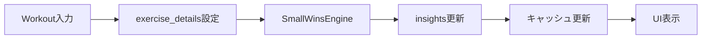

# Small Wins Engine MVP - データベース設計書

**文書番号**: DBD-SW-001
**バージョン**: 1.0.0
**作成日**: 2025-09-25
**ステータス**: MVP Design

## 1. 設計方針

### 1.1 MVP原則
- 必要最小限のテーブル追加（insights のみ）
- 既存テーブルへの影響最小化
- JSONBによる柔軟性確保
- 将来の拡張を妨げない設計

### 1.2 パフォーマンス考慮
- 適切なインデックス配置
- キャッシュ前提の設計
- 不要な正規化を避ける

## 2. テーブル設計

### 2.0 既存テーブルとの関係性サマリー

| 関係 | 説明 | 外部キー | 削除ポリシー |
|------|------|----------|-------------|
| USERS → INSIGHTS | 1対多: 1ユーザーが複数日のインサイトを持つ | insights.user_id → users.id | CASCADE |
| WORKOUTS ⇢ INSIGHTS | 集約関係: 週間ワークアウトを集計してインサイトを生成 | なし（論理的関係） | 独立管理 |
| INSIGHTS ↔ STRAVA_SYNC_DATA | 間接関係: WORKOUTSを経由してStravaデータを参照 | なし（WORKOUTs経由） | 独立管理 |

### 2.1 新規テーブル: insights

```sql
-- MVP版: シンプルかつ拡張可能な構造
CREATE TABLE insights (
  id SERIAL PRIMARY KEY,
  user_id INTEGER NOT NULL REFERENCES users(id) ON DELETE CASCADE,
  date DATE NOT NULL,

  -- スコア（0-100）
  total_score INTEGER DEFAULT 0 CHECK (total_score >= 0 AND total_score <= 100),
  cardio_score INTEGER DEFAULT 0 CHECK (cardio_score >= 0 AND cardio_score <= 100),
  strength_score INTEGER DEFAULT 0 CHECK (strength_score >= 0 AND strength_score <= 100),

  -- WHO達成フラグ
  who_cardio_achieved BOOLEAN DEFAULT FALSE,
  who_strength_achieved BOOLEAN DEFAULT FALSE,

  -- 詳細データ（JSONB for flexibility）
  metrics JSONB DEFAULT '{}',
  /* 構造例:
  {
    "cardio": {
      "weeklyMinutes": 157,
      "targetMinutes": 150,
      "intensity": {"moderate": 120, "vigorous": 37}
    },
    "strength": {
      "weeklyDays": 2,
      "targetDays": 2,
      "muscleGroups": ["chest", "back", "legs"],
      "sessions": [
        {"date": "2025-01-20", "exercises": ["push_up", "squat"]}
      ]
    },
    "streak": {
      "currentDays": 7,
      "bestDays": 14
    }
  }
  */

  -- メッセージと推奨
  health_message VARCHAR(255),
  recommendations TEXT[],

  -- メタデータ
  calculated_at TIMESTAMP DEFAULT CURRENT_TIMESTAMP,
  version VARCHAR(10) DEFAULT '1.0.0',

  -- ユニーク制約
  UNIQUE(user_id, date)
);

-- インデックス
CREATE INDEX idx_insights_user_date ON insights(user_id, date DESC);
CREATE INDEX idx_insights_user_score ON insights(user_id, total_score DESC);
CREATE INDEX idx_insights_date ON insights(date);
CREATE INDEX idx_insights_who_achieved ON insights(user_id)
  WHERE who_cardio_achieved = TRUE AND who_strength_achieved = TRUE;
```

### 2.2 既存テーブル拡張: workouts（最小限の変更）

```sql
-- MVP: 1カラム追加のみ
ALTER TABLE workouts ADD COLUMN IF NOT EXISTS
  exercise_details JSONB DEFAULT '{}';

/* exercise_details の構造:
{
  "type": "strength" | "cardio" | "mixed",
  "muscleGroups": ["chest", "back"],
  "equipment": "dumbbell",
  "sets": 3,
  "reps": [12, 10, 8],
  "weight": [20, 22.5, 25],
  "restTime": 60
}
*/

-- 筋トレ判定用の部分インデックス
CREATE INDEX idx_workouts_strength ON workouts(userID, date)
  WHERE exercise_details->>'type' = 'strength';
```

## 3. データフロー設計

### 3.1 スコア計算フロー



### 3.2 データ取得パターン

```sql
-- 1. 最新スコア取得（高頻度）
SELECT
  total_score,
  cardio_score,
  strength_score,
  who_cardio_achieved,
  who_strength_achieved,
  health_message
FROM insights
WHERE user_id = $1 AND date = CURRENT_DATE;

-- 2. 週次トレンド取得（中頻度）
SELECT
  date,
  total_score,
  metrics
FROM insights
WHERE user_id = $1
  AND date >= CURRENT_DATE - INTERVAL '7 days'
ORDER BY date DESC;

-- 3. WHO達成者リスト（低頻度）
SELECT
  u.username,
  i.total_score,
  i.date
FROM insights i
JOIN users u ON i.user_id = u.id
WHERE i.who_cardio_achieved = TRUE
  AND i.who_strength_achieved = TRUE
  AND i.date = CURRENT_DATE
ORDER BY i.total_score DESC
LIMIT 10;
```

## 4. マイグレーション戦略

### 4.1 初期マイグレーション

```sql
-- migrations/001_create_insights_table.sql
BEGIN;

-- 1. insights テーブル作成
CREATE TABLE IF NOT EXISTS insights (...);

-- 2. インデックス作成
CREATE INDEX CONCURRENTLY ...;

-- 3. workouts テーブル拡張
ALTER TABLE workouts ADD COLUMN IF NOT EXISTS ...;

-- 4. 初期データ生成（過去7日分）
INSERT INTO insights (user_id, date, total_score)
SELECT
  userID,
  CURRENT_DATE,
  50 -- デフォルトスコア
FROM workouts
WHERE date >= CURRENT_DATE - INTERVAL '7 days'
GROUP BY userID
ON CONFLICT DO NOTHING;

COMMIT;
```

### 4.2 ロールバック

```sql
-- rollback/001_drop_insights_table.sql
BEGIN;

DROP TABLE IF EXISTS insights CASCADE;
ALTER TABLE workouts DROP COLUMN IF EXISTS exercise_details;

COMMIT;
```

## 5. パフォーマンス最適化

### 5.1 クエリ最適化

```javascript
// バッチ取得でN+1問題回避
const getWeeklyInsights = async (userIds) => {
  return await db.query(`
    SELECT * FROM insights
    WHERE user_id = ANY($1)
      AND date >= CURRENT_DATE - INTERVAL '7 days'
    ORDER BY user_id, date DESC
  `, [userIds]);
};
```

### 5.2 キャッシュ戦略

```javascript
// MVP: シンプルなメモリキャッシュ
class InsightCache {
  constructor() {
    this.cache = new Map();
    this.TTL = 3600000; // 1時間
  }

  getKey(userId, date) {
    return `${userId}-${date}`;
  }

  async get(userId, date) {
    const key = this.getKey(userId, date);
    const cached = this.cache.get(key);

    if (cached && cached.expires > Date.now()) {
      return cached.data;
    }

    return null;
  }

  set(userId, date, data) {
    const key = this.getKey(userId, date);
    this.cache.set(key, {
      data,
      expires: Date.now() + this.TTL
    });
  }
}
```

## 6. データ整合性

### 6.1 トリガー定義

```sql
-- workout更新時に自動的にinsight無効化
CREATE OR REPLACE FUNCTION invalidate_insight()
RETURNS TRIGGER AS $$
BEGIN
  -- 該当日のinsightを削除（再計算フラグ）
  DELETE FROM insights
  WHERE user_id = NEW.userID
    AND date = NEW.date::date;

  RETURN NEW;
END;
$$ LANGUAGE plpgsql;

CREATE TRIGGER workout_change_trigger
AFTER INSERT OR UPDATE OR DELETE ON workouts
FOR EACH ROW EXECUTE FUNCTION invalidate_insight();
```

## 7. 将来の拡張ポイント

### 7.1 Phase 2で追加可能な機能

```sql
-- 月次集計テーブル（将来）
CREATE TABLE monthly_insights (
  id SERIAL PRIMARY KEY,
  user_id INTEGER NOT NULL,
  year_month DATE NOT NULL,
  avg_score NUMERIC(5,2),
  total_workout_days INTEGER,
  achievements JSONB
);

-- 目標設定テーブル（将来）
CREATE TABLE user_goals (
  id SERIAL PRIMARY KEY,
  user_id INTEGER NOT NULL,
  goal_type VARCHAR(50),
  target_value INTEGER,
  current_value INTEGER,
  deadline DATE
);
```

### 7.2 パーティショニング（10万ユーザー時点）

```sql
-- 月単位パーティション
CREATE TABLE insights_2025_01 PARTITION OF insights
  FOR VALUES FROM ('2025-01-01') TO ('2025-02-01');
```

## 8. 監視指標

```sql
-- テーブルサイズ監視
SELECT
  schemaname,
  tablename,
  pg_size_pretty(pg_total_relation_size(schemaname||'.'||tablename)) AS size
FROM pg_tables
WHERE tablename = 'insights';

-- インデックス使用率
SELECT
  indexrelname,
  idx_scan,
  idx_tup_read,
  idx_tup_fetch
FROM pg_stat_user_indexes
WHERE schemaname = 'public'
  AND tablename = 'insights';
```

---

**次のアクション**:
1. マイグレーションファイル作成
2. Sequelizeモデル定義
3. キャッシュクラス実装
4. バッチ処理スクリプト作成