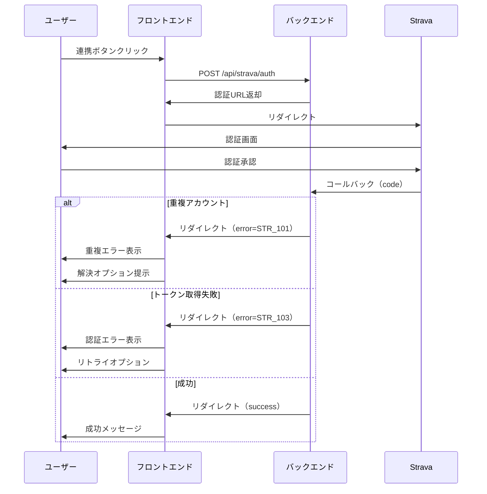

# Strava連携エラーハンドリング - 機能要件書

**文書番号**: FRD-STR-001
**バージョン**: 1.0.0
**作成日**: 2025-09-25
**ステータス**: Draft

## 改訂履歴
| バージョン | 日付 | 変更者 | 変更内容 |
|----------|------|--------|---------|
| 1.0.0 | 2025-09-25 | システム | 初版作成 |

## 1. 機能概要

### 1.1 目的
Strava連携プロセスにおけるエラーハンドリングを改善し、ユーザーがエラー発生時に適切な対処法を理解し、自己解決できるようにする。

### 1.2 スコープ
- Strava初回連携時のエラー処理
- 連携済みアカウントの重複エラー処理
- トークン期限切れ時の再認証フロー
- 同期エラー時の詳細表示とリカバリー

### 1.3 ビジネス価値
- **ユーザー離脱率の削減**: エラー時の離脱率を現状推定60%から20%以下へ
- **サポート問い合わせ削減**: エラー関連の問い合わせを70%削減
- **ユーザー満足度向上**: 自己解決率を90%以上に

## 2. ユーザーストーリー

### US-001: エラー原因の理解
**As a** 一般ユーザー
**I want to** エラーが発生した理由を明確に理解したい
**So that** 問題を回避または解決できる

**受け入れ条件**:
- [ ] エラーメッセージが日本語で表示される
- [ ] 技術用語を使わない平易な説明
- [ ] エラーの原因が3秒以内に理解できる

### US-002: エラー解決の実行
**As a** 一般ユーザー
**I want to** エラーを解決する具体的な手順を知りたい
**So that** サポートに頼らず自分で解決できる

**受け入れ条件**:
- [ ] 解決手順がステップバイステップで表示
- [ ] 各ステップに必要なアクションボタンが配置
- [ ] 進捗状況が視覚的に確認できる

### US-003: 重複アカウントエラーの解決
**As a** 既に別アカウントでStrava連携済みのユーザー
**I want to** どのアカウントで連携されているか確認し、必要に応じて切り替えたい
**So that** 正しいアカウントで連携できる

**受け入れ条件**:
- [ ] 既存の連携アカウント情報が（一部マスクして）表示される
- [ ] 連携解除の方法が明示される
- [ ] 別のStravaアカウントの使用を提案

### US-004: トークン期限切れの対応
**As a** 長期間利用していないユーザー
**I want to** トークン期限切れを簡単に解決したい
**So that** サービスの利用を継続できる

**受け入れ条件**:
- [ ] 期限切れの理由が説明される
- [ ] ワンクリックで再連携が開始できる
- [ ] データが保持されることが明示される

## 3. 機能要件詳細

### 3.1 データ要件

#### エラーコード体系
```javascript
const ERROR_CODES = {
  // 連携エラー (STR_1xx)
  STR_101: 'DUPLICATE_ACCOUNT',     // 重複アカウント
  STR_102: 'TOKEN_EXPIRED',         // トークン期限切れ
  STR_103: 'AUTH_FAILED',           // 認証失敗
  STR_104: 'NETWORK_ERROR',         // ネットワークエラー

  // 同期エラー (STR_2xx)
  STR_201: 'SYNC_PARTIAL_FAILURE',  // 部分的な同期失敗
  STR_202: 'SYNC_RATE_LIMIT',       // API制限
  STR_203: 'SYNC_DATA_INVALID',     // データ不正
};
```

#### エラーメッセージ構造
```javascript
const ERROR_MESSAGES = {
  STR_101: {
    title: 'このStravaアカウントは既に使用されています',
    description: '同じStravaアカウントを複数のユーザーで共有することはできません。',
    solutions: [
      {
        text: '別のStravaアカウントを使用する',
        action: 'USE_DIFFERENT_ACCOUNT',
        primary: true
      },
      {
        text: '既存の連携を確認する',
        action: 'CHECK_EXISTING',
        primary: false
      }
    ],
    severity: 'warning',
    recoverable: true,
    autoHideMs: null  // 自動的に隠さない
  }
};
```

### 3.2 ビジネスルール

#### エラー表示ルール
1. **表示優先度**
   - Critical > Error > Warning > Info
   - 新しいエラーが優先

2. **自動非表示タイミング**
   - Success: 5秒
   - Info: 7秒
   - Warning: null（手動で閉じる）
   - Error: null（手動で閉じる）

3. **リトライポリシー**
   ```javascript
   const RETRY_POLICY = {
     maxAttempts: 5,
     backoffMs: [1000, 2000, 4000, 8000, 16000],
     cooldownMs: 3600000  // 1時間
   };
   ```

### 3.3 処理フロー

#### 連携エラー処理フロー


## 4. 非機能要件

### 4.1 パフォーマンス
- エラーメッセージレンダリング: < 100ms
- エラー状態の永続化: IndexedDB使用
- バッチエラー処理: 最大100件/秒

### 4.2 セキュリティ
- エラーログのサニタイゼーション
- PII（個人識別情報）のマスキング
- XSS対策済みエラー表示

### 4.3 可用性
- エラー処理のフェイルセーフ機構
- オフラインエラーメッセージ対応
- 部分的機能継続性の確保

### 4.4 アクセシビリティ
- WCAG 2.1 AA準拠
- スクリーンリーダー対応
- キーボードナビゲーション完全対応
- 高コントラストモード対応

## 5. UI/UX詳細設計

### 5.1 エラー表示コンポーネント階層

```
<StravaErrorBoundary>
  <ErrorNotificationContainer>
    <ErrorNotification>
      <ErrorIcon type={severity} />
      <ErrorContent>
        <ErrorTitle>{title}</ErrorTitle>
        <ErrorDescription>{description}</ErrorDescription>
        <ErrorSolutions>
          {solutions.map(solution => (
            <SolutionItem key={solution.action}>
              <SolutionText>{solution.text}</SolutionText>
              <SolutionAction onClick={handleAction} />
            </SolutionItem>
          ))}
        </ErrorSolutions>
      </ErrorContent>
      <ErrorActions>
        <PrimaryButton />
        <SecondaryButton />
        <DismissButton />
      </ErrorActions>
    </ErrorNotification>
  </ErrorNotificationContainer>
</StravaErrorBoundary>
```

### 5.2 ビジュアルデザイン仕様

#### カラーパレット
- Error: #F44336
- Warning: #FF9800
- Info: #2196F3
- Success: #4CAF50
- Background: rgba(0,0,0,0.87)

#### アニメーション
- 表示: slideDown + fadeIn (300ms ease-out)
- 非表示: slideUp + fadeOut (200ms ease-in)
- 震動: shake (150ms) ※重大エラー時

## 6. テスト要件

### 6.1 単体テスト
- エラーコード→メッセージ変換
- リトライロジック
- 自動非表示タイマー

### 6.2 統合テスト
- エンドツーエンドエラーフロー
- 複数エラーの優先度処理
- バックエンドとの連携

### 6.3 ユーザビリティテスト
- エラーメッセージの理解度
- 解決策の実行可能性
- 全体的な満足度

## 7. 実装チェックリスト

- [ ] エラーコード体系の定義
- [ ] エラーメッセージマスターの作成
- [ ] Dashboardページのコールバック処理
- [ ] ErrorNotificationコンポーネント
- [ ] StravaErrorHandlerフック
- [ ] リトライメカニズム
- [ ] エラーログ収集
- [ ] 単体テスト
- [ ] 統合テスト
- [ ] ユーザビリティテスト

## 8. 成功指標（KPI）

### 定量指標
| 指標 | 現状 | 目標 | 測定方法 |
|-----|------|------|---------|
| エラー時離脱率 | 60% | 20% | GA/Analytics |
| 自己解決率 | 30% | 90% | エラー後のアクション追跡 |
| 平均解決時間 | 10分 | 3分 | セッション分析 |
| サポート問い合わせ | 100件/月 | 30件/月 | サポートチケット |

### 定性指標
- ユーザーインタビューでの満足度向上
- エラー体験に関するネガティブフィードバックの減少
- SNSでの好意的な言及の増加

## 9. リリース計画

### Phase 1 (Week 1-2)
- 基本的なエラー表示機能
- コールバックパラメータ処理

### Phase 2 (Week 3-4)
- エラー別解決策の実装
- リトライメカニズム

### Phase 3 (Week 5-6)
- 高度な機能（ログ、分析）
- A/Bテスト準備

## 10. 付録

### A. 用語集
- **PII**: Personal Identifiable Information（個人識別情報）
- **トークン**: APIアクセス用の認証情報
- **コールバック**: 外部サービスからの応答処理

### B. 参考資料
- [Strava API Documentation](https://developers.strava.com)
- [Material-UI Alert Component](https://mui.com/components/alert/)
- [エラーハンドリングのベストプラクティス](https://www.nngroup.com/articles/error-message-guidelines/)