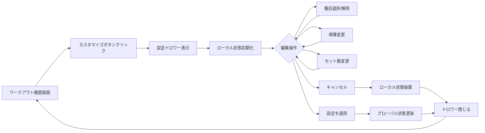

# WorkoutHistory設定管理 - UI/UX設計書

**文書番号**: UXD-WH-002
**バージョン**: 2.0.0
**作成日**: 2025-09-20
**ステータス**: FormConfigパターン準拠版

## 1. UI/UX設計原則

### 1.1 設計理念
- **シンプルさ**: プリセット機能を削除し、必要最小限の機能に集中
- **一貫性**: FormConfigDrawerと同じインタラクションパターン
- **明確性**: 編集モード（下書き）と確定操作の明確な分離
- **直感性**: ドラッグ&ドロップによる順番変更

### 1.2 ユーザビリティ目標
- 3クリック以内で目的の設定完了
- エラー発生率 < 1%
- タスク完了時間 < 30秒
- 順番変更の直感的操作

## 2. 画面遷移フロー



## 3. UIコンポーネント仕様

### 3.1 設定ドロワー（FormConfigパターン準拠）

#### レイアウト
```
┌──────────────────────────────────────────┐
│  ワークアウトカスタマイズ設定        [✕]  │ <- Header (固定)
├──────────────────────────────────────────┤
│                                          │
│  ┌────────────────────────────────────┐ │
│  │  現在選択中の種目 (3/5)            │ │ <- Section 1
│  │  ─────────────────────────────────  │ │
│  │  [≡] 🏃 ウォーキング     [🗑️]    │ │ <- ドラッグ可能
│  │  [≡] 💪 プッシュアップ   [🗑️]    │ │
│  │  [≡] 💪 スクワット       [🗑️]    │ │
│  │                                    │ │
│  │  ↑ ドラッグで順番変更可能         │ │
│  └────────────────────────────────────┘ │
│                                          │
│  ┌────────────────────────────────────┐ │
│  │  筋トレ設定                        │ │ <- Section 2
│  │  ─────────────────────────────────  │ │
│  │  最大セット数: 3                   │ │
│  │  [1]---●---[3]---[4]---[5]        │ │
│  └────────────────────────────────────┘ │
│                                          │
│  ┌────────────────────────────────────┐ │
│  │  種目を追加                        │ │ <- Section 3
│  │  ─────────────────────────────────  │ │
│  │  □ ランニング (カーディオ)        │ │ <- チェックボックス
│  │  □ サイクリング (カーディオ)      │ │
│  │  □ デッドリフト (筋トレ)          │ │
│  │  □ ベンチプレス (筋トレ)          │ │
│  └────────────────────────────────────┘ │
│                                          │
├──────────────────────────────────────────┤
│  [キャンセル]          [設定を適用]      │ <- Footer (固定)
└──────────────────────────────────────────┘
```

#### サイズ仕様
- **デスクトップ**: 幅400px（FormConfigDrawerと同一）
- **タブレット**: 幅400px
- **モバイル**: 全画面（100%）

### 3.2 コンポーネント詳細

#### Header
```jsx
<Box sx={{ p: 2, display: 'flex', alignItems: 'center', justifyContent: 'space-between' }}>
  <Typography variant="h6">ワークアウトカスタマイズ設定</Typography>
  <IconButton onClick={handleCancel} size="small">
    <CloseIcon />
  </IconButton>
</Box>
```

#### Section 1: 現在選択中の種目（順番変更機能付き）
```jsx
<Box>
  <Typography variant="subtitle1">
    現在選択中の種目 ({localConfig.exercises.length}/5)
  </Typography>

  <DraggableList onReorder={handleReorder}>
    {localConfig.exercises.map((exercise, index) => (
      <DraggableItem key={exercise} index={index}>
        <ListItem>
          <ListItemIcon>
            <DragIndicatorIcon /> {/* ドラッグハンドル */}
          </ListItemIcon>
          <ListItemIcon>
            {isCardioExercise(exercise) ? <RunIcon /> : <FitnessCenterIcon />}
          </ListItemIcon>
          <ListItemText primary={exercise} />
          <IconButton
            color="error"
            size="small"
            onClick={() => handleToggle(exercise)}
          >
            <DeleteIcon />
          </IconButton>
        </ListItem>
      </DraggableItem>
    ))}
  </DraggableList>

  <Typography variant="caption" color="text.secondary">
    ドラッグで順番を変更できます
  </Typography>
</Box>
```

#### Section 2: 筋トレ設定
```jsx
<Box>
  <Typography variant="subtitle1">筋トレ設定</Typography>
  <Typography variant="body2" color="text.secondary">
    筋トレ種目の最大セット数
  </Typography>
  <Slider
    value={localConfig.maxSets}  // ローカル状態を参照
    min={1}
    max={5}
    marks
    valueLabelDisplay="auto"
    onChange={handleMaxSetsChange}
  />
</Box>
```

#### Section 3: 種目追加（FormConfigと同じトグル方式）
```jsx
<Box>
  <Typography variant="subtitle1">種目を追加</Typography>
  <List dense sx={{ maxHeight: 200, overflow: 'auto' }}>
    {availableExercises.map(exercise => {
      const isSelected = localConfig.exercises.includes(exercise);
      const isDisabled = !isSelected && localConfig.exercises.length >= 5;

      return (
        <ListItem
          key={exercise}
          onClick={() => !isDisabled && handleToggle(exercise)}
          sx={{
            cursor: isDisabled ? 'not-allowed' : 'pointer',
            opacity: isDisabled ? 0.5 : 1
          }}
        >
          <Checkbox
            edge="start"
            checked={isSelected}
            disabled={isDisabled}
            tabIndex={-1}
            disableRipple
          />
          <ListItemIcon>
            {isCardioExercise(exercise) ? (
              <RunIcon color="secondary" fontSize="small" />
            ) : (
              <FitnessCenterIcon color="primary" fontSize="small" />
            )}
          </ListItemIcon>
          <ListItemText
            primary={exercise}
            secondary={isCardioExercise(exercise) ? 'カーディオ' : '筋トレ'}
          />
        </ListItem>
      );
    })}
  </List>
</Box>
```

#### Footer（FormConfigと同一パターン）
```jsx
<Box sx={{ display: 'flex', gap: 2, p: 2, borderTop: 1, borderColor: 'divider' }}>
  <Button variant="outlined" fullWidth onClick={handleCancel}>
    キャンセル
  </Button>
  <Button
    variant="contained"
    fullWidth
    onClick={handleSave}
    disabled={localConfig.exercises.length === 0}
  >
    設定を適用
  </Button>
</Box>
```

## 4. インタラクション設計

### 4.1 状態管理（FormConfigパターン）

```javascript
// ローカル状態での編集（下書き）
const [localConfig, setLocalConfig] = useState({
  exercises: [],
  maxSets: 3
});

// ドロワーを開いた時に初期化
useEffect(() => {
  if (open) {
    setLocalConfig({
      exercises: workoutConfig.exercises,
      maxSets: workoutConfig.maxSets
    });
  }
}, [open, workoutConfig]);
```

### 4.2 操作フィードバック

| 操作 | フィードバック | 実装方法 |
|------|---------------|----------|
| 種目トグル | チェックボックス即座に反映 | setLocalConfig |
| 順番変更 | ドラッグ中にプレビュー | onDragEnd → setLocalConfig |
| 上限到達 | チェックボックス無効化 | disabled属性 |
| セット数変更 | スライダー値即座に表示 | onChange → setLocalConfig |
| 保存 | グローバル状態更新後ドロワー閉じる | updateExercises & updateMaxSets |
| キャンセル | ローカル状態破棄してドロワー閉じる | setLocalConfig & onClose |

### 4.3 バリデーション

#### 種目数制限（handleToggle内）
```javascript
const handleToggle = (exercise) => {
  setLocalConfig(currentConfig => {
    const currentIndex = currentConfig.exercises.indexOf(exercise);
    const newExercises = [...currentConfig.exercises];

    if (currentIndex === -1) {
      if (newExercises.length >= 5) {
        alert('種目は最大5つまでです');
        return currentConfig;
      }
      newExercises.push(exercise);
    } else {
      if (newExercises.length <= 1) {
        alert('最低1つの種目が必要です');
        return currentConfig;
      }
      newExercises.splice(currentIndex, 1);
    }

    return { ...currentConfig, exercises: newExercises };
  });
};
```

## 5. 順番変更機能（WorkoutHistory独自）

### 5.1 ドラッグ&ドロップ実装

```javascript
// 順番変更ハンドラー
const handleReorder = (fromIndex, toIndex) => {
  setLocalConfig(currentConfig => {
    const newExercises = [...currentConfig.exercises];
    const [movedItem] = newExercises.splice(fromIndex, 1);
    newExercises.splice(toIndex, 0, movedItem);

    return {
      ...currentConfig,
      exercises: newExercises
    };
  });
};
```

### 5.2 ビジュアルフィードバック

- **ドラッグ中**: 要素を半透明化（opacity: 0.5）
- **ドロップ可能エリア**: 青い線で表示
- **ドラッグハンドル**: 明確なアイコン表示
- **カーソル**: grab/grabbing

## 6. レスポンシブデザイン

### 6.1 ブレークポイント（FormConfigと統一）

```jsx
sx={{
  '& .MuiDrawer-paper': {
    width: {
      xs: '100%',  // モバイル: 全画面
      sm: 400      // タブレット以上: 400px固定
    },
    boxSizing: 'border-box'
  }
}}
```

### 6.2 モバイル最適化

- タッチ操作でのドラッグ&ドロップ対応
- タップ領域を44px以上確保
- スクロール可能エリアの最適化

## 7. アクセシビリティ

### 7.1 WCAG 2.1準拠

- **キーボード操作**:
  - Tab: フォーカス移動
  - Space/Enter: 選択/解除
  - 矢印キー: 順番変更（代替手段）
- **スクリーンリーダー**:
  - aria-label適切に設定
  - role属性の追加
- **色コントラスト**: 4.5:1以上

### 7.2 実装例

```jsx
<ListItem
  role="button"
  aria-label={`${exercise}を${isSelected ? '削除' : '追加'}`}
  tabIndex={0}
>
  {/* ... */}
</ListItem>

<div
  role="list"
  aria-label="選択中の種目リスト（ドラッグで順番変更可能）"
>
  {/* ... */}
</div>
```

## 8. アニメーション

### 8.1 トランジション

```css
/* ドロワー開閉 */
transition: transform 0.3s cubic-bezier(0.4, 0, 0.2, 1);

/* チェックボックス */
transition: all 0.2s ease;

/* ドラッグ&ドロップ */
transition: transform 0.2s ease;

/* ホバー効果 */
transition: background-color 0.15s ease;
```

### 8.2 マイクロインタラクション

- チェックボックス: リップルエフェクト
- ドラッグ開始: スケール1.05
- ドロップ: バウンス効果
- ボタンホバー: elevation変更

## 9. エラー状態のUI

### 9.1 エラー表示パターン

```jsx
// 上限到達時（視覚的無効化）
<ListItem sx={{ opacity: 0.5, cursor: 'not-allowed' }}>
  <Checkbox disabled />
  {/* ... */}
</ListItem>

// アラート（一時的な通知）
const showAlert = (message) => {
  // Snackbarやalertを使用
  alert(message); // MVP版
};
```

## 10. パフォーマンス最適化

### 10.1 レンダリング最適化

```javascript
// メモ化によるリレンダリング防止
const MemoizedDraggableList = React.memo(DraggableList);

// デバウンス処理（将来的な検索機能用）
const debouncedSearch = useMemo(
  () => debounce(handleSearch, 300),
  []
);
```

## 11. ユーザビリティテスト項目

### 11.1 タスクベーステスト

1. **タスク1**: 種目を3つ選択して順番を変更
   - 成功基準: 45秒以内
   - エラー率: < 5%

2. **タスク2**: セット数を変更して保存
   - 成功基準: 15秒以内
   - エラー率: < 1%

3. **タスク3**: 変更を加えた後でキャンセル
   - 成功基準: 元の設定が維持される
   - エラー率: 0%

### 11.2 ヒューリスティック評価

- [x] システム状態の可視性（選択数表示）
- [x] 現実世界との一致（ドラッグ&ドロップ）
- [x] ユーザーコントロール（キャンセル可能）
- [x] 一貫性（FormConfigと同じパターン）
- [x] エラー防止（上限チェック）
- [x] 認識より想起（現在の選択を表示）
- [x] 柔軟性（順番変更可能）
- [x] 美的で最小限（プリセット削除）
- [x] エラー回復（キャンセル機能）

## 12. 実装チェックリスト

### Phase 1: 基本UI（FormConfigパターン）
- [ ] ドロワーレイアウト実装
- [ ] localConfig状態管理
- [ ] チェックボックスによる種目選択
- [ ] スライダーによるセット数変更
- [ ] 保存/キャンセルボタン

### Phase 2: 独自機能
- [ ] ドラッグ&ドロップ実装
- [ ] 順番変更のビジュアルフィードバック
- [ ] タッチデバイス対応

### Phase 3: 品質向上
- [ ] アクセシビリティ対応
- [ ] アニメーション追加
- [ ] エラーハンドリングUI
- [ ] パフォーマンス最適化