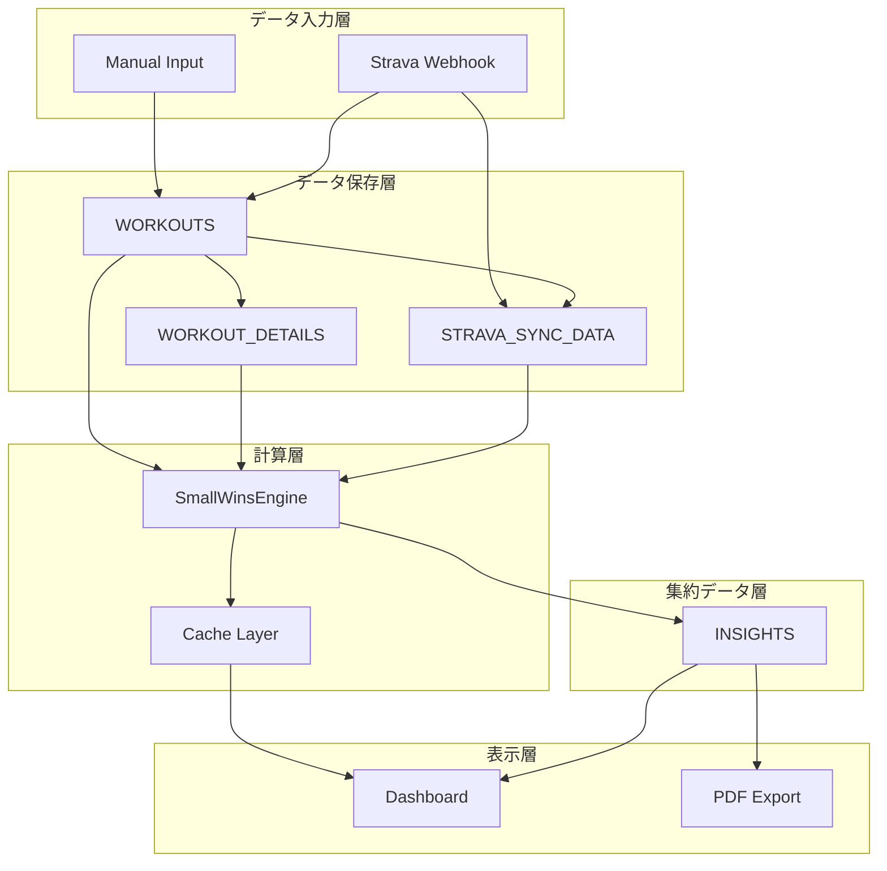

# Small Wins Engine - データベース関係性設計書

**文書番号**: DBR-SW-001
**バージョン**: 1.0.0
**作成日**: 2025-09-25
**ステータス**: MVP Database Relationships

## 1. 既存テーブル構造との統合

### 1.1 全体ER図（DBML形式）

```dbml
// ========== 既存テーブル ==========
Table USERS {
  id            int        [pk, increment]
  username      string     [not null, unique]
  email         varchar    [not null, unique]
  password_hash varchar    [not null]
  created_at    datetime   [default: `now()`]
  updated_at    datetime

  // MVP追加カラム（オプション）
  health_profile jsonb     [default: '{}', note: '身長、体重、年齢など']
  privacy_settings jsonb   [default: '{}', note: '同意管理']
}

Table STRAVA_TOKENS {
  user_id       int        [pk]  // PK=FK で USERS と 1:1
  athlete_id    varchar    [unique]
  access_token  text
  refresh_token text
  expires_at    datetime
  last_sync     datetime

  indexes {
    athlete_id [unique]
  }
}

Table WORKOUTS {
  id            int        [pk, increment]
  user_id       int        [not null]
  workout_date  date       [not null]
  exercise_name varchar    [not null]
  exercise_type varchar    [note: 'strength | cardio | flexibility | mixed']
  source        varchar    [note: 'manual | strava']
  created_at    datetime   [default: `now()`]
  updated_at    datetime

  // MVP追加カラム
  exercise_details jsonb   [default: '{}', note: '筋群、強度などの詳細']

  indexes {
    (user_id, workout_date) [name: 'idx_user_date']
    exercise_type
  }
}

Table WORKOUT_DETAILS {
  workout_id    int        [pk]  // PK=FK で WORKOUTS と 1:1
  sets          int
  reps          int
  reps_detail   json
  distance_km   float
  duration_min  int
  intensity     varchar    [note: 'low | moderate | high | vigorous']

  indexes {
    intensity
  }
}

Table STRAVA_SYNC_DATA {
  workout_id    int        [pk]  // PK=FK で WORKOUTS と 1:1
  external_id   varchar    [unique]
  raw_data      json
  synced_at     datetime

  indexes {
    external_id [unique]
  }
}

// ========== 新規テーブル（MVP） ==========
Table INSIGHTS {
  id                    int        [pk, increment]
  user_id               int        [not null]
  date                  date       [not null]
  total_score           int        [default: 0, note: '0-100']
  cardio_score          int        [default: 0, note: '0-100']
  strength_score        int        [default: 0, note: '0-100']
  who_cardio_achieved   boolean    [default: false]
  who_strength_achieved boolean    [default: false]
  metrics               jsonb      [default: '{}', note: '詳細メトリクス']
  health_message        varchar(255)
  recommendations       text[]
  calculated_at         datetime   [default: `now()`]
  version               varchar(10) [default: '1.0.0']
  created_at            datetime   [default: `now()`]
  updated_at            datetime

  indexes {
    (user_id, date) [unique, name: 'unique_user_date']
    user_id [name: 'idx_user']
    date [name: 'idx_date']
    (user_id, total_score) [name: 'idx_user_score']
  }

  note: '''
    健康スコアの日次記録
    workoutsテーブルのデータを集約して計算
    医療連携用の履歴管理
  '''
}

// ========== リレーション定義 ==========
// 既存リレーション
Ref: USERS.id < WORKOUTS.user_id [delete: cascade]
Ref: USERS.id - STRAVA_TOKENS.user_id [delete: cascade]
Ref: WORKOUTS.id - WORKOUT_DETAILS.workout_id [delete: cascade]
Ref: WORKOUTS.id - STRAVA_SYNC_DATA.workout_id [delete: cascade]

// 新規リレーション（MVP）
Ref: USERS.id < INSIGHTS.user_id [delete: cascade]

// 論理的関係（外部キー制約なし）
// INSIGHTS は WORKOUTS の集約データ
// Note: INSIGHTS.date と WORKOUTS.workout_date で期間集約
```

## 2. テーブル関係性の詳細説明

### 2.1 INSIGHTS と USERS の関係
- **関係性**: 1対多（1 User : N Insights）
- **外部キー**: `INSIGHTS.user_id → USERS.id`
- **削除ポリシー**: CASCADE（ユーザー削除時に全インサイトも削除）
- **ビジネスルール**: 各ユーザーは1日1レコードのみ（UNIQUE制約）

### 2.2 INSIGHTS と WORKOUTS の関係
- **関係性**: 集約関係（Aggregation）
- **外部キー**: なし（論理的関係のみ）
- **データフロー**:
  ```
  WORKOUTS（週間データ） → 集約計算 → INSIGHTS（日次スコア）
  ```
- **集約ロジック**:
  - 過去7日間のWORKOUTSを取得
  - 有酸素運動と筋力トレーニングを分類
  - WHO基準でスコア計算
  - INSIGHTSに保存

### 2.3 データ整合性の保証

```sql
-- トリガー: workout変更時にinsight再計算フラグを立てる
CREATE OR REPLACE FUNCTION mark_insight_for_recalculation()
RETURNS TRIGGER AS $$
BEGIN
  -- 該当日のinsightに再計算フラグを設定
  UPDATE insights
  SET metrics = jsonb_set(metrics, '{needs_recalculation}', 'true')
  WHERE user_id = NEW.user_id
    AND date = NEW.workout_date;

  RETURN NEW;
END;
$$ LANGUAGE plpgsql;

CREATE TRIGGER workout_change_trigger
AFTER INSERT OR UPDATE OR DELETE ON workouts
FOR EACH ROW EXECUTE FUNCTION mark_insight_for_recalculation();
```

## 3. データアクセスパターン

### 3.1 スコア計算時のJOIN

```sql
-- 週間ワークアウトデータと最新インサイトの取得
WITH weekly_workouts AS (
  SELECT
    w.user_id,
    w.workout_date,
    w.exercise_name,
    w.exercise_type,
    wd.duration_min,
    wd.intensity,
    w.exercise_details->>'muscleGroups' as muscle_groups
  FROM workouts w
  INNER JOIN workout_details wd ON w.id = wd.workout_id
  WHERE w.user_id = $1
    AND w.workout_date >= CURRENT_DATE - INTERVAL '7 days'
),
latest_insight AS (
  SELECT *
  FROM insights
  WHERE user_id = $1
    AND date = CURRENT_DATE
)
SELECT
  ww.*,
  li.total_score as current_score,
  li.metrics as previous_metrics
FROM weekly_workouts ww
CROSS JOIN latest_insight li;
```

### 3.2 Strava同期データとの統合

```sql
-- Strava由来のワークアウトを含むスコア計算
SELECT
  w.id,
  w.exercise_name,
  w.source,
  wd.duration_min,
  wd.intensity,
  ssd.raw_data->>'average_heartrate' as avg_hr,
  CASE
    WHEN w.exercise_details->>'type' = 'strength' THEN true
    WHEN ssd.raw_data->>'type' IN ('WeightTraining', 'Workout') THEN true
    ELSE false
  END as is_strength
FROM workouts w
INNER JOIN workout_details wd ON w.id = wd.workout_id
LEFT JOIN strava_sync_data ssd ON w.id = ssd.workout_id
WHERE w.user_id = $1
  AND w.workout_date >= CURRENT_DATE - INTERVAL '7 days';
```

## 4. マイグレーション実装

### 4.1 Sequelizeモデル定義（関係性含む）

```javascript
// models/Insight.js
module.exports = (sequelize, DataTypes) => {
  const Insight = sequelize.define('Insight', {
    id: {
      type: DataTypes.INTEGER,
      primaryKey: true,
      autoIncrement: true
    },
    userId: {
      type: DataTypes.INTEGER,
      allowNull: false,
      field: 'user_id'
    },
    date: {
      type: DataTypes.DATEONLY,
      allowNull: false
    },
    totalScore: {
      type: DataTypes.INTEGER,
      defaultValue: 0,
      field: 'total_score',
      validate: { min: 0, max: 100 }
    },
    cardioScore: {
      type: DataTypes.INTEGER,
      defaultValue: 0,
      field: 'cardio_score',
      validate: { min: 0, max: 100 }
    },
    strengthScore: {
      type: DataTypes.INTEGER,
      defaultValue: 0,
      field: 'strength_score',
      validate: { min: 0, max: 100 }
    },
    whoCardioAchieved: {
      type: DataTypes.BOOLEAN,
      defaultValue: false,
      field: 'who_cardio_achieved'
    },
    whoStrengthAchieved: {
      type: DataTypes.BOOLEAN,
      defaultValue: false,
      field: 'who_strength_achieved'
    },
    metrics: {
      type: DataTypes.JSONB,
      defaultValue: {}
    },
    healthMessage: {
      type: DataTypes.STRING(255),
      field: 'health_message'
    },
    recommendations: {
      type: DataTypes.ARRAY(DataTypes.TEXT),
      defaultValue: []
    },
    calculatedAt: {
      type: DataTypes.DATE,
      defaultValue: DataTypes.NOW,
      field: 'calculated_at'
    },
    version: {
      type: DataTypes.STRING(10),
      defaultValue: '1.0.0'
    }
  }, {
    tableName: 'insights',
    timestamps: true,
    underscored: true,
    indexes: [
      {
        unique: true,
        fields: ['user_id', 'date']
      },
      {
        fields: ['user_id', 'date']
      },
      {
        fields: ['user_id', 'total_score']
      }
    ]
  });

  // アソシエーション定義
  Insight.associate = (models) => {
    // INSIGHTS belongs to USERS (N:1)
    Insight.belongsTo(models.User, {
      foreignKey: 'userId',
      as: 'user',
      onDelete: 'CASCADE'
    });

    // 論理的関係（コード内で管理）
    // Insightは複数のWorkoutを集約するが、直接の外部キー関係はない
  };

  // カスタムメソッド
  Insight.calculateFromWorkouts = async function(userId, date) {
    const { Workout, WorkoutDetail } = sequelize.models;

    // 週間ワークアウトデータを取得
    const endDate = new Date(date);
    const startDate = new Date(date);
    startDate.setDate(startDate.getDate() - 6);

    const workouts = await Workout.findAll({
      where: {
        userId: userId,
        workoutDate: {
          [Op.between]: [startDate, endDate]
        }
      },
      include: [{
        model: WorkoutDetail,
        as: 'details'
      }]
    });

    // SmallWinsEngineでスコア計算
    const engine = require('../services/SmallWinsEngine');
    return await engine.calculateFromWorkouts(workouts);
  };

  return Insight;
};
```

### 4.2 マイグレーションSQL

```sql
-- migrations/001_create_insights_table.sql
BEGIN;

-- 1. INSIGHTSテーブル作成
CREATE TABLE IF NOT EXISTS insights (
  id                    SERIAL PRIMARY KEY,
  user_id               INTEGER NOT NULL REFERENCES users(id) ON DELETE CASCADE,
  date                  DATE NOT NULL,
  total_score           INTEGER DEFAULT 0 CHECK (total_score BETWEEN 0 AND 100),
  cardio_score          INTEGER DEFAULT 0 CHECK (cardio_score BETWEEN 0 AND 100),
  strength_score        INTEGER DEFAULT 0 CHECK (strength_score BETWEEN 0 AND 100),
  who_cardio_achieved   BOOLEAN DEFAULT FALSE,
  who_strength_achieved BOOLEAN DEFAULT FALSE,
  metrics               JSONB DEFAULT '{}',
  health_message        VARCHAR(255),
  recommendations       TEXT[],
  calculated_at         TIMESTAMP DEFAULT CURRENT_TIMESTAMP,
  version               VARCHAR(10) DEFAULT '1.0.0',
  created_at            TIMESTAMP DEFAULT CURRENT_TIMESTAMP,
  updated_at            TIMESTAMP DEFAULT CURRENT_TIMESTAMP,

  CONSTRAINT unique_user_date UNIQUE (user_id, date)
);

-- 2. インデックス作成
CREATE INDEX idx_insights_user ON insights(user_id);
CREATE INDEX idx_insights_date ON insights(date);
CREATE INDEX idx_insights_user_score ON insights(user_id, total_score DESC);
CREATE INDEX idx_insights_who_compliance ON insights(user_id)
  WHERE who_cardio_achieved = TRUE AND who_strength_achieved = TRUE;

-- 3. WORKOUTSテーブル拡張
ALTER TABLE workouts
ADD COLUMN IF NOT EXISTS exercise_details JSONB DEFAULT '{}';

-- 4. 更新トリガー
CREATE OR REPLACE FUNCTION update_updated_at()
RETURNS TRIGGER AS $$
BEGIN
  NEW.updated_at = CURRENT_TIMESTAMP;
  RETURN NEW;
END;
$$ LANGUAGE plpgsql;

CREATE TRIGGER insights_updated_at
BEFORE UPDATE ON insights
FOR EACH ROW EXECUTE FUNCTION update_updated_at();

-- 5. 初期データ作成（過去7日分）
INSERT INTO insights (user_id, date, total_score, metrics)
SELECT DISTINCT
  user_id,
  CURRENT_DATE,
  50, -- デフォルトスコア
  jsonb_build_object(
    'initial_calculation', true,
    'created_from_migration', true
  )
FROM workouts
WHERE workout_date >= CURRENT_DATE - INTERVAL '7 days'
ON CONFLICT (user_id, date) DO NOTHING;

COMMIT;
```

## 5. データフローダイアグラム



## 6. パフォーマンス考慮事項

### 6.1 インデックス戦略

```sql
-- 高頻度クエリ用の複合インデックス
CREATE INDEX idx_workouts_user_date_type
ON workouts(user_id, workout_date DESC, exercise_type);

CREATE INDEX idx_insights_recent
ON insights(user_id, date DESC)
WHERE date >= CURRENT_DATE - INTERVAL '30 days';
```

### 6.2 パーティショニング（将来）

```sql
-- 月単位パーティション（10万ユーザー到達時）
CREATE TABLE insights_2025_01 PARTITION OF insights
FOR VALUES FROM ('2025-01-01') TO ('2025-02-01');

CREATE TABLE insights_2025_02 PARTITION OF insights
FOR VALUES FROM ('2025-02-01') TO ('2025-03-01');
```

---

**次のステップ**:
1. マイグレーションファイル作成
2. Sequelizeモデル実装
3. アソシエーション設定
4. テストデータ投入