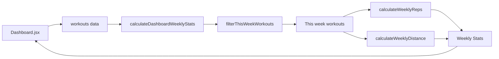

# Dashboard週間統計修正 - MVP設計書

**文書番号**: DES-WS-MVP-001
**バージョン**: 2.0.0
**作成日**: 2025-09-20
**ステータス**: MVP Design

## 1. 設計概要

### 1.1 設計目標
Dashboard.jsxの週間統計表示を修正し、実際のワークアウトデータから正確な値を計算する。単一責任原則に基づいてビジネスロジックを分離し、テスト可能で保守性の高いコードにする。

### 1.2 設計原則
- **単一責任原則**: 各モジュールは一つの責任のみを持つ
- **DRY原則**: 計算ロジックの重複を避ける
- **最小限の変更**: 既存UIへの影響を最小化
- **テスタビリティ**: 純粋関数による実装

### 1.3 アーキテクチャ

```
frontend/src/
├── pages/
│   └── Dashboard.jsx              # 表示責任のみ
├── services/
│   └── StatisticsService.js       # 計算責任（拡張）
└── hooks/ (オプション)
    └── useWeeklyStats.js          # データ取得とメモ化
```

## 2. 詳細設計

### 2.1 StatisticsService.js の拡張

#### 2.1.1 メイン関数

```javascript
// services/StatisticsService.js

import dayjs from 'dayjs';
import isoWeek from 'dayjs/plugin/isoWeek';

dayjs.extend(isoWeek);

/**
 * Dashboard用の週間統計を計算
 * @param {Array} workouts - 全ワークアウトデータ
 * @returns {Object} 週間統計 {weeklyWorkouts, weeklyReps, weeklyDistance}
 */
export const calculateDashboardWeeklyStats = (workouts) => {
  // 入力検証
  if (!workouts || workouts.length === 0) {
    return {
      weeklyWorkouts: 0,
      weeklyReps: 0,
      weeklyDistance: 0,
      previousWeek: {
        weeklyWorkouts: 0,
        weeklyReps: 0,
        weeklyDistance: 0
      },
      changeRates: {
        workouts: 0,
        reps: 0,
        distance: 0
      }
    };
  }

  // 今週と前週のワークアウトをフィルタリング
  const thisWeekWorkouts = filterThisWeekWorkouts(workouts);
  const previousWeekWorkouts = filterPreviousWeekWorkouts(workouts);

  // 各統計値を計算
  const currentStats = {
    weeklyWorkouts: thisWeekWorkouts.length,
    weeklyReps: calculateWeeklyReps(thisWeekWorkouts),
    weeklyDistance: calculateWeeklyDistance(thisWeekWorkouts)
  };

  const previousStats = {
    weeklyWorkouts: previousWeekWorkouts.length,
    weeklyReps: calculateWeeklyReps(previousWeekWorkouts),
    weeklyDistance: calculateWeeklyDistance(previousWeekWorkouts)
  };

  // 変化率を計算
  const changeRates = {
    workouts: calculateChangeRate(currentStats.weeklyWorkouts, previousStats.weeklyWorkouts),
    reps: calculateChangeRate(currentStats.weeklyReps, previousStats.weeklyReps),
    distance: calculateChangeRate(currentStats.weeklyDistance, previousStats.weeklyDistance)
  };

  return {
    ...currentStats,
    previousWeek: previousStats,
    changeRates
  };
};
```

#### 2.1.2 週フィルタリング関数

```javascript
/**
 * 今週（月曜開始）のワークアウトをフィルタリング
 * @private
 * @param {Array} workouts - 全ワークアウトデータ
 * @returns {Array} 今週のワークアウト
 */
const filterThisWeekWorkouts = (workouts) => {
  const now = dayjs();
  const weekStart = now.startOf('isoWeek'); // 月曜日 00:00:00
  const weekEnd = now.endOf('isoWeek');     // 日曜日 23:59:59

  return filterWorkoutsByDateRange(workouts, weekStart, weekEnd);
};

/**
 * 前週のワークアウトをフィルタリング
 * @private
 * @param {Array} workouts - 全ワークアウトデータ
 * @returns {Array} 前週のワークアウト
 */
const filterPreviousWeekWorkouts = (workouts) => {
  const now = dayjs();
  const previousWeek = now.subtract(1, 'week');
  const weekStart = previousWeek.startOf('isoWeek');
  const weekEnd = previousWeek.endOf('isoWeek');

  return filterWorkoutsByDateRange(workouts, weekStart, weekEnd);
};

/**
 * 日付範囲でワークアウトをフィルタリング（共通関数）
 * @private
 * @param {Array} workouts - ワークアウトデータ
 * @param {dayjs.Dayjs} startDate - 開始日
 * @param {dayjs.Dayjs} endDate - 終了日
 * @returns {Array} フィルタリングされたワークアウト
 */
const filterWorkoutsByDateRange = (workouts, startDate, endDate) => {
  return workouts.filter(workout => {
    // dateForSortを優先、なければdateを使用
    const workoutDate = dayjs(workout.dateForSort || workout.date);

    // 無効な日付の場合はスキップ
    if (!workoutDate.isValid()) {
      console.warn('Invalid date in workout:', workout);
      return false;
    }

    return workoutDate.isSameOrAfter(startDate) &&
           workoutDate.isSameOrBefore(endDate);
  });
};
```

#### 2.1.3 レップス計算関数

```javascript
/**
 * 週間のレップス数を計算
 * @private
 * @param {Array} weeklyWorkouts - 週のワークアウト
 * @returns {number} 総レップス数
 */
const calculateWeeklyReps = (weeklyWorkouts) => {
  return weeklyWorkouts.reduce((total, workout) => {
    // strengthタイプのみ計算
    if (workout.exerciseType !== 'strength') {
      return total;
    }

    // totalRepsが既に計算されている場合
    if (workout.totalReps && typeof workout.totalReps === 'number') {
      return total + workout.totalReps;
    }

    // repsDetailがある場合（セット毎の詳細）
    if (workout.repsDetail && Array.isArray(workout.repsDetail)) {
      const detailTotal = workout.repsDetail.reduce((sum, set) => {
        return sum + (set.reps || 0);
      }, 0);
      return total + detailTotal;
    }

    // repsとsetsから計算
    if (workout.reps && workout.sets) {
      return total + (workout.reps * workout.sets);
    }

    // repsのみの場合
    if (workout.reps) {
      return total + workout.reps;
    }

    return total;
  }, 0);
};
```

#### 2.1.4 距離計算関数

```javascript
/**
 * 週間の総距離を計算
 * @private
 * @param {Array} weeklyWorkouts - 週のワークアウト
 * @returns {number} 総距離（km）
 */
const calculateWeeklyDistance = (weeklyWorkouts) => {
  return weeklyWorkouts.reduce((total, workout) => {
    // cardioタイプのみ計算
    if (workout.exerciseType !== 'cardio') {
      return total;
    }

    // distanceフィールドから取得
    const distance = parseFloat(workout.distance) || 0;
    return total + distance;
  }, 0);
};
```

#### 2.1.5 変化率計算関数

```javascript
/**
 * 前週からの変化率を計算
 * @private
 * @param {number} currentValue - 今週の値
 * @param {number} previousValue - 前週の値
 * @returns {number} 変化率（％）
 */
const calculateChangeRate = (currentValue, previousValue) => {
  // 前週が0の場合
  if (previousValue === 0) {
    // 今週に値がある場合は100%増加
    return currentValue > 0 ? 100 : 0;
  }

  // 変化率を計算（小数点第1位まで）
  const rate = ((currentValue - previousValue) / previousValue) * 100;
  return Math.round(rate * 10) / 10;  // 小数点第1位まで
};
```

### 2.2 Dashboard.jsx の修正

#### 2.2.1 インポートの追加

```javascript
// Dashboard.jsx の上部
import { useMemo } from 'react';
import { calculateDashboardWeeklyStats } from '../services/StatisticsService';
```

#### 2.2.2 既存コードの削除（108-120行目）

```javascript
// 削除する関数
const getWeeklyWorkouts = () => { ... }  // 削除
```

#### 2.2.3 新しい実装（122-154行目を置き換え）

```javascript
// 週間統計を計算（メモ化）
const weeklyStats = useMemo(() => {
  return calculateDashboardWeeklyStats(workouts);
}, [workouts]);

// continuityDataの修正（週間統計以外は維持）
const continuityData = {
  currentStreak: workouts?.length > 0 ? Math.min(workouts.length, 7) : 0,
  totalWorkouts: workouts?.length || 0,
  totalMinutes: workouts?.reduce((acc, w) => acc + (w.duration || 30), 0) || 0,
  weeklyGoalProgress: Math.min((weeklyStats.weeklyWorkouts / 5) * 100, 100),
};

// クイックスタットデータ
const quickStats = [
  {
    label: '今週のワークアウト',
    value: weeklyStats.weeklyWorkouts,
    unit: '回',
    icon: <CalendarIcon sx={{ fontSize: 17 }} />,
    color: '#4CAF50',
    // 前週比表示用
    change: weeklyStats.changeRates?.workouts,
    previousValue: weeklyStats.previousWeek?.weeklyWorkouts
  },
  {
    label: '今週のレップス回数',
    value: weeklyStats.weeklyReps,
    unit: '回',
    icon: <FitnessCenterIcon sx={{ fontSize: 17 }} />,
    color: '#2196F3',
    change: weeklyStats.changeRates?.reps,
    previousValue: weeklyStats.previousWeek?.weeklyReps
  },
  {
    label: '今週の距離',
    value: weeklyStats.weeklyDistance.toFixed(1),  // 小数点1桁表示
    unit: 'km',
    icon: <DirectionsRunIcon sx={{ fontSize: 17 }} />,
    color: '#FF5722',
    change: weeklyStats.changeRates?.distance,
    previousValue: weeklyStats.previousWeek?.weeklyDistance
  },
];

// quickStatsの表示部分（Dashboard.jsxの既存のマップ内に追加）
{quickStats.map((stat, index) => (
  <Grid item xs={4} key={stat.label}>
    <Fade in={true} timeout={1000 + index * 200}>
      <Box
        sx={{
          bgcolor: 'rgba(255,255,255,0.15)',
          borderRadius: 2,
          p: { xs: 0.75, sm: 1 },
          textAlign: 'center',
          // ... 既存のスタイル
        }}
      >
        {/* 既存のアイコンと値表示 */}

        {/* 前週比表示を追加 */}
        {stat.change !== undefined && (
          <Box
            sx={{
              mt: 0.5,
              display: 'flex',
              alignItems: 'center',
              justifyContent: 'center',
              gap: 0.5
            }}
          >
            {/* 変化アイコン */}
            {stat.change > 0 && (
              <TrendingUpIcon sx={{ fontSize: 12, color: '#4CAF50' }} />
            )}
            {stat.change < 0 && (
              <TrendingDownIcon sx={{ fontSize: 12, color: '#f44336' }} />
            )}
            {stat.change === 0 && (
              <TrendingFlatIcon sx={{ fontSize: 12, color: 'rgba(255,255,255,0.5)' }} />
            )}

            {/* 変化率テキスト */}
            <Typography
              variant="caption"
              sx={{
                color: stat.change > 0 ? '#4CAF50' :
                       stat.change < 0 ? '#f44336' : 'rgba(255,255,255,0.7)',
                fontSize: '0.65rem',
                fontWeight: 'bold'
              }}
            >
              {stat.change > 0 ? '+' : ''}{stat.change}%
            </Typography>
          </Box>
        )}
      </Box>
    </Fade>
  </Grid>
))}
```

### 2.3 オプション: カスタムフック実装

```javascript
// hooks/useWeeklyStats.js

import { useMemo } from 'react';
import { calculateDashboardWeeklyStats } from '../services/StatisticsService';

/**
 * 週間統計を取得するカスタムフック
 * @param {Array} workouts - ワークアウトデータ
 * @returns {Object} 週間統計
 */
export const useWeeklyStats = (workouts) => {
  const stats = useMemo(() => {
    return calculateDashboardWeeklyStats(workouts);
  }, [workouts]);

  return stats;
};
```

使用例:
```javascript
// Dashboard.jsx でカスタムフックを使用
const weeklyStats = useWeeklyStats(workouts);
```

## 3. データフロー設計

### 3.1 処理フロー



### 3.2 データ変換の流れ

1. **入力**: 全期間のワークアウトデータ配列
2. **フィルタリング**: 今週のデータのみ抽出（月曜〜日曜）
3. **集計**:
   - ワークアウト数: 配列の長さ
   - レップス数: strengthタイプから集計
   - 距離: cardioタイプから集計
4. **出力**: Dashboard表示用の統計オブジェクト

## 4. エラーハンドリング設計

### 4.1 防御的プログラミング

```javascript
// データ検証とデフォルト値
const calculateWeeklyReps = (weeklyWorkouts) => {
  if (!Array.isArray(weeklyWorkouts)) {
    console.error('Invalid input: weeklyWorkouts must be an array');
    return 0;
  }

  return weeklyWorkouts.reduce((total, workout) => {
    try {
      // 計算ロジック
      if (workout.exerciseType !== 'strength') return total;

      // 各種ケースの処理...

    } catch (error) {
      console.error('Error calculating reps for workout:', workout, error);
      return total; // エラー時は現在の合計を維持
    }
  }, 0);
};
```

### 4.2 日付処理のエラーハンドリング

```javascript
const filterThisWeekWorkouts = (workouts) => {
  return workouts.filter(workout => {
    try {
      const workoutDate = dayjs(workout.dateForSort || workout.date);

      if (!workoutDate.isValid()) {
        console.warn(`Invalid date in workout ID ${workout.id}:`,
                     workout.date || workout.dateForSort);
        return false;
      }

      // フィルタリングロジック

    } catch (error) {
      console.error('Error filtering workout:', workout, error);
      return false;
    }
  });
};
```

## 5. テスト設計

### 5.1 単体テストケース

```javascript
// __tests__/services/StatisticsService.test.js

import { calculateDashboardWeeklyStats } from '../../services/StatisticsService';
import dayjs from 'dayjs';

describe('calculateDashboardWeeklyStats', () => {
  // テスト用の現在日時を固定
  beforeEach(() => {
    jest.useFakeTimers();
    jest.setSystemTime(new Date('2025-01-20')); // 月曜日
  });

  afterEach(() => {
    jest.useRealTimers();
  });

  describe('ワークアウト回数計算', () => {
    test('今週のワークアウトのみカウントされる', () => {
      const workouts = [
        { date: '2025-01-20', exerciseType: 'strength' }, // 今週月曜
        { date: '2025-01-19', exerciseType: 'cardio' },   // 先週日曜
        { date: '2025-01-21', exerciseType: 'strength' }, // 今週火曜
      ];

      const result = calculateDashboardWeeklyStats(workouts);
      expect(result.weeklyWorkouts).toBe(2);
    });

    test('空配列の場合は0を返す', () => {
      const result = calculateDashboardWeeklyStats([]);
      expect(result.weeklyWorkouts).toBe(0);
    });
  });

  describe('レップス数計算', () => {
    test('totalRepsが優先される', () => {
      const workouts = [
        {
          date: '2025-01-20',
          exerciseType: 'strength',
          totalReps: 50,
          reps: 10,
          sets: 3
        }
      ];

      const result = calculateDashboardWeeklyStats(workouts);
      expect(result.weeklyReps).toBe(50);
    });

    test('repsDetailから正しく集計される', () => {
      const workouts = [
        {
          date: '2025-01-20',
          exerciseType: 'strength',
          repsDetail: [
            { reps: 10 },
            { reps: 12 },
            { reps: 8 }
          ]
        }
      ];

      const result = calculateDashboardWeeklyStats(workouts);
      expect(result.weeklyReps).toBe(30);
    });

    test('reps × setsで計算される', () => {
      const workouts = [
        {
          date: '2025-01-20',
          exerciseType: 'strength',
          reps: 10,
          sets: 3
        }
      ];

      const result = calculateDashboardWeeklyStats(workouts);
      expect(result.weeklyReps).toBe(30);
    });

    test('cardioタイプは無視される', () => {
      const workouts = [
        {
          date: '2025-01-20',
          exerciseType: 'cardio',
          reps: 100 // cardioにrepsがあっても無視
        }
      ];

      const result = calculateDashboardWeeklyStats(workouts);
      expect(result.weeklyReps).toBe(0);
    });
  });

  describe('距離計算', () => {
    test('cardioタイプの距離が合計される', () => {
      const workouts = [
        { date: '2025-01-20', exerciseType: 'cardio', distance: 5 },
        { date: '2025-01-21', exerciseType: 'cardio', distance: 3.5 },
        { date: '2025-01-22', exerciseType: 'strength', distance: 10 }, // 無視
      ];

      const result = calculateDashboardWeeklyStats(workouts);
      expect(result.weeklyDistance).toBe(8.5);
    });

    test('distanceがない場合は0として扱う', () => {
      const workouts = [
        { date: '2025-01-20', exerciseType: 'cardio' },
      ];

      const result = calculateDashboardWeeklyStats(workouts);
      expect(result.weeklyDistance).toBe(0);
    });
  });

  describe('前週比較機能', () => {
    test('前週データが正しく取得される', () => {
      jest.setSystemTime(new Date('2025-01-27')); // 次週月曜

      const workouts = [
        { date: '2025-01-20', exerciseType: 'strength', totalReps: 30 }, // 前週
        { date: '2025-01-27', exerciseType: 'strength', totalReps: 40 }, // 今週
      ];

      const result = calculateDashboardWeeklyStats(workouts);
      expect(result.previousWeek.weeklyReps).toBe(30);
      expect(result.weeklyReps).toBe(40);
    });

    test('変化率が正しく計算される', () => {
      const workouts = [
        { date: '2025-01-13', exerciseType: 'strength', totalReps: 20 }, // 前週
        { date: '2025-01-20', exerciseType: 'strength', totalReps: 30 }, // 今週
      ];

      const result = calculateDashboardWeeklyStats(workouts);
      expect(result.changeRates.reps).toBe(50); // 50%増加
    });

    test('前週が0の場合の変化率', () => {
      const workouts = [
        { date: '2025-01-20', exerciseType: 'cardio', distance: 5 }, // 今週のみ
      ];

      const result = calculateDashboardWeeklyStats(workouts);
      expect(result.changeRates.distance).toBe(100); // 100%（新規）
      expect(result.changeRates.workouts).toBe(100);
    });

    test('今週が0の場合の変化率', () => {
      const workouts = [
        { date: '2025-01-13', exerciseType: 'cardio', distance: 5 }, // 前週のみ
      ];

      const result = calculateDashboardWeeklyStats(workouts);
      expect(result.changeRates.distance).toBe(-100); // -100%（減少）
    });
  });
});
```

## 6. パフォーマンス最適化

### 6.1 メモ化戦略
- Dashboard.jsxで`useMemo`を使用して再計算を最小化
- workoutsデータが変更された場合のみ再計算

### 6.2 計算効率
- 単一パスでのフィルタリング
- 早期リターンによる不要な処理の回避

## 7. 実装スケジュール

### 7.1 実装順序
1. **Step 1**: Day.jsのインストール（5分）
2. **Step 2**: StatisticsService.jsの実装（30分）
3. **Step 3**: Dashboard.jsxの修正（15分）
4. **Step 4**: 動作確認とデバッグ（20分）
5. **Step 5**: テストの作成（30分）

### 7.2 依存関係
```bash
# Day.jsのインストールが必要
npm install dayjs
```

## 8. リスク管理

### 8.1 技術的リスク

| リスク | 影響 | 軽減策 |
|--------|------|--------|
| Day.jsの追加によるバンドルサイズ増加 | 低 | 必要なプラグインのみインポート |
| 既存データ構造の不整合 | 中 | 複数のフィールドから値を取得する防御的実装 |
| 日付フォーマットの違い | 中 | Day.jsによる柔軟な日付パース |

### 8.2 実装時の注意点
- dateForSortとdateフィールドの両方を考慮
- 無効なデータに対する防御的処理
- コンソールへの適切なログ出力

## 9. 検証計画

### 9.1 動作確認項目
- [ ] 今週のワークアウト回数が正しく表示される
- [ ] strengthタイプのレップス数が正確
- [ ] cardioタイプの距離が正確
- [ ] 週の境界（月曜開始）が正しい
- [ ] データがない場合に0が表示される

### 9.2 回帰テスト
- [ ] 既存のUIレイアウトに影響がない
- [ ] 他の統計表示が正常に動作する
- [ ] ページロード時間に大きな変化がない