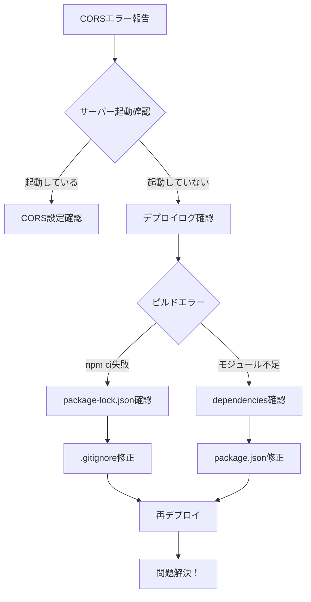

# 🎯 ACQUIRE フェーズ 学習記録 - CORS誤診断とデプロイエラーの複合問題

---

## 📋 基本情報

### 日時・環境
- **記録日時**: 2025/09/12 10:00-11:00
- **学習時間**: 1時間
- **プロジェクト**: FitTrack App
- **作業ブランチ**: docker-setup
- **関連ファイル**: 
  - `backend/Dockerfile`
  - `backend/Dockerfile.dev`
  - `backend/package.json`
  - `backend/app.js`
  - `.gitignore`
  - `docker-compose.yml`

### カテゴリ選択（1つ選択）
- [x] error - エラー・バグ対応

### 技術スタック（該当するものをチェック）
- [x] Docker
- [x] Node.js/Express
- [x] Railway (PaaS)
- [x] npm/package管理
- [x] CORS設定

### 優先度
- [x] high - 即座に解決が必要（本番環境が動作していない）

---

## 🔍 学習対象・問題の詳細

### 一言でまとめると
```
CORSエラーに見えた問題が、実はDockerfile設定とpackage.json依存関係の問題だった
```

### 発生状況・背景
```
[いつ]: 2025/09/12 午前
[どこで]: Railway本番環境 (https://fittrack-app-production-9f4a.up.railway.app)
[何をしていた時]: Vercelフロントエンドからログイン機能をテスト
[どうなった]: CORSエラーメッセージが表示され、ログインできない

詳細：
- ブラウザコンソールにCORSエラーが表示
- ローカルDocker環境では正常動作
- Railway環境でのみ発生
```

### エラーメッセージ・ログ（ある場合）
```javascript
// ブラウザコンソールのエラー
Access to XMLHttpRequest at 'https://fittrack-app-production-9f4a.up.railway.app/authrouter/login' 
from origin 'https://fitstart-frontend.vercel.app' has been blocked by CORS policy: 
Response to preflight request doesn't pass access control check: 
No 'Access-Control-Allow-Origin' header is present on the requested resource.

// Railwayデプロイログのエラー1
npm error code EUSAGE
npm error The `npm ci` command can only install with an existing package-lock.json

// Railwayデプロイログのエラー2
Error: Cannot find module 'dotenv'
Require stack:
- /app/server.js
    at Module._resolveFilename (node:internal/modules/cjs/loader:1140:15)
```

---

## 💻 コード記録

### ❌ Before - 問題のあったコード / 最初の実装

#### 1. package.json（dotenvがdevDependenciesに）
```json
{
  "dependencies": {
    "express": "^4.21.2",
    "cors": "^2.8.5",
    // ... 他の依存関係
  },
  "devDependencies": {
    "dotenv": "^16.4.7",  // ← 問題：本番でも必要なのにdevDependenciesに
    "jest": "^30.0.5",
    "nodemon": "^3.1.9"
  }
}
```

#### 2. Dockerfile（npm ciを使用）
```dockerfile
# 依存関係のインストール
RUN npm ci && \  # ← 問題：package-lock.jsonがGitにないと失敗
    npm cache clean --force
```

#### 3. .gitignore（package-lock.jsonを除外）
```
# NPM Package Lock files
package-lock.json  # ← 問題：Gitから除外されている
yarn.lock
pnpm-lock.yaml
```

### ✅ After - 改善後のコード / 解決策

#### 1. package.json（dotenvをdependenciesに移動）
```json
{
  "dependencies": {
    "express": "^4.21.2",
    "cors": "^2.8.5",
    "dotenv": "^16.4.7",  // ← 解決：dependenciesに移動
    // ... 他の依存関係
  },
  "devDependencies": {
    "jest": "^30.0.5",
    "nodemon": "^3.1.9"
  }
}
```

#### 2. Dockerfileの分離
```dockerfile
# 本番用: Dockerfile
RUN npm install --production && \  # ← 解決：npm installを使用
    npm cache clean --force

# 開発用: Dockerfile.dev  
RUN npm ci && \  # ← 開発環境ではnpm ciを維持
    npm cache clean --force
```

#### 3. .gitignore（package-lock.jsonをコメントアウト）
```
# NPM Package Lock files
# package-lock.json  # ← 解決：コメントアウトしてGitに含める
yarn.lock
pnpm-lock.yaml
```

#### 4. docker-compose.yml（開発用Dockerfileを指定）
```yaml
backend:
  build:
    context: ./backend
    dockerfile: Dockerfile.dev  # ← 開発用を明示的に指定
```

---

## 🔎 調査・試行錯誤の記録

### 試したアプローチ

#### アプローチ1: CORS設定の調査
```javascript
// デバッグログを追加
console.log(`[CORS Debug] Request origin: ${origin}`);
console.log(`[CORS Debug] Allowed origins: ${JSON.stringify(allowedOrigins)}`);
console.log(`[CORS Debug] NODE_ENV: ${currentEnv}`);
console.log(`[CORS Debug] isProduction: ${isProduction}`);
```
**結果**: ローカルDockerでは正常に動作 - CORS設定は正しかった

#### アプローチ2: 本番環境を再現するDocker環境構築
```bash
# 本番環境設定でDockerを起動
docker-compose -f docker-compose.production.yml up -d backend

# CORSプリフライトテスト
curl -X OPTIONS http://localhost:8000/authrouter/login \
  -H "Origin: https://fitstart-frontend.vercel.app" \
  -v
```
**結果**: ローカルでは成功 - 環境変数の問題ではなかった

#### アプローチ3: Railwayデプロイログの確認
```bash
# デプロイログを詳細に確認
railway logs --tail 100
```
**結果**: npm ciエラーとdotenvエラーを発見 - 真の原因が判明

### 参照した情報源

#### 公式ドキュメント
- [x] 確認した
- **URL**: https://docs.railway.app/deploy/builds
- **重要な情報**: 
```
RailwayはDockerfileを自動検出し、なければNixpacksで自動ビルド
Dockerfileがある場合はそれを優先的に使用
```

#### Stack Overflow / GitHub Issues
- [x] 確認した
- **URL**: https://stackoverflow.com/questions/50093741/npm-ci-can-only-install-packages-with-an-existing-package-lock-json
- **解決策の要約**: 
```
npm ciはpackage-lock.jsonが必須
本番環境では依存関係の固定のためpackage-lock.jsonをGitにコミットすべき
```

#### AIツールとの対話
- [x] Claude
- **質問内容**:
```
CORSエラーが表示されるが、実際はアプリケーションが起動していない可能性はあるか？
```
- **得られた回答の要点**:
```
サーバーが起動していない場合もCORSエラーとして表示される
デプロイログを最優先で確認すべき
```

---

## 💡 学習内容・気づき

### 技術的な学び

#### 1. エラーメッセージの誤解を招く性質
```
CORSエラーは必ずしもCORS設定の問題ではない
- サーバーが起動していない場合もCORSエラーとして表示
- プリフライトリクエストへの応答がない = CORSエラー
- 根本原因を探るにはサーバーログの確認が必須
```

#### 2. npm ciとnpm installの使い分け
```
npm ci（Continuous Integration用）:
- package-lock.jsonが必須
- node_modulesを削除してクリーンインストール
- 本番環境での再現性を保証

npm install:
- package-lock.jsonを生成/更新
- 既存のnode_modulesを更新
- 開発時や初回セットアップで使用
```

#### 3. Dockerfileの環境別管理
```
本番用と開発用を分離する利点:
- 本番: 最小構成、セキュリティ重視
- 開発: デバッグツール、ホットリロード対応
- ファイル名規則: Dockerfile（本番）、Dockerfile.dev（開発）
```

### 概念的な理解

#### なぜこの方法が良いのか
```
依存関係管理のベストプラクティス:
1. 本番で使うものは必ずdependenciesに
2. package-lock.jsonは必ずGitにコミット
3. 環境別にDockerfileを分離
4. エラーメッセージを鵜呑みにせず根本原因を探る
```

#### いつ使うべきか
```
- Dockerfileの分離: 本番と開発で異なる要件がある時
- package-lock.json: 常に（依存関係の固定化）
- npm ci: CI/CD環境、本番デプロイ時
- npm install: 開発環境、package.json更新時
```

---

## 🏥 ヘルステック特有の考慮事項

### データプライバシー
```
今回の問題では直接関係なかったが、以下は重要:
- 環境変数（JWT_SECRET等）は環境別に管理
- .envファイルは絶対にGitにコミットしない
- デバッグログに個人情報を含めない
```

### パフォーマンス・信頼性
```
- サービスの可用性が重要（ヘルスチェックエンドポイント）
- デプロイ失敗時の迅速な検知と対応
- ローカルでの本番環境再現による事前検証
```

---

## 🎯 次のアクション

### 理解を深めるべき点
- [x] npm workspacesによるモノレポ管理
- [ ] Railway vs Heroku vs Renderの比較
- [ ] multi-stage Dockerビルドの最適化

### 実装で検証すべき仮説
- [x] package-lock.jsonの有無による挙動の違い
- [x] 環境変数の優先順位（Dockerfile vs .env vs Railway設定）

### 追加で調査が必要な項目
- [ ] Railwayのビルドキャッシュ最適化
- [ ] GitHub Actionsでのデプロイ前検証

---

## 📝 メモ・備考

```
重要な学び:
- ブラウザのエラーメッセージは必ずしも真の原因を示さない
- デプロイログは最初に確認すべき情報源
- ローカルでの本番環境再現は問題解決の近道
- Dockerfileの存在はPaaSのビルド方法を変える

Railway特有の注意点:
- Dockerfileがあれば自動的にそれを使用
- なければNixpacksで自動ビルド
- 環境変数はRailwayダッシュボードで設定可能

今後の改善案:
- CI/CDパイプラインでデプロイ前にビルドテスト
- health checkエンドポイントの監視強化
- エラー時の自動ロールバック設定
```

---

## 🚀 カスタムコマンド実行用

### コマンド生成情報
```yaml
topic: "CORSエラー誤診断とDockerデプロイ設定問題"
context: "Railway本番環境でログイン不可、実はデプロイ失敗が原因"
category: error
stack: docker/nodejs/railway
priority: high
files: "backend/Dockerfile,backend/package.json,.gitignore,docker-compose.yml"
```

### 実行例
```bash
claude-code learning acquire \
  --topic "CORSエラー誤診断とDockerデプロイ設定問題" \
  --context "Railway本番環境でログイン不可、実はデプロイ失敗が原因" \
  --category error \
  --stack docker/nodejs/railway \
  --priority high \
  --files "backend/Dockerfile,backend/package.json,.gitignore,docker-compose.yml"
```

---

## ✅ 提出前チェックリスト

- [x] エラーメッセージは正確にコピーした
- [x] Before/Afterのコードを記録した
- [x] 試したアプローチを全て記録した
- [x] 学習内容を言語化した
- [x] ヘルステック特有の考慮事項を確認した
- [x] 機密情報や個人情報は含まれていない
- [x] 次のアクションが明確になった

---

## 🔍 問題解決フローチャート



## 📊 エラー解決の時系列

| 時刻 | アクション | 結果 | 学び |
|------|------------|------|------|
| 10:00 | CORSエラー確認 | 環境変数を疑う | エラーメッセージを鵜呑みにしない |
| 10:15 | Docker環境で検証 | ローカルは正常 | 本番固有の問題と判明 |
| 10:30 | Railwayログ確認 | npm ciエラー発見 | デプロイログを最初に見るべき |
| 10:40 | package-lock.json追加 | dotenvエラー発見 | 連鎖的な問題の存在 |
| 10:50 | dotenv移動 | デプロイ成功 | 依存関係の正しい管理 |
| 11:00 | ログイン成功確認 | 問題解決 | 根本原因の特定が重要 |