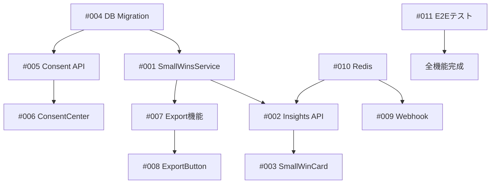

# 実装タスクリスト（GitHub Issue形式）

## 📝 タスク管理ガイド

- **優先度**: P0（必須）、P1（重要）、P2（推奨）、P3（オプション）
- **ラベル**: `backend`, `frontend`, `infra`, `docs`, `testing`
- **見積もり**: ストーリーポイント（1=1時間、8=1日）

## 🔴 P0: 必須タスク（Week 1）

### #001 [backend] Small Wins Service実装
**優先度**: P0 | **見積もり**: 8 | **担当**: Backend

#### 概要
運動データをWHO基準の健康指標に変換するサービスを実装

#### 受け入れ基準
- [ ] `/backend/services/SmallWinsService.js` 作成
- [ ] `calculateDaily(userId, date)` メソッド実装
- [ ] 週150分達成率の計算ロジック
- [ ] 連続日数カウントロジック
- [ ] 前週比較の計算ロジック
- [ ] 単体テスト作成（カバレッジ80%以上）

#### 実装詳細
```javascript
// 主要メソッド
- calculateWeeklyMinutes()    // 週次運動時間集計
- calculateStreak()            // 連続日数計算
- calculateScore()             // 健康スコア算出
- getHealthBenefit()           // 健康寄与メッセージ取得
```

#### 関連ファイル
- `backend/config/smallwins.json` - 設定ファイル
- `backend/models/Workout.js` - 既存モデル

---

### #002 [backend] Insights API実装
**優先度**: P0 | **見積もり**: 4 | **担当**: Backend

#### 概要
健康指標を提供するRESTful APIエンドポイント

#### 受け入れ基準
- [ ] `GET /api/insights/daily/:userId` 実装
- [ ] `GET /api/insights/weekly/:userId` 実装
- [ ] Redisキャッシング（TTL: 1時間）
- [ ] 認証ミドルウェア適用
- [ ] エラーハンドリング
- [ ] Swagger仕様書作成

#### APIレスポンス例
```json
{
  "type": "daily",
  "score": 85,
  "rationale": {
    "weeklyMinutes": 157,
    "targetMinutes": 150,
    "streakDays": 7,
    "weekOverWeekChange": 12,
    "healthBenefit": "WHO推奨達成：心疾患リスク30%減"
  }
}
```

---

### #003 [frontend] SmallWinCard実装
**優先度**: P0 | **見積もり**: 5 | **担当**: Frontend

#### 概要
健康スコアと根拠を表示するカードコンポーネント

#### 受け入れ基準
- [ ] `/frontend/src/components/SmallWinCard.tsx` 作成
- [ ] Material-UI Card使用
- [ ] 根拠ピル（Chip）表示
- [ ] グラデーション背景
- [ ] レスポンシブデザイン
- [ ] Storybookストーリー作成
- [ ] 単体テスト作成

#### Props定義
```typescript
interface SmallWinCardProps {
  type: 'daily' | 'weekly' | 'achievement';
  score: number;
  rationale: RationaleData;
}
```

---

### #004 [backend] データベースマイグレーション
**優先度**: P0 | **見積もり**: 2 | **担当**: Backend

#### 概要
insights, consents, audit_logsテーブル作成

#### 受け入れ基準
- [ ] マイグレーションファイル作成
- [ ] insightsテーブル定義
- [ ] consentsテーブル定義
- [ ] audit_logsテーブル定義
- [ ] インデックス作成
- [ ] ロールバックテスト

#### SQL
```sql
CREATE TABLE insights (
  id SERIAL PRIMARY KEY,
  user_id INTEGER NOT NULL REFERENCES users(id),
  date DATE NOT NULL,
  type VARCHAR(50),
  score INTEGER,
  rationale_json JSONB,
  created_at TIMESTAMP DEFAULT CURRENT_TIMESTAMP
);
```

## 🟡 P1: 重要タスク（Week 2）

### #005 [backend] Consent管理API
**優先度**: P1 | **見積もり**: 4 | **担当**: Backend

#### 概要
データ利用同意を管理するCRUD API

#### 受け入れ基準
- [ ] `POST /api/consents` - 同意登録
- [ ] `GET /api/consents/:userId` - 同意状態取得
- [ ] `PUT /api/consents/:id` - 同意更新
- [ ] `DELETE /api/consents/:id` - 同意撤回
- [ ] 監査ログ記録
- [ ] GDPR準拠の実装

---

### #006 [frontend] ConsentCenterページ
**優先度**: P1 | **見積もり**: 6 | **担当**: Frontend

#### 概要
プライバシー設定と同意管理のUIページ

#### 受け入れ基準
- [ ] `/frontend/src/pages/Settings/ConsentCenter.tsx` 作成
- [ ] データ源一覧表示
- [ ] 同意トグルスイッチ
- [ ] 削除リクエストフォーム
- [ ] Strava連携解除ボタン
- [ ] エクスポートボタン配置
- [ ] レスポンシブ対応

---

### #007 [backend] PDF/CSVエクスポート
**優先度**: P1 | **見積もり**: 6 | **担当**: Backend

#### 概要
健康データの医療向けエクスポート機能

#### 受け入れ基準
- [ ] PDFテンプレート作成（puppeteer/jsPDF）
- [ ] CSVフォーマッター実装
- [ ] `GET /api/export/pdf/:userId`
- [ ] `GET /api/export/csv/:userId`
- [ ] 日付範囲フィルタリング
- [ ] 医療向けフォーマット
- [ ] ダウンロード処理

#### PDFレポート内容
- ユーザー基本情報
- 期間別統計
- 健康スコア推移グラフ
- ワークアウト履歴
- 医療機関向け注記

---

### #008 [frontend] ExportButton コンポーネント
**優先度**: P1 | **見積もり**: 3 | **担当**: Frontend

#### 概要
PDF/CSVエクスポートを実行するボタンコンポーネント

#### 受け入れ基準
- [ ] ローディング状態表示
- [ ] エラーハンドリング
- [ ] ダウンロード処理
- [ ] トースト通知

## 🔵 P2: 推奨タスク（Week 3）

### #009 [backend] Strava Webhook実装
**優先度**: P2 | **見積もり**: 6 | **担当**: Backend

#### 概要
Stravaからのリアルタイムイベント受信

#### 受け入れ基準
- [ ] `GET /api/strava/webhook` - 検証エンドポイント
- [ ] `POST /api/strava/webhook` - イベント受信
- [ ] サブスクリプション管理
- [ ] 冪等性保証
- [ ] キューイング実装
- [ ] レート制限対応

---

### #010 [infra] Redis導入
**優先度**: P2 | **見積もり**: 3 | **担当**: Infrastructure

#### 概要
キャッシュとジョブキューのためのRedis設定

#### 受け入れ基準
- [ ] docker-compose.ymlにRedis追加
- [ ] 接続設定作成
- [ ] キャッシュヘルパー実装
- [ ] Bullキュー設定
- [ ] モニタリング設定

---

### #011 [testing] E2Eテストスイート
**優先度**: P2 | **見積もり**: 8 | **担当**: QA

#### 概要
主要ユーザーフローの自動テスト

#### 受け入れ基準
- [ ] Playwright/Cypress設定
- [ ] ログインフローテスト
- [ ] ワークアウト記録テスト
- [ ] Small Wins表示テスト
- [ ] エクスポートテスト
- [ ] CI/CD統合

#### テストシナリオ
1. 新規ユーザー登録
2. Strava連携
3. ワークアウト記録
4. Small Wins確認
5. PDFエクスポート
6. データ削除

## 🟢 P3: オプションタスク（Week 4+）

### #012 [frontend] 睡眠データ統合
**優先度**: P3 | **見積もり**: 8 | **担当**: Full Stack

#### 概要
HealthKit/Health Connectからの睡眠データ取得

#### 受け入れ基準
- [ ] プラットフォームAPI連携
- [ ] 睡眠モデル追加
- [ ] UI統合
- [ ] 相関分析表示

---

### #013 [frontend] ダークモード対応
**優先度**: P3 | **見積もり**: 4 | **担当**: Frontend

#### 概要
システム設定に応じたダークモード切り替え

#### 受け入れ基準
- [ ] テーマプロバイダー実装
- [ ] カラーパレット定義
- [ ] 切り替えトグル
- [ ] LocalStorage保存

---

### #014 [backend] 通知システム
**優先度**: P3 | **見積もり**: 6 | **担当**: Backend

#### 概要
目標達成通知やリマインダー機能

#### 受け入れ基準
- [ ] メール通知
- [ ] プッシュ通知（PWA）
- [ ] 通知設定管理
- [ ] テンプレート作成

## 📋 タスク依存関係



## 🎯 週次スプリント計画

### Sprint 1 (Week 1)
- #001 SmallWinsService [8h]
- #002 Insights API [4h]
- #003 SmallWinCard [5h]
- #004 DB Migration [2h]
**合計**: 19h

### Sprint 2 (Week 2)
- #005 Consent API [4h]
- #006 ConsentCenter [6h]
- #007 Export機能 [6h]
- #008 ExportButton [3h]
**合計**: 19h

### Sprint 3 (Week 3)
- #009 Webhook [6h]
- #010 Redis [3h]
- #011 E2Eテスト [8h]
**合計**: 17h

## 📊 進捗トラッキング

| タスク | 状態 | 進捗 | 担当 | 開始日 | 完了日 |
|-------|------|------|------|--------|--------|
| #001 | Todo | 0% | - | - | - |
| #002 | Todo | 0% | - | - | - |
| #003 | Todo | 0% | - | - | - |
| #004 | Todo | 0% | - | - | - |

## 🚀 実装開始コマンド

```bash
# 開発環境セットアップ
git checkout -b feature/health-decision-support
npm install

# バックエンド
cd backend
npm install bull redis dayjs
npx sequelize-cli migration:generate --name add-health-tables

# フロントエンド
cd ../frontend
npm install jspdf html2canvas

# Docker
docker-compose up -d
```

---

**作成日**: 2025年9月26日
**作成者**: FitStart Tech Lead