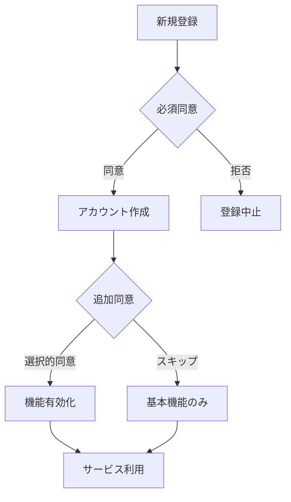

# プライバシーポリシー・データ管理仕様

## 📋 概要

FitStartは、ユーザーのプライバシーを最優先に考え、GDPR（EU一般データ保護規則）および日本の個人情報保護法に準拠したデータ管理を実施します。

## 🔐 データ保護原則

### 1. 最小権限の原則（Data Minimization）
必要最小限のデータのみを収集し、目的外使用を禁止します。

```typescript
// 収集するデータの定義
interface UserData {
  // 必須データ
  required: {
    email: string;        // アカウント識別
    hashedPassword: string; // 認証用（bcrypt）
  };

  // オプショナルデータ（明示的同意が必要）
  optional: {
    workoutData?: WorkoutRecord[];
    healthMetrics?: HealthMetric[];
    stravaConnection?: StravaAuth;
  };

  // 収集しないデータ
  prohibited: [
    'realName',        // 実名不要
    'phoneNumber',     // 電話番号不要
    'creditCard',      // 決済情報不要
    'socialSecurity', // 社会保障番号不要
  ];
}
```

### 2. 目的限定（Purpose Limitation）
収集したデータは明示された目的のみに使用します。

```javascript
const DATA_PURPOSES = {
  workoutData: [
    'health_score_calculation',  // 健康スコア計算
    'progress_visualization',    // 進捗可視化
    'export_for_medical'         // 医療連携用エクスポート
  ],

  stravaData: [
    'activity_import',           // アクティビティ取り込み
    'automatic_sync'             // 自動同期
  ],

  analyticsData: [
    'service_improvement',       // サービス改善
    'anonymous_statistics'       // 匿名統計
  ]
};
```

### 3. データ保存期限（Storage Limitation）

```javascript
const RETENTION_PERIODS = {
  activeUserData: 'unlimited',      // アクティブユーザー：無期限
  inactiveUserData: '2_years',      // 非アクティブ：2年
  deletedUserData: '0_days',        // 削除要求：即座
  auditLogs: '90_days',            // 監査ログ：90日
  exportCache: '24_hours',         // エクスポート：24時間
  tempData: '1_hour'               // 一時データ：1時間
};
```

## 🎛️ 同意管理（Consent Management）

### 同意の種類

| 同意タイプ | 説明 | デフォルト | 必須 |
|-----------|------|-----------|------|
| dataUsage | 運動データの健康指標変換 | false | No |
| stravaSync | Strava自動同期 | false | No |
| exportData | データエクスポート許可 | false | No |
| analytics | 匿名利用統計 | true | No |
| marketing | マーケティング通信 | false | No |

### 同意取得フロー



### 同意の実装

```typescript
class ConsentManager {
  async requestConsent(userId: string, consentType: string): Promise<boolean> {
    // 1. 現在の同意状態を確認
    const currentConsent = await this.getConsent(userId, consentType);
    if (currentConsent?.granted && !currentConsent.revoked) {
      return true;
    }

    // 2. 同意UIを表示
    const userResponse = await this.showConsentDialog({
      type: consentType,
      description: this.getConsentDescription(consentType),
      dataUsage: this.getDataUsageDetails(consentType)
    });

    // 3. 同意を記録
    if (userResponse.granted) {
      await this.recordConsent({
        userId,
        consentType,
        granted: true,
        grantedAt: new Date(),
        ipAddress: this.getUserIP(),
        userAgent: this.getUserAgent()
      });
    }

    // 4. 監査ログ記録
    await this.auditLog({
      action: 'consent_request',
      userId,
      consentType,
      result: userResponse.granted
    });

    return userResponse.granted;
  }
}
```

## 🗑️ データ削除権（Right to Erasure）

### 削除可能なデータ

```sql
-- ユーザーデータ完全削除
BEGIN;

-- 1. ワークアウトデータ削除
DELETE FROM workouts WHERE userID = :userId;
DELETE FROM insights WHERE user_id = :userId;

-- 2. 同意記録削除
DELETE FROM consents WHERE user_id = :userId;

-- 3. エクスポート履歴削除
DELETE FROM export_jobs WHERE user_id = :userId;

-- 4. アチーブメント削除
DELETE FROM achievements WHERE user_id = :userId;

-- 5. ユーザーアカウント削除
DELETE FROM users WHERE id = :userId;

COMMIT;
```

### 削除不可能なデータ（法的要件）

```javascript
const RETENTION_REQUIRED = {
  // 監査ログ（不正調査用）
  auditLogs: {
    period: '90_days',
    reason: 'security_investigation',
    anonymize: true
  },

  // 集計済み統計（匿名化済み）
  aggregatedStats: {
    period: 'permanent',
    reason: 'anonymous_analytics',
    identifiable: false
  }
};
```

## 📤 データポータビリティ（Data Portability）

### エクスポート形式

```typescript
interface ExportFormats {
  pdf: {
    name: 'Health Report PDF',
    mimeType: 'application/pdf',
    includes: ['summary', 'charts', 'recommendations'],
    useCase: 'medical_consultation'
  },

  csv: {
    name: 'Workout Data CSV',
    mimeType: 'text/csv',
    includes: ['raw_workout_data', 'calculated_metrics'],
    useCase: 'data_analysis'
  },

  json: {
    name: 'Complete Data JSON',
    mimeType: 'application/json',
    includes: ['all_user_data'],
    useCase: 'service_migration'
  }
}
```

### エクスポート実装

```javascript
class DataExporter {
  async exportUserData(userId, format) {
    // 1. 同意確認
    const hasConsent = await this.checkExportConsent(userId);
    if (!hasConsent) {
      throw new Error('Export consent required');
    }

    // 2. データ収集
    const userData = await this.collectUserData(userId);

    // 3. フォーマット変換
    let exportData;
    switch (format) {
      case 'pdf':
        exportData = await this.generatePDF(userData);
        break;
      case 'csv':
        exportData = await this.generateCSV(userData);
        break;
      case 'json':
        exportData = await this.generateJSON(userData);
        break;
    }

    // 4. 監査ログ
    await this.auditLog({
      action: 'data_export',
      userId,
      format,
      timestamp: new Date()
    });

    return exportData;
  }
}
```

## 🔒 セキュリティ実装

### 暗号化

```javascript
// 保存時暗号化（Encryption at Rest）
const ENCRYPTION_CONFIG = {
  algorithm: 'AES-256-GCM',
  keyDerivation: 'PBKDF2',
  iterations: 100000,
  saltLength: 32
};

// 通信時暗号化（Encryption in Transit）
const TLS_CONFIG = {
  minVersion: 'TLSv1.3',
  ciphers: [
    'TLS_AES_256_GCM_SHA384',
    'TLS_CHACHA20_POLY1305_SHA256'
  ]
};
```

### アクセス制御

```typescript
class AccessControl {
  async checkAccess(userId: string, resource: string, action: string): Promise<boolean> {
    // 1. 認証確認
    if (!this.isAuthenticated(userId)) {
      return false;
    }

    // 2. リソース所有者確認
    if (!this.isResourceOwner(userId, resource)) {
      return false;
    }

    // 3. 同意確認
    if (!this.hasRequiredConsent(userId, action)) {
      return false;
    }

    // 4. レート制限確認
    if (this.isRateLimited(userId, action)) {
      return false;
    }

    return true;
  }
}
```

## 📊 プライバシー影響評価（PIA）

### リスク評価マトリクス

| データタイプ | センシティビティ | リスクレベル | 対策 |
|------------|---------------|------------|------|
| 運動データ | 中 | 中 | 暗号化、アクセス制御 |
| 健康スコア | 高 | 高 | 暗号化、同意必須、監査ログ |
| Stravaトークン | 高 | 高 | 暗号化、定期更新 |
| エクスポートデータ | 高 | 中 | 一時保存、自動削除 |

### データ侵害対応計画

```javascript
class DataBreachResponse {
  async handleBreach(breachDetails) {
    // 1. 即座の対応（1時間以内）
    await this.containBreach(breachDetails);
    await this.assessImpact(breachDetails);

    // 2. 通知（72時間以内）
    if (this.isHighRisk(breachDetails)) {
      await this.notifyAuthorities(breachDetails);  // 個人情報保護委員会
      await this.notifyUsers(breachDetails);        // 影響を受けるユーザー
    }

    // 3. 対策実施
    await this.implementCountermeasures(breachDetails);

    // 4. レポート作成
    await this.generateBreachReport(breachDetails);
  }
}
```

## 🌍 国際コンプライアンス

### GDPR（EU）

```typescript
const GDPR_REQUIREMENTS = {
  lawfulBasis: ['consent', 'legitimate_interest'],
  rights: [
    'access',        // アクセス権
    'rectification', // 訂正権
    'erasure',       // 削除権
    'portability',   // ポータビリティ権
    'objection'      // 異議申立権
  ],
  notification: '72_hours',
  penalties: 'up_to_4%_annual_revenue'
};
```

### 個人情報保護法（日本）

```typescript
const JPIPA_REQUIREMENTS = {
  保有個人データ: ['開示', '訂正', '削除', '利用停止'],
  第三者提供: '明示的同意必須',
  安全管理措置: ['技術的', '組織的', '人的', '物理的'],
  漏洩時報告: '速やかに'
};
```

### CCPA（カリフォルニア）

```typescript
const CCPA_REQUIREMENTS = {
  rights: ['know', 'delete', 'opt-out', 'non-discrimination'],
  disclosure: 'privacy_policy',
  verifiableRequest: true,
  responseTime: '45_days'
};
```

## 📝 プライバシーポリシー文面

```markdown
## FitStart プライバシーポリシー

最終更新日：2025年9月26日

### 1. 収集する情報
- アカウント情報（メールアドレス）
- 運動記録データ（任意）
- 健康指標（自動計算）

### 2. 情報の利用目的
- 健康スコアの計算と表示
- サービスの改善
- ご本人の同意に基づく医療連携

### 3. 情報の第三者提供
- 原則として第三者提供は行いません
- 法令に基づく場合を除きます

### 4. データの保管と削除
- 暗号化して安全に保管
- いつでも削除要求可能

### 5. あなたの権利
- データの開示請求
- データの訂正・削除
- データのエクスポート
- 同意の撤回
```

---

**作成日**: 2025年9月26日
**バージョン**: 1.0.0
**作成者**: FitStart Tech Lead