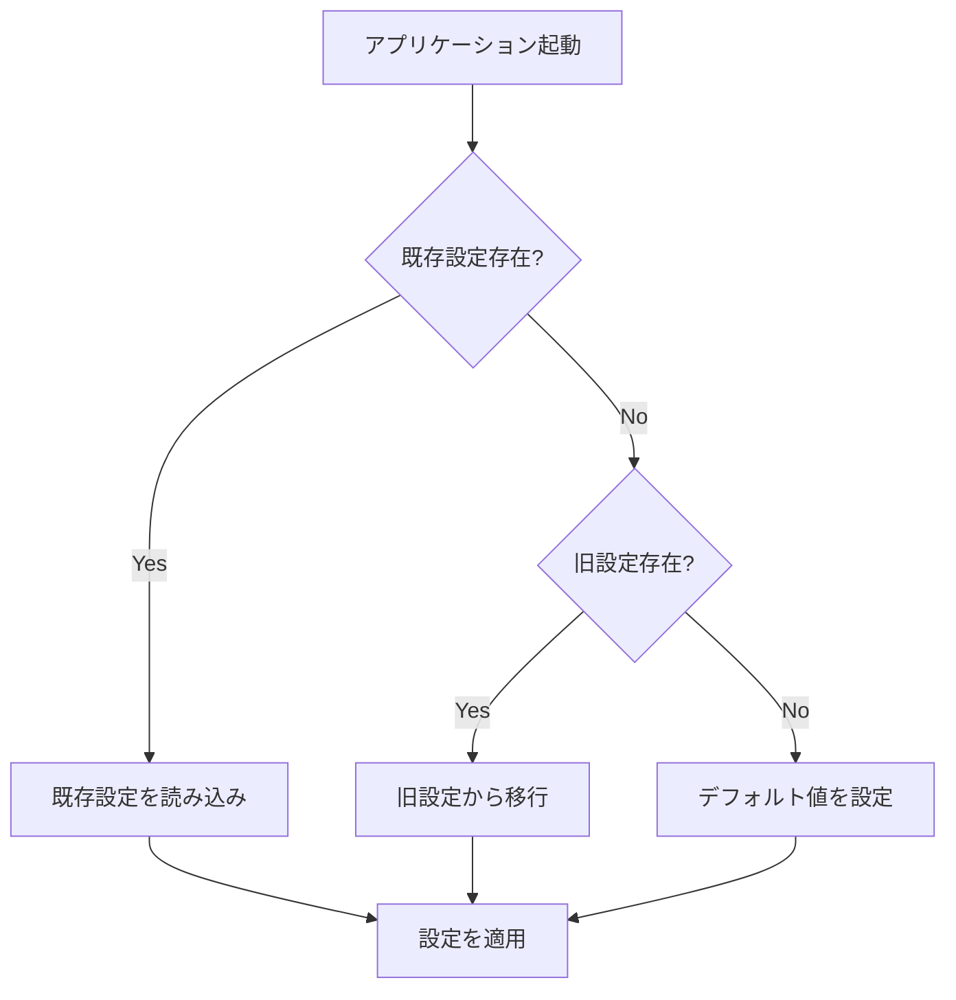
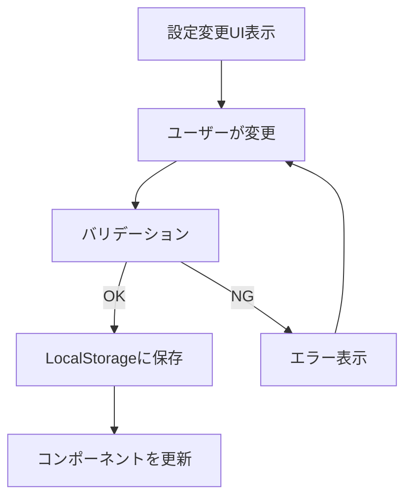

# ワークアウト設定分離機能 - 機能要件書

**文書番号**: FRD-WS-001
**バージョン**: 1.0.0
**作成日**: 2025-09-16
**ステータス**: Draft

## 改訂履歴
| バージョン | 日付 | 変更者 | 変更内容 |
|---------|------|--------|----------|
| 1.0.0 | 2025-09-16 | System | 初版作成 |

## 1. 機能概要

### 1.1 目的
現在、ワークアウトフォーム（入力画面）とワークアウト履歴（表示画面）が同一の設定を共有しているため、片方での変更が他方に影響してしまう問題を解決する。各画面で独立した設定管理を可能にし、ユーザーの利便性を向上させる。

### 1.2 スコープ
- WorkoutFormとWorkoutHistoryの設定を分離
- 各画面に独自のカスタマイズ機能を実装
- 設定の同期オプション機能の提供
- 既存データとの後方互換性の維持

### 1.3 ビジネス価値
- **柔軟性の向上**: ユーザーが各画面で最適な設定を選択可能
- **ユーザビリティの改善**: 用途に応じた表示・入力項目の最適化
- **効率性の向上**: 不要な項目を非表示にすることで操作性が向上

## 2. ユーザーストーリー

### US-001: フォーム独立設定
**As a** フィットネスアプリユーザー
**I want to** ワークアウトフォームで今日トレーニングする種目だけを選択したい
**So that** 入力画面がシンプルになり、素早く記録できる

**受け入れ条件**:
- [ ] フォーム専用の設定画面が存在する
- [ ] 選択した種目のみがフォームに表示される
- [ ] 履歴画面の設定に影響しない
- [ ] 設定がセッション間で保持される

### US-002: 履歴独立設定
**As a** フィットネスアプリユーザー
**I want to** 履歴画面で全ての種目の実績を確認したい
**So that** 総合的なトレーニング進捗を把握できる

**受け入れ条件**:
- [ ] 履歴専用の設定画面が存在する
- [ ] 選択した種目のみが履歴に表示される
- [ ] フォーム画面の設定に影響しない
- [ ] フィルタリング機能が正常に動作する

### US-003: 設定同期オプション
**As a** フィットネスアプリユーザー
**I want to** 必要に応じてフォームと履歴の設定を同期したい
**So that** 同じ設定を使いたい時に簡単に統一できる

**受け入れ条件**:
- [ ] 「フォーム設定を履歴に適用」ボタンが機能する
- [ ] 「履歴設定をフォームに適用」ボタンが機能する
- [ ] 同期実行前に確認ダイアログが表示される
- [ ] 同期後に成功メッセージが表示される

## 3. 機能要件詳細

### 3.1 データ要件

#### 3.1.1 フォーム設定データ
```javascript
{
  "formConfig": {
    "exercises": ["プッシュアップ", "スクワット", "ランニング"],
    "maxSets": 3,
    "defaultIntensity": "medium",
    "lastUpdated": "2025-01-16T10:00:00Z"
  }
}
```

#### 3.1.2 履歴設定データ
```javascript
{
  "historyConfig": {
    "exercises": ["プッシュアップ", "スクワット", "ランニング", "プランク", "懸垂"],
    "maxSets": 5,
    "displayColumns": ["totalReps", "totalTime", "intensity"],
    "sortOrder": "desc",
    "dateRange": "all",
    "lastUpdated": "2025-01-16T10:00:00Z"
  }
}
```

### 3.2 ビジネスルール

1. **最小種目数**: 各設定で最低1つの種目を選択必須
2. **最大種目数**: 各設定で最大10種目まで選択可能
3. **セット数範囲**: 1〜10セットの範囲で設定可能
4. **デフォルト値**: 初回利用時は現在の共通設定を両方にコピー
5. **データ移行**: 既存のworkoutConfigから初期データを生成

### 3.3 処理フロー

#### 3.3.1 初期化フロー


#### 3.3.2 設定変更フロー


## 4. 非機能要件

### 4.1 パフォーマンス
- 設定の読み込み: 100ms以内
- 設定の保存: 50ms以内
- UI更新: 16ms以内（60fps維持）

### 4.2 セキュリティ
- LocalStorageのデータはユーザー端末内のみで管理
- XSS対策: 入力値のサニタイゼーション
- データサイズ制限: 各設定最大10KB

### 4.3 可用性
- LocalStorageが利用不可の場合はメモリ内で管理
- 設定破損時の自動復旧機能
- エラー時のフォールバック処理

## 5. 制約事項
- ブラウザのLocalStorage容量制限（通常5-10MB）
- IE11はサポート対象外
- プライベートブラウジングモードでの制限

## 6. 前提条件
- React 18以上
- Material-UI v5以上
- 最新版のChrome、Firefox、Safari、Edgeをサポート

## 7. リスクと対策

| リスク | 影響度 | 発生確率 | 対策 |
|-------|--------|----------|------|
| 既存データの移行失敗 | 高 | 低 | バックアップ機能とロールバック処理の実装 |
| 設定の不整合 | 中 | 中 | バリデーション強化と自動修復機能 |
| パフォーマンス劣化 | 低 | 低 | 設定のキャッシング実装 |

## 8. 成功指標

### 8.1 定量的指標
- 設定変更の操作時間が50%短縮
- ユーザーエラー率が30%減少
- 設定関連の問い合わせが40%減少

### 8.2 定性的指標
- ユーザーフィードバックの向上
- 開発チームの保守性評価の向上
- 新機能追加の容易性向上

## 9. テスト要件

### 9.1 単体テスト
- 各フックの機能テスト
- バリデーションロジックのテスト
- エラーハンドリングのテスト

### 9.2 統合テスト
- データ移行のテスト
- 設定同期のテスト
- LocalStorage操作のテスト

### 9.3 E2Eテスト
- ユーザーストーリーベースのシナリオテスト
- クロスブラウザテスト
- パフォーマンステスト

## 10. ドキュメント要件
- 開発者向けAPI仕様書
- ユーザー向け操作マニュアル
- 移行ガイド
- トラブルシューティングガイド