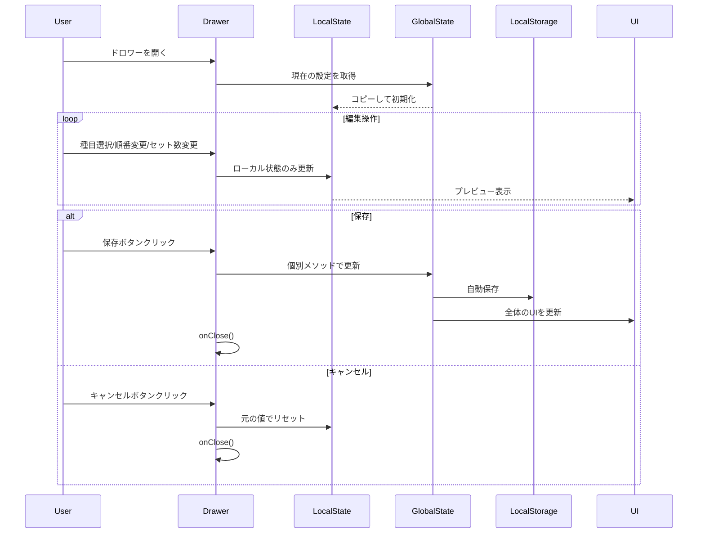

# WorkoutHistory設定管理 - コンポーネントアーキテクチャ設計書

**文書番号**: CAD-WH-003
**バージョン**: 3.0.0
**作成日**: 2025-09-20
**ステータス**: FormConfigパターン準拠版

## 1. アーキテクチャ概要

### 1.1 設計背景と課題

#### 解決すべき問題（クロージャー問題）
```javascript
// ❌ 問題のあったパターン - stale closure
const updateMaxSets = useCallback(sets => {
  const newConfig = {
    ...workoutConfig,  // 古い値を参照し続ける
    maxSets: sets,
  };
  saveConfig(newConfig);
}, [workoutConfig, saveConfig]);
```

#### 根本原因
- propsとローカル状態の混在管理
- リアルタイム更新による状態の不整合
- useCallbackによるクロージャーで古い値を参照

### 1.2 設計方針（FormConfigパターン準拠）

1. **完全なローカル状態管理**
   - 編集中の全ての状態をlocalConfigで管理
   - propsは初期値の参照のみ

2. **編集モード/下書きパターン**
   - ユーザーの操作は全てローカル状態を更新
   - 保存ボタンで初めて親の状態を更新

3. **関数型アップデート**
   - setState(prev => ...) パターンで最新値を参照
   - 空の依存配列で不要な再生成を防止

4. **JavaScript実装**
   - 実装コストを考慮し、TypeScriptは将来の拡張として検討

### 1.3 アーキテクチャ構造

#### ファイル構造（単一責任原則）
```
frontend/src/
├── pages/
│   └── WorkoutHistory.jsx              # ページコンポーネント
├── components/
│   ├── WorkoutCustomizationDrawer.jsx  # 設定編集UI
│   └── WorkoutHistoryTable.jsx         # 履歴表示テーブル
├── hooks/
│   └── useWorkoutConfig.js             # 設定管理ロジック
└── utils/
    └── workoutStorage.js               # LocalStorage操作
```

#### 論理的な依存関係
```
WorkoutHistory (ページ)
    ↓ import & use
├── useWorkoutConfig (カスタムフック)
│   ├── workoutConfig (state)
│   ├── updateExercises (個別更新)
│   ├── updateMaxSets (個別更新)
│   └── updateExerciseOrder (個別更新) ※独自機能
│
├── WorkoutCustomizationDrawer (コンポーネント)
│   ├── localConfig (ローカル状態)
│   ├── handleToggle (種目選択/解除)
│   ├── handleReorder (順番変更) ※独自機能
│   ├── handleSave (一括保存)
│   └── handleCancel (変更破棄)
│
└── WorkoutHistoryTable (コンポーネント)
    └── 動的に順番変更されたUIを表示
```

#### データフロー
```
useWorkoutConfig (hooks/)
    ↓ provides state & actions
WorkoutHistory (pages/)
    ↓ passes props
    ├── WorkoutCustomizationDrawer (components/)
    └── WorkoutHistoryTable (components/)
```

## 2. 状態管理設計

### 2.1 状態フロー図



### 2.2 状態定義

#### グローバル状態 (useWorkoutConfig)
```javascript
// FormConfigと同じ構造 + 順番管理
const workoutConfig = {
  exercises: ['プッシュアップ', 'スクワット', 'ウォーキング'],  // 順番も保持
  maxSets: 3
};
```

#### ローカル状態 (WorkoutCustomizationDrawer)
```javascript
// FormConfigDrawerのlocalConfigと同一構造
const localConfig = {
  exercises: [],  // 編集中の種目リスト（順番含む）
  maxSets: 3      // 編集中のセット数
};
```

## 3. コンポーネント詳細設計

### 3.1 WorkoutCustomizationDrawer

#### 責任
- 設定の一時的な編集（下書き機能）
- 順番変更のUI提供（独自機能）
- 変更の適用/キャンセル

#### Props（FormConfigDrawerと同一パターン）
```javascript
const WorkoutCustomizationDrawer = ({
  open,
  onClose,
  workoutConfig,           // 現在の設定
  availableExercises,      // 利用可能な種目リスト
  isCardioExercise,        // カーディオ判定
  updateExercises,         // 個別更新（FormConfig同一）
  updateMaxSets            // 個別更新（FormConfig同一）
}) => {
  // 実装...
};
```

#### 内部状態管理（FormConfigDrawerと完全同一）
```javascript
// ローカル状態の初期化
const [localConfig, setLocalConfig] = useState({
  exercises: workoutConfig.exercises || [],
  maxSets: workoutConfig.maxSets || 3
});

// ドロワーが開いた時だけ同期
useEffect(() => {
  if (open) {
    setLocalConfig({
      exercises: workoutConfig.exercises,
      maxSets: workoutConfig.maxSets,
    });
  }
}, [open, workoutConfig.exercises, workoutConfig.maxSets]);
```

#### 主要メソッド実装

```javascript
// 種目のトグル（FormConfigDrawerのhandleToggleと同一）
const handleToggle = (exercise) => {
  setLocalConfig(currentConfig => {
    const currentIndex = currentConfig.exercises.indexOf(exercise);
    const newExercises = [...currentConfig.exercises];

    if (currentIndex === -1) {
      // 追加時の制限
      if (newExercises.length >= 5) {
        alert('種目は最大5つまでです');
        return currentConfig;
      }
      newExercises.push(exercise);
    } else {
      // 削除時の制限
      if (newExercises.length <= 1) {
        alert('最低1つの種目が必要です');
        return currentConfig;
      }
      newExercises.splice(currentIndex, 1);
    }

    return {
      ...currentConfig,
      exercises: newExercises
    };
  });
};

// 順番変更（WorkoutHistory独自機能）
const handleReorder = (fromIndex, toIndex) => {
  setLocalConfig(currentConfig => {
    const newExercises = [...currentConfig.exercises];
    const [movedItem] = newExercises.splice(fromIndex, 1);
    newExercises.splice(toIndex, 0, movedItem);

    return {
      ...currentConfig,
      exercises: newExercises
    };
  });
};

// スライダー操作
const handleMaxSetsChange = (event, value) => {
  setLocalConfig(prev => ({
    ...prev,
    maxSets: value
  }));
};

// 保存（FormConfigDrawerのhandleSaveと同一パターン）
const handleSave = () => {
  if (localConfig.exercises.length === 0) {
    alert('最低1つの種目を選択してください');
    return;
  }
  updateExercises(localConfig.exercises);  // 順番も含めて保存
  updateMaxSets(localConfig.maxSets);
  onClose();
};

// キャンセル（FormConfigDrawerのhandleCancelと同一）
const handleCancel = () => {
  setLocalConfig({
    exercises: workoutConfig.exercises,
    maxSets: workoutConfig.maxSets
  });
  onClose();
};
```

### 3.2 useWorkoutConfig（FormConfigパターン準拠）

#### 実装
```javascript
import { useCallback, useEffect, useMemo, useState } from 'react';
import { EXERCISE_DATABASE, WORKOUT_TYPES } from '../data/exercises';

const useWorkoutConfig = () => {
  // exerciseData生成（useFormConfigと同一パターン）
  const exerciseData = useMemo(() => {
    const cardio = [];
    const strength = [];
    const nameMapping = {};

    Object.values(EXERCISE_DATABASE).forEach(exercise => {
      nameMapping[exercise.id] = exercise.name;

      if (exercise.type === WORKOUT_TYPES.CARDIO) {
        cardio.push(exercise.name);
      } else if (exercise.type === WORKOUT_TYPES.STRENGTH) {
        strength.push(exercise.name);
      }
    });

    return {
      cardio,
      strength,
      all: [...cardio, ...strength],
      nameMapping,
      database: EXERCISE_DATABASE,
    };
  }, []);

  // 初期状態
  const [workoutConfig, setWorkoutConfig] = useState({
    exercises: [
      exerciseData.nameMapping.pushup || 'プッシュアップ',
      exerciseData.nameMapping.squat || 'スクワット',
      exerciseData.nameMapping.walking || 'ウォーキング',
    ],
    maxSets: 3,
  });

  // カーディオ判定
  const isCardioExercise = useCallback(
    exerciseName => {
      return exerciseData.cardio.includes(exerciseName);
    },
    [exerciseData.cardio]
  );

  // LocalStorageから読込
  useEffect(() => {
    const savedConfig = localStorage.getItem('workoutConfig');
    if (savedConfig) {
      try {
        const parsed = JSON.parse(savedConfig);
        // プリセット関連は除外
        const { presets, ...validConfig } = parsed;

        // バリデーション
        const validExercises = validConfig.exercises?.filter(exercise =>
          exerciseData.all.includes(exercise)
        ) || [];

        setWorkoutConfig({
          exercises: validExercises.length > 0
            ? validExercises
            : workoutConfig.exercises,
          maxSets: validConfig.maxSets || 3,
        });
      } catch (error) {
        console.error('設定読み込み失敗:', error);
      }
    }
  }, [exerciseData.all]);

  // 種目リスト更新（順番も保持）- 関数型アップデートでクロージャー問題回避
  const updateExercises = useCallback(exercises => {
    if (!exercises || exercises.length === 0) {
      alert('最低1つの運動は必要です');
      return;
    }

    const validExercises = exercises.filter(exercise =>
      exerciseData.all.includes(exercise)
    );

    if (validExercises.length === 0) {
      alert('有効な種目を選択してください');
      return;
    }

    setWorkoutConfig(prevConfig => {
      const newConfig = {
        ...prevConfig,
        exercises: validExercises,
      };
      localStorage.setItem('workoutConfig', JSON.stringify(newConfig));
      return newConfig;
    });
  }, [exerciseData.all]);

  // 最大セット数更新 - 関数型アップデートでクロージャー問題回避
  const updateMaxSets = useCallback(sets => {
    setWorkoutConfig(prevConfig => {
      const newConfig = {
        ...prevConfig,
        maxSets: sets,
      };
      localStorage.setItem('workoutConfig', JSON.stringify(newConfig));
      return newConfig;
    });
  }, []);  // 空の依存配列

  return {
    // 状態
    workoutConfig,
    availableExercises: exerciseData.all,

    // ユーティリティ
    isCardioExercise,

    // アクション関数（FormConfig同一パターン）
    updateExercises,
    updateMaxSets,
  };
};

export default useWorkoutConfig;
```

## 4. UI/UX設計（WorkoutHistory独自機能）

### 4.1 順番変更可能なUI

```
┌─────────────────────────────────────┐
│         Drawer Header               │
│  ワークアウトカスタマイズ設定    [X]  │
├─────────────────────────────────────┤
│                                     │
│  現在選択中の種目 (3/5)             │
│  ┌─────────────────────────┐       │
│  │ [≡] 🏃 ウォーキング [🗑️]│       │
│  │ [≡] 💪 プッシュアップ [🗑️]│       │
│  │ [≡] 💪 スクワット   [🗑️]│       │
│  └─────────────────────────┘       │
│  ↑ ドラッグで順番変更可能           │
│                                     │
│  筋トレ設定                         │
│  最大セット数: 3                    │
│  [1]--●--[3]--[4]--[5]             │
│                                     │
│  種目追加                           │
│  ┌─────────────────────────┐       │
│  │ 🏃 ランニング      [➕]│       │
│  │ 💪 デッドリフト    [➕]│       │
│  └─────────────────────────┘       │
│                                     │
├─────────────────────────────────────┤
│  [キャンセル]    [設定を適用]       │
└─────────────────────────────────────┘
```

### 4.2 動的なテーブル表示

```javascript
// WorkoutHistoryTable内で順番通りに表示
const WorkoutHistoryTable = ({ workoutConfig }) => {
  // workoutConfig.exercisesの順番通りにカラムを生成
  return (
    <Table>
      <TableHead>
        <TableRow>
          <TableCell>日付</TableCell>
          {workoutConfig.exercises.map(exercise => (
            <TableCell key={exercise}>
              {exercise}
            </TableCell>
          ))}
        </TableRow>
      </TableHead>
      {/* ... */}
    </Table>
  );
};
```

## 5. エラーハンドリング

### 5.1 バリデーション

| 項目 | 条件 | エラー処理 |
|------|------|------------|
| 種目数上限 | 5種目以上の追加 | アラート表示・追加を拒否 |
| 種目数下限 | 0種目になる削除 | アラート表示・削除を拒否 |
| 無効な種目 | DBに存在しない種目 | フィルタリングで除外 |
| LocalStorage失敗 | 保存/読込エラー | コンソールエラー・デフォルト値使用 |

## 6. パフォーマンス最適化

### 6.1 最適化戦略

1. **メモ化**
   ```javascript
   const exerciseData = useMemo(() => {...}, []);
   const isCardioExercise = useCallback(..., [exerciseData.cardio]);
   ```

2. **関数型アップデート**
   ```javascript
   setWorkoutConfig(prevConfig => ({...prevConfig, ...}));
   ```

3. **不要な再レンダリング防止**
   - ローカル状態で編集中は親コンポーネントを更新しない
   - 保存時のみ一括更新

## 7. 移行計画

### 7.1 段階的実装

1. **Phase 1: 基本機能（FormConfigパターン適用）**
   - [x] クロージャー問題の解決
   - [x] ローカル状態管理への統一
   - [ ] 個別更新メソッドの実装

2. **Phase 2: 独自機能追加**
   - [ ] 順番変更機能の実装
   - [ ] 動的UIの対応

3. **Phase 3: プリセット機能削除**
   - [ ] プリセット関連コードの削除
   - [ ] LocalStorageデータの移行

### 7.2 既存データの互換性

```javascript
// LocalStorage移行処理
const migrateConfig = (oldConfig) => {
  const { presets, ...validConfig } = oldConfig;  // プリセット除外
  return {
    exercises: validConfig.exercises || [],
    maxSets: validConfig.maxSets || 3
  };
};
```

## 8. テスト計画

### 8.1 単体テスト項目

```javascript
describe('WorkoutCustomizationDrawer', () => {
  it('ドロワーを開いた時にグローバル状態をローカルにコピー', () => {});
  it('種目追加時に上限チェック（5種目）', () => {});
  it('種目削除時に下限チェック（1種目）', () => {});
  it('順番変更が正しく動作', () => {});
  it('保存時に個別メソッドを呼び出し', () => {});
  it('キャンセル時にローカル状態をリセット', () => {});
});

describe('useWorkoutConfig', () => {
  it('関数型アップデートで最新値を参照', () => {});
  it('LocalStorageへの自動保存', () => {});
  it('無効な種目のフィルタリング', () => {});
});
```

### 8.2 統合テスト項目

- クロージャー問題が発生しないことの確認
- 順番変更がUIに反映されることの確認
- LocalStorage同期の確認

## 9. 実装チェックリスト

### Phase 1: 基本実装
- [ ] hooks/useWorkoutConfig.jsの修正
  - [ ] プリセット機能削除
  - [ ] 関数型アップデート適用
  - [ ] exerciseDataパターン採用
- [ ] components/WorkoutCustomizationDrawer.jsxの修正
  - [ ] localConfig状態管理
  - [ ] handleToggleメソッド実装
  - [ ] handleSave/handleCancel実装
- [ ] pages/WorkoutHistory.jsxの修正
  - [ ] useWorkoutConfigをimport
  - [ ] updateExercises/updateMaxSetsをDrawerへprops渡し

### Phase 2: 独自機能
- [ ] 順番変更機能の実装
  - [ ] ドラッグ&ドロップUI
  - [ ] handleReorderメソッド
- [ ] 動的テーブル表示の実装

### Phase 3: クリーンアップ
- [ ] プリセット関連コードの削除
- [ ] テストの実装
- [ ] ドキュメント更新

## 10. 注意事項

### 10.1 クロージャー問題の回避

```javascript
// ❌ 悪い例
const updateSomething = useCallback(value => {
  const newConfig = {...config, something: value};  // 古い値を参照
}, [config]);

// ✅ 良い例
const updateSomething = useCallback(value => {
  setConfig(prev => ({...prev, something: value}));  // 最新値を参照
}, []);  // 空の依存配列
```

### 10.2 状態管理の原則

1. **全てローカルか全てprops** - 混在させない
2. **編集は下書き** - 保存するまで親に影響しない
3. **原子性の保証** - 全ての変更が適用されるか、全て破棄されるか

## 11. 参考資料

- [React状態管理でのクロージャー問題解決記録](/learning/daily/2025/9/2025-09-16/acquire_react_state_management.md)
- [FormConfigDrawer実装](/frontend/src/components/FormConfigDrawer.jsx)
- [useFormConfig実装](/frontend/src/hooks/useFormConfig.js)