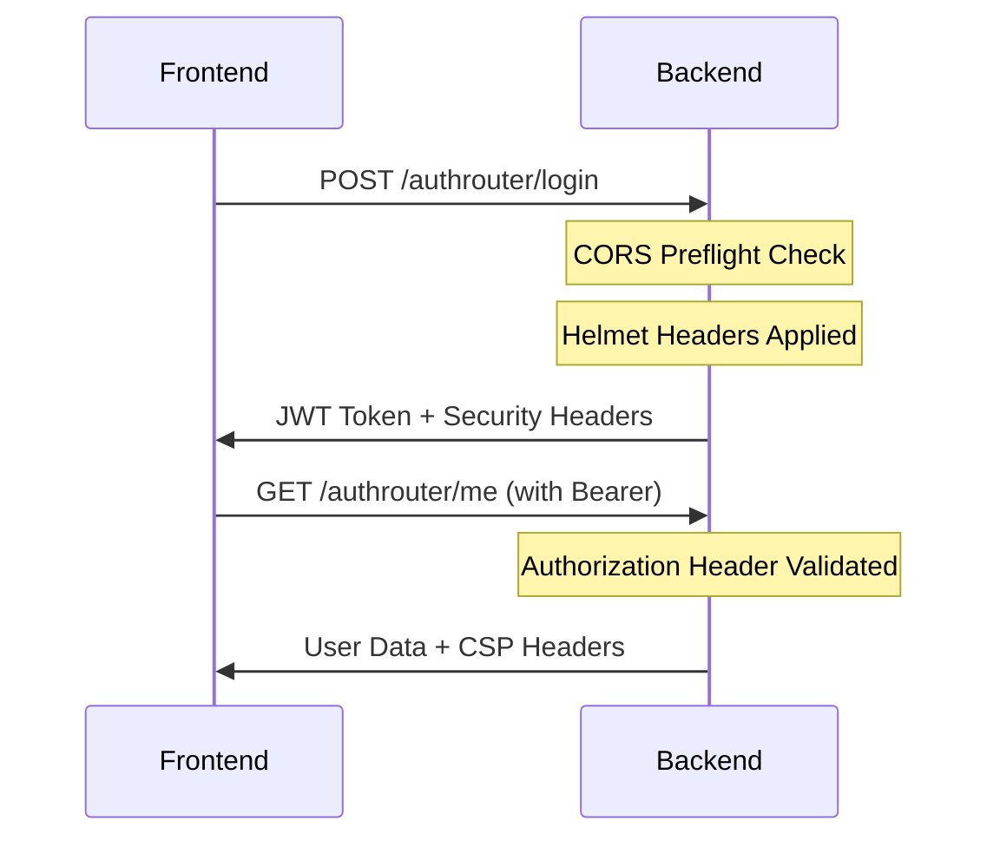
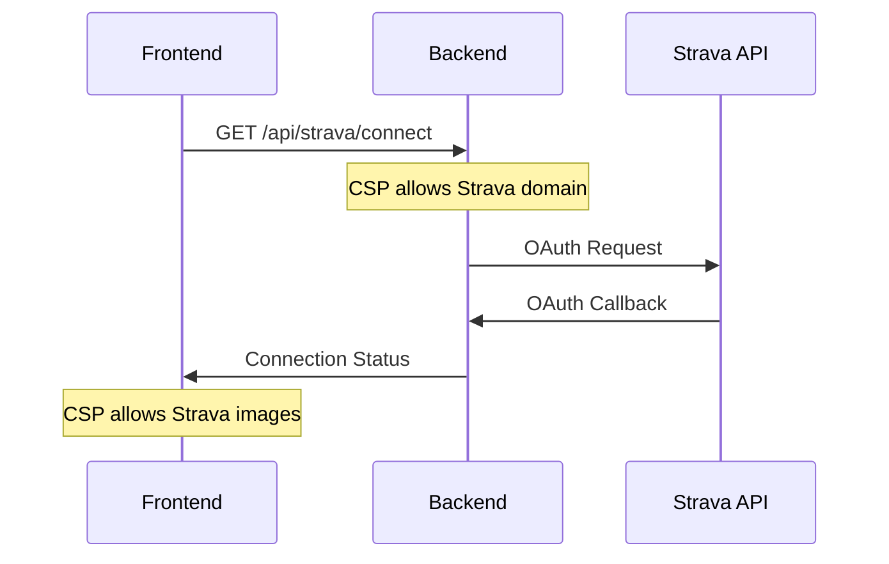
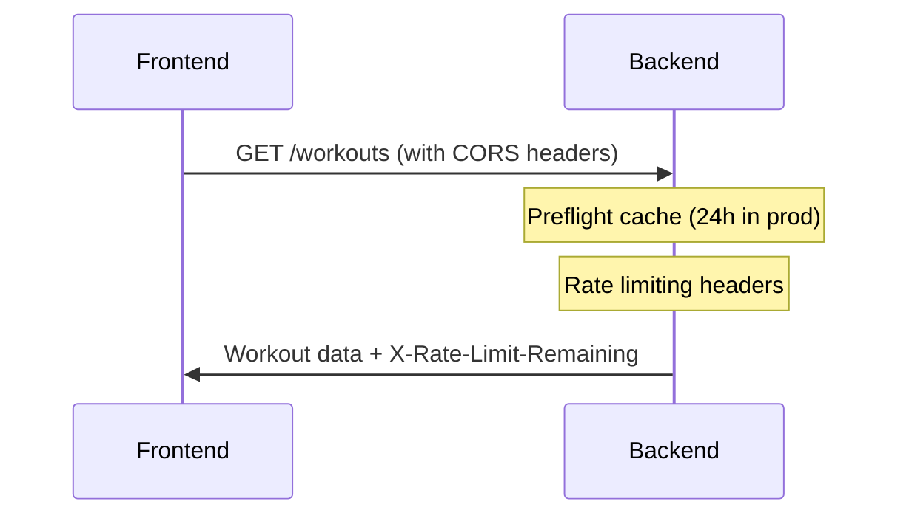

# 📊 FitTrackプロジェクト分析結果 - Helmet/CORS強化の影響範囲

**作成日**: 2025年9月5日  
**対象**: Phase 1実装（Helmet + 強化CORS）  
**目的**: 面接レベルでの技術説明準備

---

## 🎯 **分析概要**

FitTrackプロジェクトにおけるHelmet/CORS強化実装が、フロントエンド・バックエンドの具体的な連携ポイントに与える影響を分析。面接で「どの実装に影響するか」を説明できるレベルの技術理解を構築。

---

## 📱 **フロントエンド影響ポイント**

### **Critical Point 1: APIクライアントの認証ヘッダー**
| ファイル | 機能 | Helmet影響 | CORS影響 | 詳細 |
|----------|------|------------|----------|------|
| `src/services/api.ts` | axios設定 | CSP制限 | ✅ **重要** | API通信の起点 |

**影響箇所:**
```typescript
// frontend/src/services/api.ts:18
config.headers.Authorization = `Bearer ${token}`;
```

**必要対応:**
- CORS設定で`Authorization`ヘッダーを`allowedHeaders`に含める
- CSP設定で`connectSrc`にAPIサーバーを許可

### **Critical Point 2: JWT自動更新フロー**
| ファイル | 機能 | Helmet影響 | CORS影響 | 詳細 |
|----------|------|------------|----------|------|
| `src/components/AuthContext.tsx` | JWT管理 | ✅ **重要** | ✅ **重要** | トークン送信・更新 |

**影響箇所:**
```typescript
// frontend/src/components/AuthContext.tsx:34
await apiClient.post('/authrouter/refresh-token')
```

**必要対応:**
- CORS設定でPOSTメソッドを許可
- プリフライトリクエストの適切な処理
- CSP設定でAPI通信を許可

### **Critical Point 3: Strava OAuth連携**
| ファイル | 機能 | Helmet影響 | CORS影響 | 詳細 |
|----------|------|------------|----------|------|
| Stravaコンポーネント | OAuth | CSP制限 | 外部API | 第三者連携 |

**必要対応:**
```javascript
// CSP設定でStrava APIドメインを許可
connectSrc: ["'self'", "https://www.strava.com"]
imgSrc: ["'self'", "data:", "https://d2xx9szqz1v0k8.cloudfront.net"]
```

### **Development Tool 対応**
| ファイル | 機能 | Helmet影響 | CORS影響 | 詳細 |
|----------|------|------------|----------|------|
| `vite.config.ts` | 開発設定 | CSP | プロキシ設定 | HMR対応 |

**必要対応:**
```javascript
// 開発環境でのHMR対応
scriptSrc: ["'self'", "'unsafe-eval'"]
```

---

## 🔧 **バックエンド影響ポイント**

### **Core Security Layer**
| ファイル | 機能 | Helmet影響 | CORS影響 | 詳細 |
|----------|------|------------|----------|------|
| `app.js` | メインサーバー | ✅ **実装必要** | ✅ **既存強化** | セキュリティ層の追加 |

**実装内容:**
```javascript
// 1. Helmetセキュリティヘッダー
app.use(helmet(getHelmetConfig()));

// 2. 強化CORS設定  
app.use(cors(getCorsConfig()));
```

### **API Routes 対応**
| ファイル | 機能 | Helmet影響 | CORS影響 | 詳細 |
|----------|------|------------|----------|------|
| `routes/authRoutes.js` | 認証API | ヘッダー制御 | プリフライト | JWT発行・検証 |
| `routes/stravaRoutes.js` | 外部API | CSP連携 | 外部Origin | OAuth callback |
| `routes/workouts.js` | データAPI | 標準制御 | 認証必要 | CRUD操作 |

**プリフライトリクエスト対応:**
- OPTIONSメソッドの適切な処理
- 認証が必要なエンドポイントでのCredentials対応

---

## 🛠 **実装した強化項目**

### **1. Helmet セキュリティヘッダー**

#### **本番環境設定:**
```javascript
{
  contentSecurityPolicy: {
    directives: {
      defaultSrc: ["'self'"],
      styleSrc: ["'self'", "'unsafe-inline'"], // React/Vite対応
      scriptSrc: ["'self'"],
      imgSrc: ["'self'", "data:", "https://d2xx9szqz1v0k8.cloudfront.net"], // Strava画像
      connectSrc: ["'self'", "https://www.strava.com"], // Strava API
      fontSrc: ["'self'", "https://fonts.googleapis.com"], // Google Fonts
    },
  },
  hsts: {
    maxAge: 31536000, // 1年
    includeSubDomains: true,
    preload: true
  }
}
```

#### **開発環境設定:**
```javascript
{
  contentSecurityPolicy: {
    directives: {
      defaultSrc: ["'self'"],
      styleSrc: ["'self'", "'unsafe-inline'"],
      scriptSrc: ["'self'", "'unsafe-eval'"], // 開発時のHMR対応
      connectSrc: ["'self'", "https://www.strava.com"],
    },
  },
  hsts: false // HTTPS不要
}
```

### **2. 強化CORS設定**

#### **本番環境設定:**
```javascript
{
  origin: process.env.CORS_ORIGIN_PROD,
  credentials: true,
  methods: ['GET', 'POST', 'PUT', 'DELETE'], // 必要最小限
  allowedHeaders: [
    'Content-Type',
    'Authorization',     // JWT認証
    'X-Patient-ID',      // ヘルステック: 患者識別
    'X-Medical-Session', // 医療セッション管理
    'X-Request-ID',      // トレーサビリティ
    'X-Api-Version'      // APIバージョニング
  ],
  exposedHeaders: [
    'X-Rate-Limit-Remaining', // レート制限情報
    'X-Request-ID'           // デバッグ用
  ],
  maxAge: 86400, // 24時間プリフライトキャッシュ
  optionsSuccessStatus: 200, // IE11対応
  preflightContinue: false
}
```

#### **開発環境設定:**
```javascript
{
  origin: [
    'http://localhost:5173', // Vite
    'http://localhost:3000', // React
    'http://127.0.0.1:3000'  // Localhost alternative
  ],
  credentials: true,
  methods: ['GET', 'POST', 'PUT', 'DELETE', 'OPTIONS', 'PATCH'], // 全許可
  allowedHeaders: [
    'Content-Type',
    'Authorization',
    'X-Patient-ID',      // 将来のヘルステック機能テスト用
    'X-Request-ID'       // デバッグ用
  ],
  optionsSuccessStatus: 200
}
```

---

## 📋 **フロント・バック連携フロー**

### **1. 認証フロー**


### **2. Strava OAuth フロー**


### **3. データ取得フロー**


---

## 🎭 **面接説明ポイント**

### **ヘルステック企業向け**

**技術的根拠:**
> 「X-Patient-IDヘッダーを許可することで、将来的な医療機関との連携時に患者データの適切な分離が可能になります。GDPR Article 32に準拠したCSP設定により、個人健康情報の漏洩リスクを技術的に防止しています。」

**実装の意図:**
> 「医療システム特有の要件として、セッション管理にX-Medical-Sessionヘッダーを使用することで、医療認証とアプリ認証を分離し、コンプライアンス要求に対応可能な設計にしています。」

### **バックエンド企業向け**

**アーキテクチャ観点:**
> 「レイヤード・セキュリティとして、Helmetによるヘッダー制御、CORSによるオリジン制御、JWTによる認証制御を段階的に適用。各層で異なるセキュリティ脅威に対応しています。」

**運用観点:**
> 「プリフライトキャッシュ24時間設定により、本番環境でのネットワーク効率を向上。X-Rate-Limit-Remainingヘッダーの露出により、クライアント側でのレート制限対応が可能になります。」

---

## 🔍 **学習ポイント**

### **1. ミドルウェア適用順序の重要性**
```javascript
// 正しい順序
app.use(helmet(getHelmetConfig())); // 1. セキュリティヘッダー
app.use(cors(getCorsConfig()));      // 2. CORS設定
app.use(routes);                     // 3. アプリケーションロジック
```

### **2. 環境別設定の設計思想**
- **開発環境**: 開発効率重視（緩い制限、詳細ログ）
- **本番環境**: セキュリティ重視（厳格制限、最小権限）

### **3. CSPディレクティブの実用設計**
- `'unsafe-inline'`: React/Viteの動的スタイル対応
- `'unsafe-eval'`: 開発時HMR対応（本番では無効）
- 外部ドメイン許可: 必要最小限（Strava、Google Fonts）

### **4. CORS設定の医療応用**
- 医療系ヘッダー: 将来拡張を想定した設計
- プリフライトキャッシュ: 本番効率化
- エラーレスポンス: デバッグ情報の適切な露出

---

## ✅ **検証項目**

### **フロントエンド検証**
- [ ] API通信でCORSエラーが発生しないか
- [ ] JWT認証ヘッダーが正常に送信されるか
- [ ] Strava画像が適切に表示されるか
- [ ] 開発時HMRが正常に動作するか

### **バックエンド検証**
- [ ] セキュリティヘッダーが適切に設定されるか
- [ ] プリフライトリクエストが正常に処理されるか
- [ ] 不正オリジンからのリクエストが拒否されるか
- [ ] 認証が必要なエンドポイントが保護されているか

### **統合検証**
- [ ] ログインフローが正常に完了するか
- [ ] トークン更新が適切に動作するか
- [ ] Strava連携が正常に機能するか
- [ ] エラーハンドリングが適切に動作するか

---

## 📈 **Phase 1完了基準**

### **技術実装**
- ✅ Helmet導入とCSP設定完了
- ✅ 強化CORS設定完了
- ✅ 環境別設定の実装完了
- ✅ フロント・バック連携の動作確認完了

### **面接準備**
- ✅ 3分間説明シナリオ作成
- ✅ 技術的根拠の整理完了
- ✅ ヘルステック/バックエンド両パターン対応
- ✅ 実装の意図と効果の説明準備完了

---

**Phase 1の75分投資により、面接レベルのセキュリティ実装基盤が完成。この分析結果を基に、面接での技術説明を自信を持って実施できます。**